# Auth/RBAC Foundation (F4) — Design

**Status:** Draft
**Author:** Claude (Opus 4.7) + Mikhail Savin
**Date:** 2026-05-07
**Feature:** auth-rbac-foundation (F4a)

## 2.1 Overview

F4 строит auth-foundation поверх F1+F2+F3. Фича логически делится на 6 частей:

1. **Domain types** — `User`, `APIToken`, `Role`, `Permission` + scope helpers (`WithUser`, `WithRole`).
2. **Repository interfaces** — `UserRepository`, `TokenRepository`. SQLite/Postgres-адаптеры реализуют через sqlc + новую миграцию `0002_users_tokens.sql`.
3. **AuthService** — доменный сервис: CreateUser, VerifyPassword, IssueToken, ValidateToken, RevokeToken, AuthorizeOperation.
4. **Storage Bundle** — `storage.Bundle{Posts, Users, Tokens, Closer}` + `Open(cfg) (*Bundle, error)`. `OpenAs` остаётся как F2-shim.
5. **HTTP middleware** — `BearerTokenMiddleware(authService)`, выбирается по `cfg.Auth.Type` в `serve.go`.
6. **CLI** — `jtpost user create/list/delete` (с `--first-owner`), `jtpost token create/list/revoke`. Запрещены при `storage.type=fs`.

Implementation order: Group 1 (types) → Group 5 (config) → Group 3 (repo+migration) → Group 2 (AuthService) → Group 4 (Bundle) → Group 6 (middleware) → Group 7 (CLI) → Group 8 (тесты).

## 2.2 Architecture

```mermaid
graph TB
    subgraph CLI["internal/cli (MODIFIED + NEW)"]
        userCmd[user.go - NEW]
        tokenCmd[token.go - NEW]
        serve[serve.go - MODIFIED]
        existing[other commands]
    end

    subgraph Storage["internal/adapters/storage (MODIFIED)"]
        Bundle[Bundle struct - NEW]
        Open[Open returns *Bundle]
        OpenAs[OpenAs F2-shim]
    end

    subgraph SQLite["internal/adapters/sqlite (MODIFIED)"]
        SQLiteRepo[PostRepository]
        SQLiteUserRepo[UserRepository - NEW]
        SQLiteTokenRepo[TokenRepository - NEW]
        Migration2[0002_users_tokens.sql]
    end

    subgraph Postgres["internal/adapters/postgres (MODIFIED)"]
        PGRepo[PostRepository]
        PGUserRepo[UserRepository - NEW]
        PGTokenRepo[TokenRepository - NEW]
        Migration2P[0002_users_tokens.sql]
    end

    subgraph FS["internal/adapters/fsrepo (UNCHANGED)"]
        FSRepo[FileSystemPostRepository]
    end

    subgraph HTTP["internal/adapters/httpapi (MODIFIED)"]
        BearerMW[BearerTokenMiddleware - NEW]
        TenantMW[TenantFromConfigMiddleware - kept for type=none]
        Server[server.go]
    end

    subgraph Core["internal/core (MODIFIED)"]
        UserType[User, APIToken, Role, Permission - NEW]
        AuthService[AuthService - NEW]
        UserRepoIface[UserRepository, TokenRepository ifaces - NEW]
        Scope[WithUser, WithRole - NEW]
        Errors[ErrUnauthorized, ErrForbidden - NEW]
        PostRepoIface[PostRepository iface]
    end

    userCmd --> Bundle
    tokenCmd --> Bundle
    serve --> Bundle
    serve --> AuthService
    existing --> Bundle

    Bundle --> SQLiteRepo
    Bundle --> SQLiteUserRepo
    Bundle --> SQLiteTokenRepo
    Bundle --> PGRepo
    Bundle --> PGUserRepo
    Bundle --> PGTokenRepo
    Bundle --> FSRepo

    AuthService --> UserRepoIface
    AuthService --> Errors
    BearerMW --> AuthService
    BearerMW --> Scope
    Server --> BearerMW
    Server --> TenantMW

    SQLiteUserRepo -. implements .-> UserRepoIface
    PGUserRepo -. implements .-> UserRepoIface
    SQLiteTokenRepo -. implements .-> UserRepoIface
    PGTokenRepo -. implements .-> UserRepoIface

    style userCmd fill:#90EE90
    style tokenCmd fill:#90EE90
    style Bundle fill:#90EE90
    style SQLiteUserRepo fill:#90EE90
    style SQLiteTokenRepo fill:#90EE90
    style Migration2 fill:#90EE90
    style PGUserRepo fill:#90EE90
    style PGTokenRepo fill:#90EE90
    style Migration2P fill:#90EE90
    style BearerMW fill:#90EE90
    style UserType fill:#90EE90
    style AuthService fill:#90EE90
    style UserRepoIface fill:#90EE90
    style Scope fill:#90EE90
    style Errors fill:#90EE90
    style serve fill:#FFD700
    style Open fill:#FFD700
    style SQLiteRepo fill:#FFD700
    style PGRepo fill:#FFD700
    style Server fill:#FFD700
    style TenantMW fill:#FFD700
```



## 2.3 Components and Interfaces

### Files Requiring Changes

| File | Change Type | Description |
|------|-------------|-------------|
| `internal/core/user.go` | `[NEW]` | `User`, `APIToken`, `Role`, `Permission` types + `RolePermissions(role)` |
| `internal/core/auth_service.go` | `[NEW]` | `AuthService` struct + 6 методов (CreateUser/Verify/Issue/Validate/Revoke/Authorize) |
| `internal/core/user_repository.go` | `[NEW]` | `UserRepository`, `TokenRepository` interfaces |
| `internal/core/scope.go` | `[MODIFIED]` | `WithUser`, `UserFromContext`, `WithRole`, `RoleFromContext` |
| `internal/core/errors.go` | `[MODIFIED]` | `ErrUnauthorized`, `ErrForbidden` |
| `internal/core/auth_service_test.go` | `[NEW]` | Unit-tests с mock-репо |
| `internal/adapters/sqlite/migrations/0002_users_tokens.sql` | `[NEW]` | Миграция users + tokens |
| `internal/adapters/sqlite/queries/users.sql` | `[NEW]` | sqlc для users |
| `internal/adapters/sqlite/queries/tokens.sql` | `[NEW]` | sqlc для tokens |
| `internal/adapters/sqlite/users.go` | `[NEW]` | `*PostRepository` методы UserRepository (или отдельный struct, см. ADR-2) |
| `internal/adapters/sqlite/tokens.go` | `[NEW]` | TokenRepository methods |
| `internal/adapters/sqlite/users_test.go` | `[NEW]` | Adapter contract tests |
| `internal/adapters/postgres/migrations/0002_users_tokens.sql` | `[NEW]` | Postgres-вариант |
| `internal/adapters/postgres/queries/users.sql` | `[NEW]` | sqlc для users |
| `internal/adapters/postgres/queries/tokens.sql` | `[NEW]` | sqlc для tokens |
| `internal/adapters/postgres/users.go` | `[NEW]` | UserRepository methods |
| `internal/adapters/postgres/tokens.go` | `[NEW]` | TokenRepository methods |
| `internal/adapters/postgres/users_test.go` | `[NEW]` | Integration tests (testcontainers, build-tag integration) |
| `internal/adapters/storage/factory.go` | `[MODIFIED]` | `Bundle` struct + `Open(cfg) (*Bundle, error)`; `OpenAs` обёртка |
| `internal/adapters/storage/factory_test.go` | `[MODIFIED]` | Тесты для Bundle |
| `internal/adapters/config/config.go` | `[MODIFIED]` | `AuthConfig.BCryptCost int`; `Validate()` extension |
| `internal/adapters/config/config_test.go` | `[MODIFIED]` | Тесты для type=token+fs validation, BCryptCost range |
| `internal/adapters/httpapi/middleware.go` | `[MODIFIED]` | Новый `BearerTokenMiddleware(authService)`; `TenantFromConfigMiddleware` остаётся |
| `internal/adapters/httpapi/middleware_test.go` | `[MODIFIED]` | Тесты для bearer (ok, missing, invalid, expired) |
| `internal/cli/user.go` | `[NEW]` | `jtpost user create/list/delete` |
| `internal/cli/user_test.go` | `[NEW]` | CLI тесты |
| `internal/cli/token.go` | `[NEW]` | `jtpost token create/list/revoke` |
| `internal/cli/token_test.go` | `[NEW]` | CLI тесты |
| `internal/cli/serve.go` | `[MODIFIED]` | Wiring middleware по `cfg.Auth.Type` |
| `internal/cli/root.go` | `[MODIFIED]` | Регистрация userCmd, tokenCmd |
| `CHANGELOG.md` | `[MODIFIED]` | F4 секция |
| `.jtpost.example.yaml` | `[MODIFIED]` | Документировать `auth.type=token`, `auth.bcrypt_cost` |

### Files NOT Requiring Changes

| File | Reason Unchanged |
|------|-----------------|
| `internal/core/post.go`, `repository.go`, `service.go`, `clock.go`, `publisher.go`, `slug.go` | F4 не меняет домен постов |
| `internal/adapters/fsrepo/*` | FS не поддерживает users; Bundle.Users = nil для fs |
| `internal/adapters/gitrepo/*` | Decorator работает поверх Posts, не Users |
| `internal/adapters/repotest/contract.go` | Контракт PostRepository не меняется |
| `internal/cli/migrate.go`, `migrate_db.go`, `migrate_ids.go` | Migration command всё ещё работает с Posts. Migration от F2 → F4 — отдельная goose-миграция (auto-applied) |
| `cmd/jtpost/main.go` | Точка входа без изменений |
| `Taskfile.yml`, `.github/workflows/ci.yml` | Без изменений |

### Interfaces (signatures only)

```go
// internal/core/user.go

type Role string
const (
    RoleOwner  Role = "owner"
    RoleEditor Role = "editor"
    RoleAuthor Role = "author"
    RoleViewer Role = "viewer"
)

type Permission string
const (
    PermPostsCreate   Permission = "posts:create"
    PermPostsEdit     Permission = "posts:edit"
    PermPostsDelete   Permission = "posts:delete"
    PermPostsPublish  Permission = "posts:publish"
    PermUsersManage   Permission = "users:manage"
    PermTokensManage  Permission = "tokens:manage"
)

type User struct {
    ID           uuid.UUID
    TenantID     uuid.UUID
    Email        string
    PasswordHash string
    Role         Role
    CreatedAt    time.Time
    UpdatedAt    time.Time
}

type APIToken struct {
    ID         uuid.UUID
    UserID     uuid.UUID
    Prefix     string // 8 chars, indexed
    SecretHash string // bcrypt
    Name       string
    CreatedAt  time.Time
    ExpiresAt  *time.Time
    LastUsedAt *time.Time
}

func RolePermissions(r Role) []Permission

// internal/core/auth_service.go

type CreateUserInput struct {
    TenantID uuid.UUID
    Email    string
    Password string
    Role     Role
}

type IssuedToken struct {
    Raw   string // "jtpat_<prefix>_<secret>" — shown ONCE to user
    Token *APIToken
}

type AuthService struct { /* opaque */ }

func NewAuthService(users UserRepository, tokens TokenRepository, bcryptCost int, clock Clock) *AuthService

func (s *AuthService) CreateUser(ctx context.Context, in CreateUserInput) (*User, error)
func (s *AuthService) VerifyPassword(ctx context.Context, tenantID uuid.UUID, email, password string) (*User, error)
func (s *AuthService) IssueToken(ctx context.Context, userID uuid.UUID, name string, expiresIn *time.Duration) (*IssuedToken, error)
func (s *AuthService) ValidateToken(ctx context.Context, raw string) (*User, Role, error)
func (s *AuthService) RevokeToken(ctx context.Context, tokenID uuid.UUID) error
func (s *AuthService) AuthorizeOperation(ctx context.Context, perm Permission) error

// internal/core/user_repository.go

type UserRepository interface {
    GetByID(ctx context.Context, id uuid.UUID) (*User, error)
    GetByEmail(ctx context.Context, tenantID uuid.UUID, email string) (*User, error)
    Create(ctx context.Context, user *User) error
    Update(ctx context.Context, user *User) error
    Delete(ctx context.Context, id uuid.UUID) error
    List(ctx context.Context, tenantID uuid.UUID) ([]*User, error)
    Count(ctx context.Context, tenantID uuid.UUID) (int64, error)
}

type TokenRepository interface {
    GetByPrefix(ctx context.Context, prefix string) (*APIToken, error)
    Create(ctx context.Context, t *APIToken) error
    Delete(ctx context.Context, id uuid.UUID) error
    ListByUser(ctx context.Context, userID uuid.UUID) ([]*APIToken, error)
    UpdateLastUsedAt(ctx context.Context, id uuid.UUID, t time.Time) error
}

// internal/adapters/storage/factory.go

type Bundle struct {
    Posts  core.PostRepository
    Users  core.UserRepository  // nil for fs
    Tokens core.TokenRepository // nil for fs
    Closer io.Closer
}

func Open(cfg *config.Config) (*Bundle, error)

// F2-shim:
func OpenAs(cfg *config.Config, storageType string) (core.PostRepository, io.Closer, error)

// internal/adapters/httpapi/middleware.go

func BearerTokenMiddleware(svc *core.AuthService) func(http.Handler) http.Handler
```

**Pre/post-conditions:**
- `AuthService.CreateUser` precondition: `ctx` опционален; `password ≥ 8 chars`. Postcondition: user сохранён, password захеширован.
- `AuthService.IssueToken` precondition: user существует. Postcondition: токен в БД (только secret_hash); `IssuedToken.Raw` показан caller'у один раз.
- `AuthService.ValidateToken` precondition: raw — non-empty string. Postcondition: при success — обновлён `LastUsedAt` (async); при failure — `ErrUnauthorized`.
- `BearerTokenMiddleware` precondition: svc — non-nil. Postcondition: ctx содержит User, TenantID, Role либо запрос завершён 401.
- `Bundle.Closer.Close()` идемпотентен (повторные вызовы — no-op).

## 2.4 Key Decisions

### ADR-1: Bundle pattern vs separate factories

- **Context:** Где хранить новые `UserRepository`/`TokenRepository` после открытия storage?
- **Options:** A. Bundle struct (один Open → все 3 repo). B. Отдельные `OpenPosts`, `OpenUsers`, `OpenTokens`. C. Расширить `core.PostRepository` интерфейс. D. Auth-service сам открывает свой storage.
- **Decision:** A (Bundle).
- **Rationale:** Один pool на process; cohesive lifecycle (один Close); легко расширять (добавить `Channels` в C-этапе). Diff больше, но изолированный — F2 `OpenAs` остаётся как shim для CLI команд работающих только с posts (`migrate.go`).
- **Consequences:** Все основные CLI-команды получают Bundle, могут не использовать User/Token поля. Для FS-режима `Bundle.Users = nil` — caller проверяет.

### ADR-2: User/Token-репо как методы существующего `*PostRepository` или отдельные структуры?

- **Context:** sqlite/postgres адаптеры имеют `*PostRepository`. Куда добавить методы UserRepository?
- **Options:** A. Расширить тот же `*PostRepository` (он implements PostRepository, UserRepository, TokenRepository — multi-interface). B. Отдельная `*UserRepository` структура с собственным db. C. Один `*Database` тип, удаются все 3 репо как поля.
- **Decision:** A (multi-interface на одном `*PostRepository`).
- **Rationale:** Один `*sql.DB`/`*pgxpool.Pool` per process — иначе 3 пула. Multi-interface — стандартный Go-pattern. Тесты не страдают (test-helpers переиспользуются).
- **Consequences:** Файл `repository.go` остаётся для Posts; новые `users.go`/`tokens.go` рядом — методы на тот же `*PostRepository`. sqlc использует один `Queries` struct (sqlitedb.Queries содержит и Posts, и Users, и Tokens после `task generate`).

### ADR-3: Bcrypt costs: password = из конфига (default 10), PAT-secret = 6 hardcoded

- **Context:** Bcrypt cost определяет CPU-cost validation. Слишком низкий — слабое hashing; слишком высокий — middleware медленный.
- **Options:** A. Один cost для всего (10). B. Раздельные costs (password=10, PAT=6). C. Конфигурируемые оба.
- **Decision:** B.
- **Rationale:** PAT-secret уже 24 random chars (≈140 bits entropy) — bcrypt здесь только защищает от БД-leak. Password — может быть слабым (`password123`), bcrypt должен быть медленным. cost=6 = ~10ms на token-validation, что приемлемо для middleware на каждый request. cost=10 = ~100ms — приемлемо для login (редкая операция).
- **Consequences:** В тестах используем `bcrypt.MinCost (4)` для скорости. Документировано в test-style.

### ADR-4: Token format `jtpat_<8>_<24>`

- **Context:** Как формировать PAT.
- **Options:** A. UUIDv4 (плохо — нет lookup-by-prefix). B. JWT-with-secret (плохо — server lookup не нужен, но JWT добавляет dependency). C. `jtpat_<prefix>_<secret>` с server-side hash.
- **Decision:** C.
- **Rationale:** Стандартный pattern (GitHub `ghp_*`, GitLab `glpat-*`). Prefix в БД индексируется → O(1) lookup. Secret hashed (bcrypt) → leak БД не даёт fundamentally bypass. Без JWT — нет sign-key management.
- **Consequences:** Token не self-validating: всегда нужен SQL hit. Кешировать validated tokens — отложено (deferred performance optimization).

### ADR-5: Versioning & Backward Compatibility

- **Versioning:** F4 = minor-bump (0.6.x → 0.7.0).
- **Breaking:**
  - `cfg.Auth.BCryptCost` новое поле — отсутствие в old-config даёт default `10`. Backward-compat OK.
  - При `auth.type=none` — F1-поведение остаётся (TenantFromConfigMiddleware). Существующие deployments не ломаются.
  - При `auth.type=token` — все API-запросы требуют PAT. Это intentional break — пользователь активирует новое поведение явно.
  - `storage.Open(cfg)` сигнатура меняется с `(PostRepository, io.Closer, error)` на `(*Bundle, error)`. Это влияет на cli/migrate.go (F2-наследие). Решение: оставить `OpenAs(cfg, type) (PostRepository, io.Closer, error)` как shim с тем же сигнатурой; CLI использующие `Open(cfg)` (новые user/token и обновлённые post-команды) получают `*Bundle`.
- **Migration path:**
  1. Update `.jtpost.yaml` — `auth.type` остаётся `none` (по умолчанию).
  2. Если хотите включить auth: переключить `storage.type` на `sqlite` или `postgres` (если был `fs`); установить `auth.type=token`.
  3. `jtpost user create --first-owner --email me@x --password ...` → создан первый owner.
  4. `jtpost token create --user-id <uuid> --name "my-cli"` → получен PAT.
  5. Все API-вызовы — с заголовком `Authorization: Bearer jtpat_...`.

### ADR-6: First-owner bootstrap через CLI flag, не HTTP

- **Context:** Как создать первого пользователя если auth требует PAT?
- **Options:** A. CLI `--first-owner` flag (работает только при `Count == 0`). B. HTTP POST `/api/setup/first-owner` (one-shot endpoint). C. Env-переменные `JTPOST_BOOTSTRAP_USER`/`PASSWORD` при старте serve.
- **Decision:** A.
- **Rationale:** CLI имеет direct DB access — не нужен HTTP. Безопаснее (HTTP-endpoint может быть случайно открыт). Бутстрап одноразовый — флаг `--first-owner` clear semantics. C — нагружает env-config, сложнее ротация.
- **Consequences:** Если admin потерял password — нужен SQL-доступ (или CLI с `--first-owner` + DROP table). Documented в README.

## 2.5 Data Models

```go
// internal/core/user.go

// [NEW] User — учётная запись пользователя.
type User struct {
    ID           uuid.UUID
    TenantID     uuid.UUID
    Email        string
    PasswordHash string // bcrypt
    Role         Role
    CreatedAt    time.Time
    UpdatedAt    time.Time
}

// [NEW] APIToken — Personal Access Token.
type APIToken struct {
    ID         uuid.UUID
    UserID     uuid.UUID
    Prefix     string  // 8 chars, indexed
    SecretHash string  // bcrypt of secret part
    Name       string
    CreatedAt  time.Time
    ExpiresAt  *time.Time // nullable
    LastUsedAt *time.Time // nullable, async update
}

// [NEW] Role и Permission — string types с константами выше.
type Role string
type Permission string

// [NEW] CreateUserInput — input DTO для AuthService.CreateUser.
type CreateUserInput struct {
    TenantID uuid.UUID
    Email    string
    Password string
    Role     Role
}

// [NEW] IssuedToken — результат IssueToken; .Raw показывается caller'у один раз.
type IssuedToken struct {
    Raw   string
    Token *APIToken
}
```

### SQLite migration `0002_users_tokens.sql`

```sql
-- +goose Up
CREATE TABLE users (
    id            TEXT PRIMARY KEY,
    tenant_id     TEXT NOT NULL,
    email         TEXT NOT NULL,
    password_hash TEXT NOT NULL,
    role          TEXT NOT NULL,
    created_at    TEXT NOT NULL,
    updated_at    TEXT NOT NULL,
    UNIQUE (tenant_id, email)
);
CREATE INDEX idx_users_tenant ON users(tenant_id);

CREATE TABLE tokens (
    id            TEXT PRIMARY KEY,
    user_id       TEXT NOT NULL,
    prefix        TEXT NOT NULL UNIQUE,
    secret_hash   TEXT NOT NULL,
    name          TEXT NOT NULL,
    created_at    TEXT NOT NULL,
    expires_at    TEXT,
    last_used_at  TEXT,
    FOREIGN KEY (user_id) REFERENCES users(id) ON DELETE CASCADE
);
CREATE INDEX idx_tokens_user ON tokens(user_id);

-- +goose Down
DROP TABLE tokens;
DROP TABLE users;
```

### Postgres migration `0002_users_tokens.sql`

```sql
-- +goose Up
CREATE TABLE users (
    id            uuid PRIMARY KEY,
    tenant_id     uuid NOT NULL,
    email         text NOT NULL,
    password_hash text NOT NULL,
    role          text NOT NULL,
    created_at    timestamptz NOT NULL,
    updated_at    timestamptz NOT NULL,
    UNIQUE (tenant_id, email)
);
CREATE INDEX idx_users_tenant ON users(tenant_id);

CREATE TABLE tokens (
    id            uuid PRIMARY KEY,
    user_id       uuid NOT NULL REFERENCES users(id) ON DELETE CASCADE,
    prefix        text NOT NULL UNIQUE,
    secret_hash   text NOT NULL,
    name          text NOT NULL,
    created_at    timestamptz NOT NULL,
    expires_at    timestamptz,
    last_used_at  timestamptz
);
CREATE INDEX idx_tokens_user ON tokens(user_id);

-- +goose Down
DROP TABLE tokens;
DROP TABLE users;
```

## 2.6 Correctness Properties

```
Property 1: Password hash is bcrypt with configured cost
Category: Equivalence
Statement: For all users created via AuthService.CreateUser with cfg.BCryptCost=N,
           bcrypt.Cost([]byte(user.PasswordHash)) == N.
Validates: REQ-2.1, REQ-5.1
```

```
Property 2: Password verification rejects wrong password
Category: Absence
Statement: For all (user, password, wrong) where user was created with `password`,
           AuthService.VerifyPassword(ctx, email, wrong) returns ErrUnauthorized.
Validates: REQ-2.4
```

```
Property 3: Email uniqueness within tenant
Category: Absence
Statement: For all (tenantID, email),
           двe попытки CreateUser с тем же (tenantID, email) — вторая возвращает ErrAlreadyExists.
Validates: REQ-2.3, REQ-3.6
```

```
Property 4: Token format conforms to jtpat_<8>_<24>
Category: Equivalence
Statement: For all IssuedToken created by IssueToken,
           IssuedToken.Raw matches regex `^jtpat_[0-9a-zA-Z]{8}_[0-9a-zA-Z]{24}$`.
Validates: REQ-2.5
```

```
Property 5: Token secret hashed with cost 6
Category: Equivalence
Statement: For all APIToken stored after IssueToken,
           bcrypt.Cost([]byte(token.SecretHash)) == 6.
Validates: REQ-2.5
```

```
Property 6: Token validation matches issued raw
Category: Round-trip
Statement: For all (issued, ctx) where issued = IssueToken(...),
           ValidateToken(ctx, issued.Raw) returns the original User and Role without error.
Validates: REQ-2.5, REQ-2.6
```

```
Property 7: Expired token rejected
Category: Absence
Statement: For all APIToken with ExpiresAt < time.Now(),
           ValidateToken returns ErrUnauthorized regardless of correct prefix/secret.
Validates: REQ-2.6
```

```
Property 8: Invalid token format rejected without DB
Category: Absence
Statement: For all raw strings not matching `jtpat_<8>_<24>`,
           ValidateToken returns ErrUnauthorized AND no SQL query was executed.
Validates: REQ-2.10
```

```
Property 9: Authorization checks role permissions
Category: Propagation
Statement: For all (role, perm) where perm ∈ RolePermissions(role),
           AuthorizeOperation(ctx_with_role, perm) returns nil.
           Else ErrForbidden.
Validates: REQ-2.9, REQ-1.5
```

```
Property 10: BearerTokenMiddleware blocks missing/invalid auth
Category: Absence
Statement: For all HTTP requests без `Authorization: Bearer ...` или с невалидным token,
           BearerTokenMiddleware returns 401 AND handler is not invoked.
Validates: REQ-6.3, REQ-6.5
```

```
Property 11: BearerTokenMiddleware injects User/Tenant/Role into ctx
Category: Propagation
Statement: For all HTTP requests с валидным `Authorization: Bearer <pat>`,
           after middleware: ctx.User, ctx.TenantID, ctx.Role are non-nil/non-empty AND match the validated user.
Validates: REQ-6.4
```

```
Property 12: Bundle Open dispatches by storage type
Category: Propagation
Statement: For all cfg with Storage.Type ∈ {fs, sqlite, postgres},
           - if "fs" → Bundle.Posts != nil, Bundle.Users == nil, Bundle.Tokens == nil
           - if "sqlite"/"postgres" → all three repositories non-nil.
Validates: REQ-4.2, REQ-4.5
```

```
Property 13: First-owner bootstrap requires empty users table
Category: Exclusion
Statement: For all calls to `jtpost user create --first-owner`:
           - if Count(users) == 0 → user created with role=owner, exit 0
           - if Count(users) > 0 → exit non-zero, no user created.
Validates: REQ-7.2, REQ-7.3
```

```
Property 14: token=type requires SQL storage
Category: Absence
Statement: For all cfg with Auth.Type=="token" && Storage.Type=="fs",
           Config.Validate() returns errors.Is(err, ErrConfigInvalid) == true.
Validates: REQ-5.2
```

```
Property 15: Last owner cannot be deleted
Category: Absence
Statement: For all cases where Count(users with role=owner) == 1,
           DeleteUser of that single owner returns error,
           Count remains == 1.
Validates: REQ-7.5 (resolved via Open Question)
```

```
Property 16: Token cascade delete on user delete
Category: Propagation
Statement: For all (user, tokens of user),
           after AuthService.DeleteUser(user.ID) (or repository.Delete),
           ListByUser(user.ID) returns empty slice (FK ON DELETE CASCADE applied).
Validates: REQ-3.6, REQ-7.5
```

## 2.7 Error Handling

| Scenario | Detection | Action |
|----------|-----------|--------|
| `auth.type=token && storage.type=fs` | `Config.Validate()` | `errors.Join(ErrConfigInvalid, ...)` |
| `BCryptCost < 4 \|\| > 14` | `Config.Validate()` | `ErrConfigInvalid` |
| `auth.type` ∉ `{none, token}` | `Config.Validate()` | `ErrConfigInvalid` |
| Empty email/password в CreateUser | `AuthService.CreateUser` (REQ-2.2) | `ErrValidation` |
| Password < 8 chars | `AuthService.CreateUser` | `ErrValidation` |
| Email collision внутри tenant | SQL `UNIQUE(tenant_id, email)` | `ErrAlreadyExists` |
| Wrong password в VerifyPassword | `bcrypt.CompareHashAndPassword` mismatch | `ErrUnauthorized` |
| User не найден в VerifyPassword | `GetByEmail` → `ErrNotFound` | `ErrUnauthorized` (не утечка email-existence) |
| Невалидный raw-token format | regex check в `ValidateToken` | `ErrUnauthorized` (без SQL) |
| Token prefix не найден | `GetByPrefix` → `ErrNotFound` | `ErrUnauthorized` |
| Secret-hash mismatch | bcrypt compare fail | `ErrUnauthorized` |
| Expired token | `time.Now() > ExpiresAt` | `ErrUnauthorized` |
| User для token удалён (cascade race) | `GetByID(token.UserID)` → `ErrNotFound` | `ErrUnauthorized` |
| Bearer middleware: missing header | parse Authorization | HTTP 401 |
| Bearer middleware: malformed Authorization | parse | HTTP 401 |
| Bearer middleware: ValidateToken fails | service error | HTTP 401 |
| Bearer middleware: panic in handler | RecoveryMiddleware (existing) | HTTP 500 |
| Authorize: role не имеет permission | `RolePermissions` lookup | `ErrForbidden` (HTTP 403 в handler) |
| `--first-owner` при Count > 0 | CLI check | exit 1, message "first owner already exists" |
| Token prefix collision на Create | SQL `UNIQUE(prefix)` violation | retry up to 3 times; otherwise `ErrUnexpected` |
| Last owner delete attempt | CLI / service check | exit 1, "cannot delete last owner" |
| FS storage + user/token CLI | check `Bundle.Users == nil` | error "user management requires sqlite/postgres" |

## 2.8 Testing Strategy

**Test Style Source:** Tier 2
- Reference test files: `internal/adapters/sqlite/repository_test.go`, `internal/core/post_test.go`, `internal/adapters/httpapi/server_test.go`, `internal/adapters/storage/factory_test.go`.
- Key patterns: native testing + table-driven, `t.TempDir()` для SQLite, `t.Setenv` для env-tests, mock-структуры для core (см. как `mockRepo` в `gitrepo/decorator_test.go`).
- Bcrypt в тестах — `cost=4` (MinCost) для скорости.
- PBT note: substitute через targeted unit tests + cartesian product параметров.

**Project Commands:**

| Action               | Command                          |
|----------------------|----------------------------------|
| Test (unit)          | `task test`                      |
| Test (race)          | `task test:race`                 |
| Test (integration)   | `task test:integration`          |
| Build                | `task build`                     |
| Lint                 | `task lint`                      |
| Generate             | `task generate`                  |
| Format / Vet         | `task fmt`, `task vet`           |

### Unit Tests

| Test | Description | Tags |
|------|-------------|------|
| `TestRolePermissions_Owner` | RoleOwner возвращает все 6 permissions | `Feature/rbac`, `Property/9` |
| `TestRolePermissions_Editor` | RoleEditor — только posts:* | `Feature/rbac`, `Property/9` |
| `TestRolePermissions_Author` | RoleAuthor — только posts:create + posts:edit | `Feature/rbac`, `Property/9` |
| `TestRolePermissions_Viewer` | RoleViewer — empty | `Feature/rbac`, `Property/9` |
| `TestAuthService_CreateUser_Success` | password ≥ 8 → user.PasswordHash bcrypt cost=N | `Feature/auth`, `Property/1` |
| `TestAuthService_CreateUser_ShortPassword` | password < 8 → ErrValidation | `Feature/auth`, `Property/1` |
| `TestAuthService_CreateUser_EmailCollision` | дубликат → ErrAlreadyExists | `Feature/auth`, `Property/3` |
| `TestAuthService_VerifyPassword_Wrong` | wrong password → ErrUnauthorized | `Feature/auth`, `Property/2` |
| `TestAuthService_VerifyPassword_UserNotFound` | unknown email → ErrUnauthorized | `Feature/auth`, `Property/2` |
| `TestAuthService_IssueToken_Format` | Raw matches `jtpat_[a-zA-Z0-9]{8}_[a-zA-Z0-9]{24}` | `Feature/auth`, `Property/4` |
| `TestAuthService_IssueToken_HashCost6` | bcrypt.Cost(SecretHash) == 6 | `Feature/auth`, `Property/5` |
| `TestAuthService_ValidateToken_RoundTrip` | Issued → Validate → returns same user | `Feature/auth`, `Property/6` |
| `TestAuthService_ValidateToken_Expired` | ExpiresAt past → ErrUnauthorized | `Feature/auth`, `Property/7` |
| `TestAuthService_ValidateToken_BadFormat` | "bad-token" → ErrUnauthorized без SQL hit (verify через mock-counter) | `Feature/auth`, `Property/8` |
| `TestAuthService_AuthorizeOperation_OK` | role с permission → nil | `Feature/auth`, `Property/9` |
| `TestAuthService_AuthorizeOperation_Forbidden` | role без permission → ErrForbidden | `Feature/auth`, `Property/9` |
| `TestSQLiteUserRepo_CRUD` | Create+Get+Update+Delete + Count + List | `Feature/sqlite-users`, `Property/3` |
| `TestSQLiteUserRepo_GetByEmail_Tenant` | tenant scope: cross-tenant lookup → ErrNotFound | `Feature/sqlite-users`, `Property/3` |
| `TestSQLiteTokenRepo_CRUD` | Create+GetByPrefix+ListByUser+Delete+UpdateLastUsedAt | `Feature/sqlite-tokens`, `Property/16` |
| `TestSQLiteTokenRepo_CascadeDelete` | DeleteUser → ListByUser empty | `Feature/sqlite-tokens`, `Property/16` |
| `TestPostgresUserRepo_*` (integration) | Зеркало SQLite через testcontainers | `Feature/postgres-auth`, `Property/3, 16` |
| `TestStorageBundle_FS_NoUsersTokens` | type=fs → Bundle.Users == nil, Tokens == nil | `Feature/factory`, `Property/12` |
| `TestStorageBundle_SQLite_AllRepos` | type=sqlite → все 3 non-nil | `Feature/factory`, `Property/12` |
| `TestConfigValidate_TokenAuthRequiresSQL` | type=token+fs → ErrConfigInvalid | `Feature/config`, `Property/14` |
| `TestConfigValidate_BCryptCostRange` | cost ∈ {3,4,10,14,15} = {fail, ok, ok, ok, fail} | `Feature/config`, `Property/1` |
| `TestBearerMiddleware_MissingHeader` | no Authorization → 401 | `Feature/middleware`, `Property/10` |
| `TestBearerMiddleware_InvalidFormat` | "Basic xyz" → 401 | `Feature/middleware`, `Property/10` |
| `TestBearerMiddleware_InvalidToken` | "Bearer wrong" → 401 | `Feature/middleware`, `Property/10` |
| `TestBearerMiddleware_ValidToken_CtxPopulated` | success → handler видит User/TenantID/Role | `Feature/middleware`, `Property/11` |
| `TestBearerMiddleware_ExpiredToken` | expired → 401 | `Feature/middleware`, `Property/7, 10` |
| `TestUserCmd_FirstOwner_EmptyDB` | `--first-owner` + empty → user created | `Feature/cli`, `Property/13` |
| `TestUserCmd_FirstOwner_NonEmptyDB` | `--first-owner` + already exists → exit 1 | `Feature/cli`, `Property/13` |
| `TestUserCmd_FS_Rejected` | storage=fs → "user management requires sqlite/postgres" | `Feature/cli` |
| `TestUserCmd_DeleteLastOwner_Rejected` | last owner → exit 1 | `Feature/cli`, `Property/15` |
| `TestTokenCmd_Create_Output` | вывод содержит `jtpat_...` + предупреждение "shown once" | `Feature/cli`, `Property/4` |
| `TestTokenCmd_Revoke` | delete + ListByUser does not contain | `Feature/cli` |
| `TestTokenCmd_FS_Rejected` | storage=fs → ошибка | `Feature/cli` |

### Property-Based Tests (substitute)

| Test | Property | Generator | Tags |
|------|----------|-----------|------|
| `prop_PasswordHashCost` | Property 1 | cost ∈ {4, 6, 10} × N=20 users | `Property/1` |
| `prop_VerifyRejects` | Property 2 | 50 random wrong-password attempts | `Property/2` |
| `prop_EmailUniqueness` | Property 3 | 20 cartesian (tenant, email) пар | `Property/3` |
| `prop_TokenFormat` | Property 4 | 100 issued tokens regex-checked | `Property/4` |
| `prop_TokenHashCost` | Property 5 | 30 issued tokens bcrypt.Cost == 6 | `Property/5` |
| `prop_RoundTrip` | Property 6 | 30 (user, expiresIn) комбинаций | `Property/6` |
| `prop_ExpiredRejected` | Property 7 | ExpiresAt ∈ {past, future, nil} | `Property/7` |
| `prop_BadFormat` | Property 8 | 20 невалидных строк | `Property/8` |
| `prop_AuthorizeMatrix` | Property 9 | 4 roles × 6 perms = 24 кейса | `Property/9` |
| `prop_BearerMissing` | Property 10 | 5 негативных сценариев | `Property/10` |
| `prop_BearerCtxPopulated` | Property 11 | 5 валидных tokens | `Property/11` |
| `prop_BundleDispatch` | Property 12 | 3 storage types | `Property/12` |
| `prop_FirstOwnerExclusive` | Property 13 | (empty, non-empty) × 5 users | `Property/13` |
| `prop_TokenAuthRequiresSQL` | Property 14 | 3 storage types × 2 auth types = 6 | `Property/14` |
| `prop_LastOwnerProtected` | Property 15 | (1, 2, 3) owners delete cases | `Property/15` |
| `prop_CascadeDelete` | Property 16 | (0, 1, N=5) tokens per user | `Property/16` |
