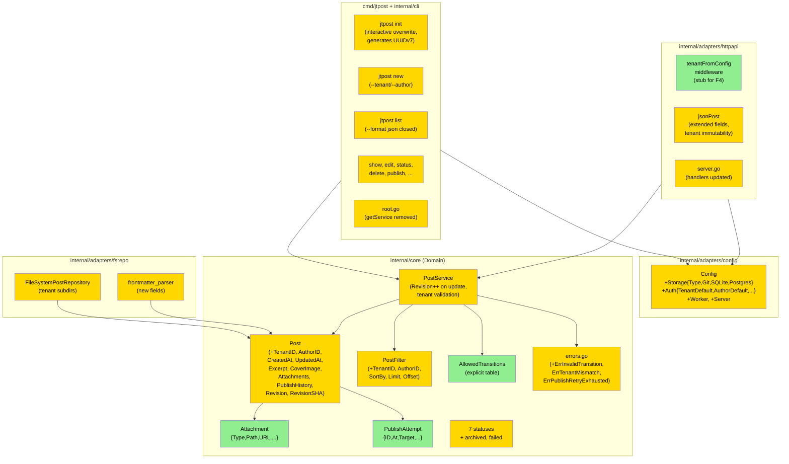
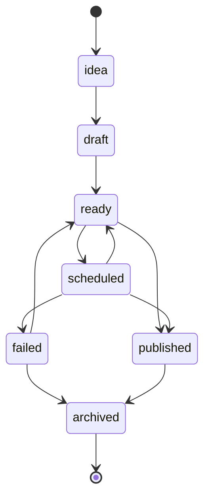
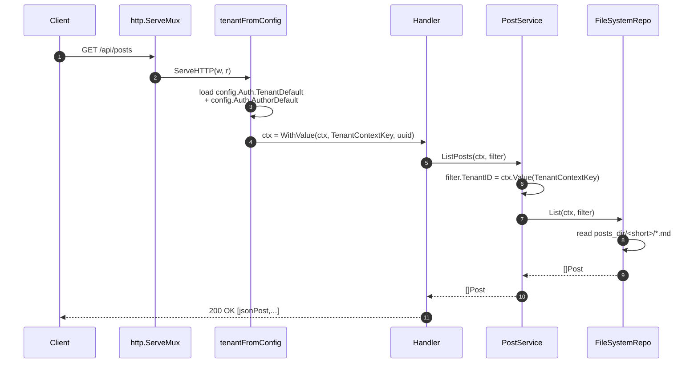

# Foundation — Domain Model & Configuration (F1) — Design

**Status:** Draft
**Author:** Claude (Opus 4.7) + Mikhail Savin
**Date:** 2026-05-06
**Feature:** foundation-domain-config (F1)
**Branch:** `feature/foundation-domain-config`

---

## 2.1 Overview

F1 расширяет доменное ядро (`internal/core`), все адаптеры, читающие/пишущие `Post` (`fsrepo`, `httpapi`), CLI и схему конфигурации. Логически фича делится на 6 параллельных, но топологически упорядоченных частей:

1. **Domain core** — расширение типов `Post`, `PostFilter`, новые типы `Attachment`, `PublishAttempt`, новые статусы и `AllowedTransitions`, новые ошибки.
2. **Service layer** — координация инкремента `Revision`, валидация `TenantID`/`AuthorID`, проверка `tenant_id` immutability, добавление записей в `PublishHistory`.
3. **Configuration** — новые секции `storage`, `auth`, `worker`, `server` в `internal/adapters/config`; интерактивный `jtpost init` с подтверждением.
4. **FS repository** — подкаталоги `<posts_dir>/<tenant_short_id>/<slug>.md`, расширенный YAML frontmatter, валидация tenant scope из `context.Context`.
5. **HTTP API** — middleware `tenantFromConfig` (заглушка под F4), обновлённый `jsonPost`, enforcement tenant immutability на PATCH.
6. **CLI** — `list --format json` (закрытие TODO), `new --tenant/--author`, `init --force` и интерактивное подтверждение, удаление legacy `getService`.

---

## 2.2 Architecture

### Слоистая диаграмма (после F1)



### Жизненный цикл статусов (новая модель)



### Поток `tenant_id` через слои (HTTP-режим)



### Implementation order

1. **Core domain types** (`post.go`, `core.go`, `errors.go`) — без них ничего не компилируется.
2. **Service layer** (`service.go`) — координирует Revision, валидацию.
3. **Config** (`config.go` + новый `config_test.go`) — `jtpost init` зависит от схемы.
4. **fsrepo + frontmatter_parser** — переход на подкаталоги, новые поля.
5. **httpapi** (`middleware.go`, `server.go`) — middleware, jsonPost.
6. **CLI** (`init.go`, `new.go`, `list.go`, `root.go`) — последний слой.
7. **testdata + tests update** — замыкаем зелёный test suite.

---

## 2.3 Components and Interfaces

### Files Requiring Changes

| File | Change Type | Description |
|------|-------------|-------------|
| `internal/core/post.go` | `[MODIFIED]` | Расширение `Post` (10→18 полей), `PostFilter` (3→9 полей), `ExternalLinks` без изменений. Добавление `Attachment`, `AttachmentType`, `PublishAttempt`. Добавление метода `Post.TenantShortID() string`. |
| `internal/core/core.go` | `[MODIFIED]` | Добавление `StatusArchived`, `StatusFailed`. Замена `StatusOrder` на `AllowedTransitions map[PostStatus][]PostStatus` (приватная) и публичной функции `IsTransitionAllowed(from, to PostStatus) bool`. |
| `internal/core/errors.go` | `[MODIFIED]` | Добавление `ErrInvalidTransition`, `ErrTenantMismatch`, `ErrPublishRetryExhausted`. Переписывание `IsStatusTransitionValid` через `AllowedTransitions`. |
| `internal/core/service.go` | `[MODIFIED]` | `CreatePost` устанавливает `CreatedAt`, `UpdatedAt`, `Revision=1`, валидирует `TenantID`/`AuthorID`. `UpdatePost` инкрементирует `Revision`, проверяет tenant immutability. Новые методы `Archive`, `MarkFailed`. |
| `internal/core/repository.go` | `[MODIFIED]` | Контракт `List` теперь требует `filter.TenantID`. Добавление в `PostFilter` полей сортировки и пагинации. |
| `internal/core/post_test.go` | `[NEW]` | Тесты для `Post.TenantShortID()`, `Attachment` сериализации, `PublishAttempt`, валидации (см. §2.8). |
| `internal/core/core_test.go` | `[MODIFIED]` | Перепись таблицы кейсов под `IsTransitionAllowed`; покрытие всех новых переходов и негативов. |
| `internal/core/service_test.go` | `[MODIFIED]` | Покрытие Revision++, tenant validation, новых методов Archive/MarkFailed. |
| `internal/adapters/config/config.go` | `[MODIFIED]` | Новые подструктуры `StorageConfig`, `GitStorageConfig`, `PostgresConfig`, `AuthConfig`, `OAuthConfig`, `WorkerConfig`, `ServerConfig`. Расширение `Validate`, `BindEnv`, `SetDefault`. |
| `internal/adapters/config/config_test.go` | `[NEW]` | Тесты загрузки/дефолтов/env-overrides/валидации. |
| `internal/adapters/fsrepo/repository.go` | `[MODIFIED]` | Подкаталоги по `tenant_short_id`, использование `ctx` для tenant scope, обработка `PostFilter.TenantID`/`SortBy`/`Limit`/`Offset`. |
| `internal/adapters/fsrepo/frontmatter_parser.go` | `[MODIFIED]` | Сериализация/десериализация новых полей; валидация обязательных полей frontmatter. |
| `internal/adapters/fsrepo/repository_test.go` | `[MODIFIED]` | Обновление под новые поля + tenant subdirs. |
| `internal/adapters/fsrepo/frontmatter_parser_test.go` | `[MODIFIED]` | Покрытие сериализации Attachment, PublishHistory (truncation до 10), CoverImage. |
| `internal/adapters/httpapi/middleware.go` | `[MODIFIED]` | Добавление `tenantFromConfig(cfg)` middleware. Объявление `TenantContextKey`, `AuthorContextKey`. |
| `internal/adapters/httpapi/server.go` | `[MODIFIED]` | Расширение `jsonPost`, конвертеры `postToJSON`/`jsonToPost`, валидация tenant immutability в PATCH. Регистрация middleware в `New`. |
| `internal/adapters/httpapi/server_test.go` | `[MODIFIED]` | Покрытие новых полей в JSON, 403 при mismatch tenant, 400 при попытке менять tenant_id через PATCH. |
| `internal/cli/root.go` | `[MODIFIED]` | Удаление функции `getService` (REQ-9.3). Загрузка конфига через `LoadWithDefaults`. |
| `internal/cli/init.go` | `[MODIFIED]` | Интерактивный prompt overwrite + `--force`; генерация `tenant_default`/`author_default` UUIDv7; коллизионная проверка `tenant_short_id`. |
| `internal/cli/new.go` | `[MODIFIED]` | Установка `TenantID`/`AuthorID` из конфига, поддержка `--tenant`/`--author` флагов. |
| `internal/cli/list.go` | `[MODIFIED]` | Реализация JSON-вывода (REQ-9.1). |
| `internal/cli/list_test.go` | `[MODIFIED]` | Покрытие JSON-формата (включая пустой результат → `[]`). |
| `testdata/posts/*.md` | `[MODIFIED]` | Добавление обязательных полей frontmatter в 5 фикстур. |
| `.jtpost.example.yaml` | `[MODIFIED]` | Полный пример со всеми новыми секциями (закомментированы части под F2–F8). |
| `internal/adapters/sqlite/*` | `[MODIFIED]` | Минимальная адаптация: схема таблицы `posts` получает колонки `tenant_id`, `author_id`, `created_at`, `updated_at`, `revision`. Полная функциональность — F2. |

### Files NOT Requiring Changes

| File | Reason Unchanged |
|------|------------------|
| `cmd/jtpost/main.go` | Точка входа не зависит от расширения модели; cobra-tree не меняется. |
| `internal/core/clock.go` | Интерфейс `Clock` уже подходит. |
| `internal/core/slug.go` | Slug-генерация не зависит от tenant/author. |
| `internal/core/publisher.go` | Контракт `Publisher` сохраняется. Изменения publisher'а — F7. |
| `internal/adapters/telegram/publisher.go` | Внутри в F1 не трогаем. F7 добавит Attachments/MessageID. |
| `internal/adapters/telegramconv/converter.go` | Markdown→HTML конвертация изолирована. |
| `internal/logger/logger.go` | Логгер уже структурированный, новых API не требуется. |
| `internal/cli/show.go`, `edit.go`, `delete.go`, `status.go`, `publish.go`, `plan.go`, `stats.go`, `next.go`, `import.go`, `migrate.go`, `migrate_ids.go`, `doctor.go`, `serve.go` | Адаптируются автоматически через сервисный слой; явные изменения этих команд (auth login, worker, search, archive, export) — последующие фичи F4–F12. |
| `.golangci.yaml`, `.goreleaser.yaml`, `Taskfile.yml`, `.github/workflows/*.yml` | CI/lint конфиг не меняется в F1. |
| `docs/*.md` | Документация обновляется в F11; в F1 только CHANGELOG в готовности к финальному обновлению. |

### Ключевые сигнатуры (signature only)

```go
// internal/core/post.go
type Post struct { /* см. §2.5 */ }
func (p Post) TenantShortID() string

type PostFilter struct { /* см. §2.5 */ }
type Attachment struct { /* см. §2.5 */ }
type AttachmentType string
type PublishAttempt struct { /* см. §2.5 */ }

// internal/core/core.go
const (
    StatusIdea, StatusDraft, StatusReady,
    StatusScheduled, StatusPublished,
    StatusArchived, StatusFailed PostStatus
)
func IsTransitionAllowed(from, to PostStatus) bool
func AllStatuses() []PostStatus

// internal/core/errors.go
var (
    ErrInvalidTransition       error
    ErrTenantMismatch          error
    ErrPublishRetryExhausted   error
)
// сохранён старый IsStatusTransitionValid как алиас IsTransitionAllowed (deprecated)

// internal/core/service.go
type PostService interface {
    CreatePost(ctx context.Context, in CreatePostInput) (*Post, error)
    UpdatePost(ctx context.Context, post *Post) (*Post, error)
    UpdateStatus(ctx context.Context, id PostID, newStatus PostStatus) (*Post, error)
    Archive(ctx context.Context, id PostID) (*Post, error)
    MarkFailed(ctx context.Context, id PostID, err string) (*Post, error)
    AppendPublishAttempt(ctx context.Context, id PostID, attempt PublishAttempt) error
    GetByID(ctx context.Context, id PostID) (*Post, error)
    List(ctx context.Context, filter PostFilter) ([]*Post, error)
    Delete(ctx context.Context, id PostID) error
}

// internal/adapters/httpapi/middleware.go
type ctxKey int
const (
    TenantContextKey ctxKey = iota
    AuthorContextKey
)
func TenantFromContext(ctx context.Context) (uuid.UUID, bool)
func AuthorFromContext(ctx context.Context) (uuid.UUID, bool)
func TenantFromConfigMiddleware(cfg *config.Config) func(http.Handler) http.Handler

// internal/adapters/config/config.go (см. §2.5 для полей)
type Config struct { /* … */ }
func Load(path string) (*Config, error)
func LoadWithDefaults(path string) (*Config, error)
func (c *Config) Save(path string) error
func (c *Config) Validate() error
```

---

## 2.4 Key Decisions (ADR)

### ADR-1. `tenant_id` доставляется через `context.Context`, не через структуру/header

**Context.** REQ-7.3 и REQ-8.1 требуют, чтобы репозиторий «знал» текущий tenant scope. Альтернативы: (a) хранить в `*http.Request.Header`, (b) передавать как параметр функции, (c) использовать `context.Context` value.

**Options considered:**
- `(a)` Header — работает только для HTTP, CLI пришлось бы фейкать заголовки.
- `(b)` Параметр функции — explicit, но засоряет все сигнатуры репозитория.
- `(c)` `context.Context` value с типизированным ключом и helper-функциями.

**Decision.** `context.Context` value через типизированный `ctxKey` и helper-функции `TenantFromContext` / `AuthorFromContext`.

**Rationale.** Идиоматический Go-паттерн (golang.org/pkg/context). Работает одинаково для HTTP, CLI, worker. `context.Context` уже передаётся во все методы репозитория. Helper-функции защищают от прямого `context.WithValue` с произвольным ключом.

**Consequences.** Антипаттерн «business data in context» смягчён тем, что `tenant_id` — это **scope** (как requestID, deadline), а не business value. Документируем правило: **только** scope-данные (tenant, author, request_id, trace_id) допустимы в context.

### ADR-2. `AllowedTransitions` — приватная переменная, доступ через функцию

**Context.** REQ-3.2 требует явной таблицы переходов. Open Question 3 спрашивает: публичная переменная или функция?

**Options considered:**
- `(a)` Публичная `var AllowedTransitions = map[...][]...` — просто, но мутабельна (тесты могут случайно её менять).
- `(b)` `func AllowedTransitions() map[...][]...` — возвращает копию, неизменна, но overhead на каждый вызов.
- `(c)` Приватная `var allowedTransitions` + публичная `func IsTransitionAllowed(from, to)` без экспорта самой карты.

**Decision.** `(c)` — приватная карта + публичная функция-предикат `IsTransitionAllowed`.

**Rationale.** Минимальная поверхность API; нет соблазна мутировать таблицу из тестов; нет overhead'а копирования. Если когда-нибудь понадобится перечислить все валидные переходы — добавим `func ValidTransitionsFrom(s PostStatus) []PostStatus`.

**Consequences.** `IsStatusTransitionValid` (старое имя) остаётся как deprecated alias на одну версию (для совместимости с любыми внешними импортами). Удаление — в F11.

### ADR-3. `Revision` инкрементируется в сервисе, не в репозитории

**Context.** REQ-1.4 требует ++Revision на каждом Update. Open Question 4: где это делать?

**Options considered:**
- `(a)` В репозитории (SQL trigger / FS write logic).
- `(b)` В сервисе.
- `(c)` В обоих (ремни и подтяжки).

**Decision.** `(b)` — в `PostService.UpdatePost`.

**Rationale.** Single source of truth. Тестируется без БД (mock-репозиторий). Одинаковая логика для FS/SQLite/Postgres без дублирования. Repository остаётся «глупым» CRUD-слоем.

**Consequences.** Concurrent updates возможны: два параллельных `UpdatePost` могут установить одинаковый `Revision`. F1 принимает это как known issue (single-user сценарий). Полная concurrency-safety — F2 (Postgres `UPDATE ... WHERE revision = ?` optimistic locking) и F4 (auth + locking).

### ADR-4. `Attachment.Path` — относительный путь от `posts_dir`

**Context.** REQ-2.3, Open Question 5. Абсолютный или относительный?

**Options considered:**
- `(a)` Абсолютный — однозначность, но непортативно (контейнеры, переезд).
- `(b)` Относительный от `posts_dir`.
- `(c)` URL-схема `file://...` или `cdn://...`.

**Decision.** `(b)` относительный от `posts_dir` (для FS-режима). Поле `URL` (тоже в `Attachment`) хранит результат загрузки на CDN/Telegram (заполняется в F7).

**Rationale.** Портативность между машинами и контейнерами. Совместимо с git-режимом (F3). Единый паттерн с YAML-фронтматтером, где пути уже относительные.

**Consequences.** При запросе физического файла нужен `filepath.Join(posts_dir, attachment.Path)`. Это реализуется хелпером `Attachment.AbsolutePath(postsDir string) string`. Безопасность: validation пути на отсутствие `..` и абсолютных префиксов.

### ADR-5. `PublishAttempt.ResponsePayload` — `json.RawMessage` inline в YAML

**Context.** REQ-2.4 определяет `ResponsePayload` как `json.RawMessage`. Open Question 2: как сериализовать в YAML frontmatter?

**Options considered:**
- `(a)` Inline JSON в YAML-строке.
- `(b)` Base64-encoded строка.
- `(c)` Отдельный файл `<slug>.responses.yaml` рядом.

**Decision.** `(a)` inline JSON, обёрнут в block scalar (`|-`) для читаемости.

**Rationale.** Читаемость (можно открыть .md и понять, что Telegram ответил). YAML поддерживает встроенные блоки. JSON-данные обычно небольшие (сотни байт).

**Consequences.** Если ответ очень большой (гипотетически больше 64KB), frontmatter раздуется. Mitigation: `PublishHistory` ограничено последними 10 (REQ-2.5), плюс сервис может truncating-сериализовать `ResponsePayload` до 4KB с пометкой `"...truncated"`.

### ADR-6. Конфиг `defaults.platforms` сохраняется как deprecated, без warning

**Context.** REQ-5.11. Пользователь решил оставить под будущие platform extensions (Q10).

**Decision.** Поле сохраняется в структуре `Config`, в `.jtpost.example.yaml` помечено комментарием `# reserved for future platform extensions (e.g. VK, Mastodon)`. Warning при загрузке **не выдаётся**.

**Rationale.** Поле legitimate под будущее использование. Warning сейчас бессмыслен.

**Consequences.** Если пользователь использует это поле сегодня — оно не делает ничего. Документация явно укажет «reserved».

### ADR-7. (Versioning & Backward Compatibility)

Фича меняет публичные контракты: схему конфига, JSON HTTP API, формат frontmatter в FS-репозитории.

**Versioning strategy.**
- Конфиг: новые поля имеют дефолты в `loadFromFile`. Старый `.jtpost.yaml` (без секций `storage`/`auth`/`worker`/`server`) продолжит работать с дефолтными значениями. **Не семантическое версионирование конфига** — миграция не нужна, добавление полей обратно совместимо.
- HTTP API: `jsonPost` получает новые поля. Существующие потребители (Web UI) не ломаются: новые поля игнорируются клиентом. Удалённых полей нет. **Не bump major API version**.
- FS frontmatter: REQ-7.5 требует обязательных полей `tenant_id`, `author_id`, `created_at`, `updated_at`, `revision`. По решению M1 — старых данных нет, поэтому миграции данных не требуется. `testdata/posts/*.md` пересоздаются.
- SQLite: схема расширяется новыми колонками. F1 не пишет миграцию (полная реализация в F2 через `goose`). Если у пользователя уже есть `.jtpost.db`, при первом запуске после F1 будет ошибка отсутствия колонок — пользователю предлагается удалить БД (`rm .jtpost.db`) и запустить `jtpost init` заново. F2 принесёт `goose` миграции.

**Breaking change assessment.**
- Старые посты в FS без `tenant_id` ломаются (REQ-7.5). M1 это разрешает.
- Старая SQLite-БД без новых колонок ломается. F1 принимает — рекомендация в `CHANGELOG`.
- Старый `.jtpost.yaml` без новых секций **не ломается** благодаря дефолтам в viper.

**Migration path.**
- Для пользователей: сделать `jtpost init --force` для регенерации конфига, при наличии SQLite — удалить БД.
- Для разработчиков (тесты): обновить `testdata/posts/*.md`.

---

## 2.5 Data Models

```go
// [NEW] Тип медиа-вложения
type AttachmentType string

const (
    AttachmentTypePhoto    AttachmentType = "photo"
    AttachmentTypeVideo    AttachmentType = "video"
    AttachmentTypeDocument AttachmentType = "document"
    AttachmentTypeAudio    AttachmentType = "audio"
)

// [NEW] Медиа-вложение, прикрепляемое к Post
type Attachment struct {
    ID       uuid.UUID      `yaml:"id" json:"id"`
    Type     AttachmentType `yaml:"type" json:"type"`
    Path     string         `yaml:"path,omitempty" json:"path,omitempty"`         // относительно posts_dir
    URL      string         `yaml:"url,omitempty" json:"url,omitempty"`           // после загрузки (CDN/Telegram)
    Caption  string         `yaml:"caption,omitempty" json:"caption,omitempty"`
    MimeType string         `yaml:"mime_type,omitempty" json:"mime_type,omitempty"`
    Size     int64          `yaml:"size,omitempty" json:"size,omitempty"`         // bytes
}

// [NEW] Запись попытки публикации
type PublishAttempt struct {
    ID              uuid.UUID       `yaml:"id" json:"id"`
    At              time.Time       `yaml:"at" json:"at"`
    Target          string          `yaml:"target" json:"target"`                       // "telegram", "vk", ...
    Status          string          `yaml:"status" json:"status"`                       // "success" | "failed"
    MessageID       string          `yaml:"message_id,omitempty" json:"message_id,omitempty"`
    ResponsePayload json.RawMessage `yaml:"response_payload,omitempty" json:"response_payload,omitempty"`
    Error           string          `yaml:"error,omitempty" json:"error,omitempty"`
    RetryAttempt    int             `yaml:"retry_attempt" json:"retry_attempt"`
    Duration        time.Duration   `yaml:"duration" json:"duration"`
}

// [MODIFIED] Расширенный Post
type Post struct {
    // Обязательные (всегда сериализуются)
    ID         PostID    `yaml:"id" json:"id"`
    TenantID   uuid.UUID `yaml:"tenant_id" json:"tenant_id"`        // [NEW] обязательное
    AuthorID   uuid.UUID `yaml:"author_id" json:"author_id"`        // [NEW] обязательное
    Title      string    `yaml:"title" json:"title"`
    Slug       string    `yaml:"slug" json:"slug"`
    Status     PostStatus `yaml:"status" json:"status"`
    CreatedAt  time.Time `yaml:"created_at" json:"created_at"`      // [NEW] обязательное
    UpdatedAt  time.Time `yaml:"updated_at" json:"updated_at"`      // [NEW] обязательное
    Revision   int       `yaml:"revision" json:"revision"`          // [NEW] обязательное

    // Опциональные
    Tags           []string         `yaml:"tags,omitempty" json:"tags,omitempty"`
    Deadline       *time.Time       `yaml:"deadline,omitempty" json:"deadline,omitempty"`
    ScheduledAt    *time.Time       `yaml:"scheduled_at,omitempty" json:"scheduled_at,omitempty"`
    PublishedAt    *time.Time       `yaml:"published_at,omitempty" json:"published_at,omitempty"`
    Excerpt        *string          `yaml:"excerpt,omitempty" json:"excerpt,omitempty"`            // [NEW]
    CoverImage     *Attachment      `yaml:"cover_image,omitempty" json:"cover_image,omitempty"`    // [NEW]
    Attachments    []Attachment     `yaml:"attachments,omitempty" json:"attachments,omitempty"`    // [NEW]
    PublishHistory []PublishAttempt `yaml:"publish_history,omitempty" json:"publish_history,omitempty"` // [NEW] truncated to 10 in FS
    RevisionSHA    *string          `yaml:"revision_sha,omitempty" json:"revision_sha,omitempty"`  // [NEW] only in git mode
    Content        string           `yaml:"-" json:"content"`
    External       ExternalLinks    `yaml:"external,omitempty" json:"external,omitempty"`
}

// [NEW] Метод
func (p Post) TenantShortID() string // первые 8 hex-символов TenantID без дефисов

// [MODIFIED] PostFilter
type PostFilter struct {
    TenantID   uuid.UUID    // [NEW] обязательное
    AuthorID   *uuid.UUID   // [NEW] опциональное
    Statuses   []PostStatus
    Tags       []string
    Search     string
    SortBy     string       // [NEW] "created_at"|"updated_at"|"deadline"|"scheduled_at"|"title"|"status"
    SortOrder  string       // [NEW] "asc"|"desc", default "asc"
    Limit      int          // [NEW] 0 = no limit
    Offset     int          // [NEW]
}

// [MODIFIED] CreatePostInput
type CreatePostInput struct {
    TenantID uuid.UUID  // [NEW] обязательное
    AuthorID uuid.UUID  // [NEW] обязательное
    Title    string
    Tags     []string
    Slug     string     // optional
    Excerpt  *string    // [NEW] optional
}

// [MODIFIED] core.go — статусы
const (
    StatusIdea      PostStatus = "idea"
    StatusDraft     PostStatus = "draft"
    StatusReady     PostStatus = "ready"
    StatusScheduled PostStatus = "scheduled"
    StatusPublished PostStatus = "published"
    StatusArchived  PostStatus = "archived" // [NEW]
    StatusFailed    PostStatus = "failed"   // [NEW]
)

// [REMOVED: StatusOrder] — больше не используется
// [NEW] Приватная таблица переходов
var allowedTransitions = map[PostStatus][]PostStatus{
    StatusIdea:      {StatusDraft},
    StatusDraft:     {StatusReady},
    StatusReady:     {StatusScheduled, StatusPublished},
    StatusScheduled: {StatusPublished, StatusReady, StatusFailed},
    StatusFailed:    {StatusReady, StatusArchived},
    StatusPublished: {StatusArchived},
    StatusArchived:  {},
}
```

```go
// internal/adapters/config/config.go
type Config struct {
    PostsDir     string         `yaml:"posts_dir" mapstructure:"posts_dir"`
    TemplatesDir string         `yaml:"templates_dir" mapstructure:"templates_dir"`
    Telegram     TelegramConfig `yaml:"telegram" mapstructure:"telegram"`
    Storage      StorageConfig  `yaml:"storage" mapstructure:"storage"`     // [NEW]
    Auth         AuthConfig     `yaml:"auth" mapstructure:"auth"`           // [NEW]
    Worker       WorkerConfig   `yaml:"worker" mapstructure:"worker"`       // [NEW]
    Server       ServerConfig   `yaml:"server" mapstructure:"server"`       // [NEW]
    Defaults     DefaultConfig  `yaml:"defaults" mapstructure:"defaults"`   // оставлено
    SQLite       SQLiteConfig   `yaml:"sqlite,omitempty" mapstructure:"sqlite"` // [DEPRECATED, used only if Storage.Type empty for backward compat]
}

// [NEW]
type StorageConfig struct {
    Type     string           `yaml:"type" mapstructure:"type"` // "fs"|"sqlite"|"postgres"
    Git      GitStorageConfig `yaml:"git" mapstructure:"git"`
    SQLite   SQLiteConfig     `yaml:"sqlite" mapstructure:"sqlite"`
    Postgres PostgresConfig   `yaml:"postgres" mapstructure:"postgres"`
}

// [NEW]
type GitStorageConfig struct {
    Enabled        bool   `yaml:"enabled" mapstructure:"enabled"`
    AutoCommit     bool   `yaml:"auto_commit" mapstructure:"auto_commit"`
    AutoPush       bool   `yaml:"auto_push" mapstructure:"auto_push"`
    Remote         string `yaml:"remote" mapstructure:"remote"`
    Branch         string `yaml:"branch" mapstructure:"branch"`
    CommitTemplate string `yaml:"commit_template" mapstructure:"commit_template"`
}

// [NEW]
type PostgresConfig struct {
    DSN             string        `yaml:"dsn" mapstructure:"dsn"`
    MaxOpenConns    int           `yaml:"max_open_conns" mapstructure:"max_open_conns"`
    MaxIdleConns    int           `yaml:"max_idle_conns" mapstructure:"max_idle_conns"`
    ConnMaxLifetime time.Duration `yaml:"conn_max_lifetime" mapstructure:"conn_max_lifetime"`
}

// [NEW]
type AuthConfig struct {
    Type          string        `yaml:"type" mapstructure:"type"`            // "none"|"basic"|"oauth"|"token"
    Secret        string        `yaml:"secret" mapstructure:"secret"`        // for JWT (F4)
    TenantDefault uuid.UUID     `yaml:"tenant_default" mapstructure:"tenant_default"`
    AuthorDefault uuid.UUID     `yaml:"author_default" mapstructure:"author_default"`
    OAuth         OAuthConfig   `yaml:"oauth" mapstructure:"oauth"`
    TokenTTL      time.Duration `yaml:"token_ttl" mapstructure:"token_ttl"`
}

// [NEW]
type OAuthConfig struct {
    Provider     string `yaml:"provider" mapstructure:"provider"` // "github"|"google"
    ClientID     string `yaml:"client_id" mapstructure:"client_id"`
    ClientSecret string `yaml:"client_secret" mapstructure:"client_secret"`
    RedirectURL  string `yaml:"redirect_url" mapstructure:"redirect_url"`
}

// [NEW]
type WorkerConfig struct {
    Enabled      bool          `yaml:"enabled" mapstructure:"enabled"`
    Interval     time.Duration `yaml:"interval" mapstructure:"interval"`
    MaxRetries   int           `yaml:"max_retries" mapstructure:"max_retries"`
    RetryBackoff time.Duration `yaml:"retry_backoff" mapstructure:"retry_backoff"`
}

// [NEW]
type ServerConfig struct {
    Addr         string        `yaml:"addr" mapstructure:"addr"`
    Port         int           `yaml:"port" mapstructure:"port"`
    BaseURL      string        `yaml:"base_url" mapstructure:"base_url"`
    ReadTimeout  time.Duration `yaml:"read_timeout" mapstructure:"read_timeout"`
    WriteTimeout time.Duration `yaml:"write_timeout" mapstructure:"write_timeout"`
}
```

---

## 2.6 Correctness Properties

### Property 1: Tenant scope isolation

```
Property 1: TenantScopeIsolation
Category: Exclusion
Statement: For all (post, repo, ctx) where post.TenantID != ctx.TenantID,
           repo.GetByID(ctx, post.ID) returns ErrNotFound and does NOT return the post.
Validates: Requirements REQ-4.6, REQ-7.3
```

### Property 2: Tenant immutability after Create

```
Property 2: TenantImmutability
Category: Absence
Statement: For all (postID, oldTenant, newTenant) where oldTenant != newTenant,
           service.UpdatePost(ctx, post{ID: postID, TenantID: newTenant}) returns ErrTenantMismatch
           and the stored post.TenantID remains oldTenant.
Validates: Requirements REQ-1.5, REQ-8.5
```

### Property 3: Revision monotonic increment

```
Property 3: RevisionMonotonic
Category: Propagation
Statement: For all sequences of N successful UpdatePost calls on the same post,
           the final post.Revision equals initial + N (initial=1 after Create).
Validates: Requirements REQ-1.3, REQ-1.4
```

### Property 4: Status transition table closure

```
Property 4: TransitionTableClosure
Category: Equivalence
Statement: For all (from, to) PostStatus pairs,
           IsTransitionAllowed(from, to) == ((from, to) ∈ allowedTransitions table from §2.5).
Validates: Requirements REQ-3.1, REQ-3.2, REQ-3.3
```

### Property 5: PublishHistory truncation in FS

```
Property 5: PublishHistoryTruncation
Category: Absence
Statement: For all posts serialized to FS frontmatter,
           the serialized PublishHistory has length ≤ 10 AND contains the most recent entries by `At` desc.
Validates: Requirements REQ-2.5
```

### Property 6: Post serialization round-trip

```
Property 6: PostRoundTrip
Category: Round-trip
Statement: For all valid Post p, ParsePost(SerializePost(p)) returns p' where
           p' equals p in all required fields (ID, TenantID, AuthorID, Title, Slug, Status,
           CreatedAt, UpdatedAt, Revision) and in all set optional fields.
Validates: Requirements REQ-2.1, REQ-2.2, REQ-2.3, REQ-2.4, REQ-7.4
```

### Property 7: Frontmatter required fields validation

```
Property 7: FrontmatterRequiredFields
Category: Absence
Statement: For all malformed frontmatter F missing any of {id, tenant_id, author_id, title, slug,
           status, created_at, updated_at, revision},
           ParsePost(F) returns ErrValidation and never returns a partial Post.
Validates: Requirements REQ-7.5
```

### Property 8: TenantShortID prefix length

```
Property 8: TenantShortIDPrefix
Category: Equivalence
Statement: For all valid uuid.UUID t, len(post.TenantShortID()) == 8 AND
           post.TenantShortID() == strings.ReplaceAll(t.String(), "-", "")[0:8].
Validates: Requirements REQ-7.6
```

### Property 9: Config defaults and env override

```
Property 9: ConfigEnvOverride
Category: Propagation
Statement: For all config keys K and values (yaml_v, env_v) where env_v is set,
           Load() returns Config with K = env_v (env > yaml).
           For all keys K not set anywhere, Load() returns Config with K = default.
Validates: Requirements REQ-5.10, REQ-5.2 (and per-section defaults REQ-5.4, 5.5, 5.8, 5.9)
```

### Property 10: Status transition validation in UpdateStatus

```
Property 10: UpdateStatusTransitionEnforcement
Category: Absence
Statement: For all (id, current, target) where IsTransitionAllowed(current, target) == false,
           service.UpdateStatus(ctx, id, target) returns ErrInvalidTransition
           and the stored post.Status remains current.
Validates: Requirements REQ-3.3
```

### Property 11: PostFilter SortBy whitelist

```
Property 11: SortByWhitelist
Category: Absence
Statement: For all filter.SortBy ∉ {"created_at","updated_at","deadline","scheduled_at","title","status"},
           service.List(ctx, filter) returns ErrValidation and does NOT execute the query.
Validates: Requirements REQ-4.3, REQ-4.4
```

### Property 12: jtpost init UUID uniqueness

```
Property 12: InitUUIDPrefixUniqueness
Category: Exclusion
Statement: For all jtpost init runs, the generated tenant_default and author_default
           never have the same TenantShortID (8-char prefix).
Validates: Requirements REQ-6.7
```

### Property 13: jtpost init non-overwriting without confirmation

```
Property 13: InitOverwriteGuard
Category: Absence
Statement: For all existing config files at path P,
           jtpost init (without --force, without 'y' answer) leaves the file at P byte-for-byte unchanged.
Validates: Requirements REQ-6.2, REQ-6.3
```

### Property 14: HTTP API tenant context enforcement

```
Property 14: APITenantEnforcement
Category: Propagation
Statement: For all HTTP requests R with body containing tenant_id != ctx.TenantID
           (extracted from middleware), the handler returns 403 with body {"error":"tenant_mismatch"}.
Validates: Requirements REQ-8.4
```

### Property 15: list --format json valid output

```
Property 15: ListJSONValid
Category: Equivalence
Statement: For all list of posts L,
           `jtpost list --format json` stdout parses as a valid JSON array of length len(L).
           If L is empty, stdout equals "[]\n" (not "null").
Validates: Requirements REQ-9.1, REQ-9.2
```

### Coverage Matrix (REQ → CP)

| REQ | CP |
|-----|-----|
| REQ-1.1, REQ-1.2 | CP-7 (validation на этапе frontmatter), плюс negative unit-tests на сервисе |
| REQ-1.3, REQ-1.4 | CP-3 |
| REQ-1.5 | CP-2 |
| REQ-2.1, REQ-2.2, REQ-2.3, REQ-2.4 | CP-6 |
| REQ-2.5 | CP-5 |
| REQ-2.6 | CP-6 (Revision/RevisionSHA included) |
| REQ-2.7 | CP-7 (AttachmentType validation falls under required-fields-style validation) |
| REQ-3.1, REQ-3.2, REQ-3.3 | CP-4, CP-10 |
| REQ-3.4 | unit test (см. §2.8) |
| REQ-3.5 | unit test |
| REQ-4.1 | CP-1 (tenant scope isolation enforces filter.TenantID требование) + unit test |
| REQ-4.2 | unit test |
| REQ-4.3, REQ-4.4 | CP-11 |
| REQ-4.5 | unit test (limit/offset boundary) |
| REQ-4.6 | CP-1 |
| REQ-5.1, REQ-5.2, REQ-5.4, REQ-5.5, REQ-5.8, REQ-5.9, REQ-5.10 | CP-9 |
| REQ-5.3 | unit test (validate negative) |
| REQ-5.6, REQ-5.7 | unit test |
| REQ-5.11 | unit test (config preserves defaults.platforms) |
| REQ-5.12 | unit test (Validate fails if tenant_default/author_default zero) |
| REQ-6.1, REQ-6.4, REQ-6.5, REQ-6.6 | unit test |
| REQ-6.2, REQ-6.3 | CP-13 |
| REQ-6.7 | CP-12 |
| REQ-7.1, REQ-7.2 | unit test (file located in tenant subdir) |
| REQ-7.3 | CP-1 |
| REQ-7.4 | CP-6 |
| REQ-7.5 | CP-7 |
| REQ-7.6 | CP-8 |
| REQ-8.1, REQ-8.2 | unit test (middleware integration) |
| REQ-8.3 | CP-6 (jsonPost mirrors Post struct) |
| REQ-8.4 | CP-14 |
| REQ-8.5 | CP-2 (tenant immutability) |
| REQ-9.1, REQ-9.2 | CP-15 |
| REQ-9.3 | unit test (compile check; build verifies absence) |
| REQ-9.4, REQ-9.5, REQ-9.6 | unit test |
| REQ-10.1, REQ-10.2, REQ-10.3 | meta — ensured by entire test suite + new config_test.go |

Все REQ покрыты как минимум одним CP или unit test.

---

## 2.7 Error Handling

| Scenario | Detection | Action |
|----------|-----------|--------|
| `Create` с пустым `TenantID` | Сервис проверяет `post.TenantID == uuid.Nil` | Возврат `ErrValidation` (с сообщением `"tenant_id required"`); не вызывать репозиторий |
| `Create` с пустым `AuthorID` | Сервис проверяет `post.AuthorID == uuid.Nil` | Возврат `ErrValidation` (`"author_id required"`) |
| `Update` с другим `TenantID` | Сервис сравнивает `post.TenantID` со старым `(repo.GetByID).TenantID` | Возврат `ErrTenantMismatch`; не вызывать `repo.Update` |
| `GetByID` чужого tenant'а | Репозиторий после загрузки сравнивает с `ctx.TenantID` | Возврат `ErrNotFound` (не утечка факта существования) |
| Невалидный переход статуса | `UpdateStatus` вызывает `IsTransitionAllowed`, получает `false` | Возврат `ErrInvalidTransition`; не пишет в репозиторий |
| Невалидный `SortBy` | Сервис проверяет against whitelist | Возврат `ErrValidation` |
| Невалидный `AttachmentType` | Парсер frontmatter / JSON unmarshaller | Возврат `ErrValidation` со списком допустимых значений |
| Неполный frontmatter (отсутствует `tenant_id` и т.д.) | `ParsePost` после yaml.Unmarshal проверяет обязательные поля | Возврат `ErrValidation`; никогда — частичный `Post` |
| `Validate()` конфига: zero `tenant_default`/`author_default` | `Validate()` сравнивает с `uuid.Nil` | Возврат `ErrConfigInvalid` с указанием поля |
| `Validate()` конфига: невалидный `storage.type` | Switch по строке | Возврат `ErrConfigInvalid` |
| `jtpost init` при существующем файле, отказ пользователя | Проверка stdin response не начинается с `y/Y` | Запись «Aborted» в stderr; exit 0 (не error) |
| Коллизия `tenant_short_id == author_short_id` при `init` | Проверка после генерации обоих UUID | Регенерация `author_default` до получения уникального префикса (REQ-6.7); при невозможности после 10 попыток — log warning и продолжить (вероятность ничтожна) |
| Неуспешная попытка публикации | Worker / `publish` команда (F6/F7) | Добавление `PublishAttempt{Status:"failed", Error: ...}` в `PublishHistory`; перевод статуса в `failed` после исчерпания retries (`ErrPublishRetryExhausted`) |
| Concurrent `UpdatePost` (race на Revision) | Не детектится в F1 (single-user) | Known issue, документируется в CHANGELOG; F2 добавит optimistic locking |
| `PostFilter.TenantID == uuid.Nil` | Репозиторий проверяет в начале `List` | Возврат `ErrValidation` (`"tenant_id required in filter"`) |
| HTTP PATCH с попыткой смены `tenant_id` | Хендлер парсит body, сравнивает с tenant из контекста | HTTP 400 `{"error":"tenant_id_immutable"}` |
| HTTP request с body.tenant_id != ctx.TenantID | Хендлер сравнивает | HTTP 403 `{"error":"tenant_mismatch"}` |
| FS: подкаталог tenant'а не существует при `List` | `os.ReadDir` возвращает `os.ErrNotExist` | Не ошибка: возврат пустого списка (тенант ещё не создал ни одного поста) |
| FS: путь `Attachment.Path` содержит `..` или абсолютный префикс | Хелпер `Attachment.AbsolutePath` валидирует через `filepath.Clean` + `strings.HasPrefix` | Возврат `ErrValidation` (`"unsafe attachment path"`) |
| `PublishAttempt.ResponsePayload` > 4KB | Сервис truncating перед сериализацией | Замена на `{"truncated": true, "size": N}` в `ResponsePayload` |

---

## 2.8 Testing Strategy

### Test Style Source

**Test Style Source:** Tier 2 — adjacent test files
- Evidence: `internal/core/core_test.go`, `internal/core/slug_test.go`, `internal/adapters/fsrepo/repository_test.go`, `internal/adapters/httpapi/server_test.go` — все используют стандартный `testing` пакет, table-driven tests со структурой `tests := []struct{ name, input, expected }`, `t.Run(tt.name, ...)`.
- Key patterns to follow:
  - Один тестовый файл рядом с production-файлом (`_test.go` суффикс).
  - Table-driven tests с именованными кейсами.
  - Стандартный `testing.T`, без сторонних assertion-библиотек.
  - Хелперы в `test_helpers_test.go` (как в `fsrepo/`).
  - Никаких mock-фреймворков — ручные test doubles (например, `fakeClock` имплементирующий `core.Clock`).
- **PBT unavailable** — нет `github.com/leanovate/gopter`, `pgregory.net/rapid` или подобной библиотеки в `go.mod`. Substitute: targeted unit tests, тагать `Property/<N>`, как указано в §2.6.

### Project Commands

| Action   | Command              |
|----------|----------------------|
| Test     | `task test`          |
| Build    | `task build`         |
| Lint     | `task lint`          |
| Race     | `task test:race`     |
| Coverage | `task test:coverage` |
| Generate | (n/a in F1)          |

### Unit Tests

| Test | Description | Tags |
|------|-------------|------|
| `TestPost_TenantShortID` | Проверка длины 8 и совпадения с первыми 8 hex-символами UUID без дефисов. | `Feature/post`, `Property/8` |
| `TestPostFilter_RequiresTenantID` | `List` возвращает `ErrValidation` если `filter.TenantID == uuid.Nil`. | `Feature/filter` |
| `TestPostFilter_AuthorIDFilter` | `List` фильтрует по `AuthorID`, если задан. | `Feature/filter` |
| `TestPostFilter_SortByLimitOffset` | `SortBy` с допустимыми значениями работает; невалидные → `ErrValidation`; `Limit`/`Offset` ограничивают результат. | `Feature/filter`, `Property/11` |
| `TestService_CreatePost_SetsAudit` | После Create `CreatedAt == UpdatedAt == clock.Now()`, `Revision == 1`. | `Feature/service`, `Property/3` |
| `TestService_UpdatePost_IncrementsRevision` | После N Update `Revision == 1+N`, `UpdatedAt` обновляется, `CreatedAt` не меняется. | `Feature/service`, `Property/3` |
| `TestService_UpdatePost_TenantImmutable` | Update с другим TenantID → `ErrTenantMismatch`, БД не меняется. | `Feature/service`, `Property/2` |
| `TestService_CreatePost_RequiresTenantAndAuthor` | Create с zero TenantID или AuthorID → `ErrValidation`. | `Feature/service` |
| `TestService_UpdateStatus_AllAllowed` | Все 10 разрешённых переходов из таблицы — успешно меняют статус. | `Feature/status`, `Property/4` |
| `TestService_UpdateStatus_DisallowedRejected` | Все недопустимые переходы (полный декартов перебор минус allowed) → `ErrInvalidTransition`. | `Feature/status`, `Property/4`, `Property/10` |
| `TestService_UpdateStatus_PublishedSetsPublishedAt` | Переход в `published` устанавливает `PublishedAt = clock.Now()`. | `Feature/status` |
| `TestService_MarkFailed_AppendsHistory` | `MarkFailed` добавляет запись с `Status="failed"` и Error. | `Feature/service` |
| `TestService_Archive` | `published→archived` и `failed→archived` работают; из других статусов → `ErrInvalidTransition`. | `Feature/service` |
| `TestStatusConstants` | Все 7 статусов объявлены. | `Feature/status`, `Property/4` |
| `TestIsTransitionAllowed_Table` | Полная таблица декартового произведения PostStatus×PostStatus сверяется с `allowedTransitions`. | `Feature/status`, `Property/4` |
| `TestAttachmentType_Validation` | Валидные типы — accepted; иные → `ErrValidation` при unmarshaling. | `Feature/attachment` |
| `TestPublishAttempt_Serialization` | Round-trip YAML и JSON сериализации `PublishAttempt` со всеми полями. | `Feature/publish-attempt`, `Property/6` |
| `TestPost_RoundTrip_FS` | `Post` → frontmatter → `Post` сохраняет все обязательные и установленные опциональные поля. | `Feature/fsrepo`, `Property/6` |
| `TestPost_RoundTrip_PublishHistoryTruncation` | После 15 attempts сериализация в FS frontmatter содержит ровно 10 последних. | `Feature/fsrepo`, `Property/5` |
| `TestFrontmatter_RejectsMissingRequired` | Каждый из 9 обязательных полей по очереди удаляется из frontmatter → `ErrValidation`. | `Feature/fsrepo`, `Property/7` |
| `TestFSRepo_TenantSubdir` | После Create файл лежит в `<posts_dir>/<tenant_short>/<slug>.md`. | `Feature/fsrepo` |
| `TestFSRepo_GetByID_OtherTenant_NotFound` | `GetByID` с context tenant != post.TenantID → `ErrNotFound`. | `Feature/fsrepo`, `Property/1` |
| `TestFSRepo_List_TenantScoped` | `List` читает только свой tenant subdir. | `Feature/fsrepo`, `Property/1` |
| `TestFSRepo_List_EmptyTenantDir` | Tenant без постов → пустой список без ошибки. | `Feature/fsrepo` |
| `TestFSRepo_AttachmentPath_Safe` | Path с `..` или абсолютным префиксом → `ErrValidation`. | `Feature/fsrepo` |
| `TestConfig_LoadDefaults` | Без файла `LoadWithDefaults` возвращает все дефолты (storage.type=fs, server.port=8080, ...). | `Feature/config`, `Property/9` |
| `TestConfig_EnvOverride` | `JTPOST_STORAGE_TYPE=postgres`, `JTPOST_SERVER_PORT=9000`, `JTPOST_AUTH_TENANT_DEFAULT=...` корректно переопределяют YAML. | `Feature/config`, `Property/9` |
| `TestConfig_Validate_RejectsZeroTenant` | `tenant_default == uuid.Nil` → `ErrConfigInvalid`. | `Feature/config` |
| `TestConfig_Validate_RejectsZeroAuthor` | `author_default == uuid.Nil` → `ErrConfigInvalid`. | `Feature/config` |
| `TestConfig_Validate_InvalidStorageType` | `storage.type="mysql"` → `ErrConfigInvalid`. | `Feature/config` |
| `TestConfig_PreservesDefaultsPlatforms` | Поле `defaults.platforms` сохраняется при load/save round-trip. | `Feature/config` |
| `TestCLIInit_NoExistingFile` | `init` создаёт файл с UUIDv7, директории `content/posts/<short>/` и `templates/`. | `Feature/cli-init` |
| `TestCLIInit_ExistingFile_AnswerNo` | Stub stdin `"\n"` → файл байт-в-байт не изменён, exit 0. | `Feature/cli-init`, `Property/13` |
| `TestCLIInit_ExistingFile_AnswerYes` | Stub stdin `"y\n"` → файл перезаписан с новыми UUID. | `Feature/cli-init` |
| `TestCLIInit_ForceFlag` | `init --force` без stdin → файл перезаписан. | `Feature/cli-init` |
| `TestCLIInit_UUIDPrefixUniqueness` | Mock UUID generator, который сначала возвращает одинаковые префиксы, потом разные → init успешно генерирует разные. | `Feature/cli-init`, `Property/12` |
| `TestCLINew_UsesConfigDefaults` | Без флагов: TenantID/AuthorID берутся из конфига. | `Feature/cli-new` |
| `TestCLINew_OverridesFromFlags` | `--tenant`, `--author` переопределяют. | `Feature/cli-new` |
| `TestCLINew_InvalidUUIDFlag` | Невалидный UUID в `--tenant` → exit 1. | `Feature/cli-new` |
| `TestCLIList_FormatJSON` | `list --format json` выводит валидный JSON массив. | `Feature/cli-list`, `Property/15` |
| `TestCLIList_FormatJSON_Empty` | Пустой результат → `"[]\n"` (не `null`). | `Feature/cli-list`, `Property/15` |
| `TestRoot_NoGetService` | (компиляционная проверка через `task build`) — symbol `getService` отсутствует. Реализация: тест проверяет через рефлексию или просто отсутствие импорта. | `Feature/cli-root` |
| `TestHTTP_TenantMiddleware_PopulatesContext` | Middleware кладёт `tenant_default`/`author_default` в context. | `Feature/httpapi` |
| `TestHTTP_GET_Posts_TenantScoped` | GET `/api/posts` возвращает только посты текущего tenant'а. | `Feature/httpapi`, `Property/1` |
| `TestHTTP_POST_Posts_TenantMismatch` | Body с tenant_id != ctx → 403 `{"error":"tenant_mismatch"}`. | `Feature/httpapi`, `Property/14` |
| `TestHTTP_PATCH_Posts_TenantImmutable` | Попытка изменить `tenant_id` → 400 `{"error":"tenant_id_immutable"}`. | `Feature/httpapi`, `Property/2` |
| `TestHTTP_jsonPost_AllFields` | jsonPost сериализует все обязательные/опциональные поля; round-trip POST→GET. | `Feature/httpapi`, `Property/6` |

### Property-Based / Targeted Tests (Substitute for PBT)

| Test | Property | Generator description (cases enumerated) | Tags |
|------|----------|------------------------------------------|------|
| `TestProp_TenantScopeIsolation` | CP-1 | 50 случайных пар (post, ctxTenant) с post.TenantID != ctxTenant; проверяем `ErrNotFound`. | `Property/1` |
| `TestProp_TenantImmutability` | CP-2 | Создаём post, потом 10 попыток UpdatePost с другим TenantID; всегда `ErrTenantMismatch`. | `Property/2` |
| `TestProp_RevisionMonotonic` | CP-3 | Цикл по N от 1 до 100, последовательные UpdatePost; проверяем `Revision == 1+N`. | `Property/3` |
| `TestProp_TransitionTableClosure` | CP-4 | Полный декартов перебор PostStatus×PostStatus (49 пар), сверка с allowedTransitions. | `Property/4` |
| `TestProp_PublishHistoryTruncation` | CP-5 | Сериализуем post с N attempts от 0 до 25; len после round-trip == min(N, 10), порядок сохранён. | `Property/5` |
| `TestProp_PostRoundTrip` | CP-6 | 30 рандомизированных Post (через генератор с rand.Seed), full round-trip frontmatter и jsonPost. | `Property/6` |
| `TestProp_FrontmatterRequiredFields` | CP-7 | По очереди удаляем каждое из 9 required-полей; всегда `ErrValidation`. | `Property/7` |
| `TestProp_TenantShortIDPrefix` | CP-8 | 100 рандомных UUIDs; проверяем длину 8 и совпадение с slice. | `Property/8` |
| `TestProp_ConfigEnvOverride` | CP-9 | Перебор всех ключей из таблицы (storage.type, server.port, auth.tenant_default, ...) — env override. | `Property/9` |
| `TestProp_UpdateStatusEnforcement` | CP-10 | Все недопустимые переходы → ErrInvalidTransition. | `Property/10` |
| `TestProp_SortByWhitelist` | CP-11 | Список из 20 случайных невалидных строк → ErrValidation. | `Property/11` |
| `TestProp_InitUUIDPrefixUniqueness` | CP-12 | Mock generator с коллизиями в первых K вызовах; init всё равно даёт уникальные. | `Property/12` |
| `TestProp_InitOverwriteGuard` | CP-13 | 5 случайных конфигов; init без `y` всегда оставляет байты. | `Property/13` |
| `TestProp_APITenantEnforcement` | CP-14 | 10 случайных body с разными tenant_id; всегда 403. | `Property/14` |
| `TestProp_ListJSONValid` | CP-15 | N постов от 0 до 20; вывод парсится `json.Unmarshal`, len совпадает. | `Property/15` |

---

## Quality Control Checklist

- [x] Все REQ из `requirements.md` (REQ-1.1 … REQ-10.3) трасируются хотя бы к одной CP или unit-тесту (см. Coverage Matrix).
- [x] Каждое CP имеет соответствующий PBT/targeted test в §2.8.
- [x] Mermaid-диаграммы используют корректные цвета: green для new, yellow для modified.
- [x] «Files NOT Requiring Changes» заполнена.
- [x] Data types определены полностью в §2.5.
- [x] Error handling покрывает edge cases (concurrent updates, unsafe paths, race на коллизию UUID, и т.д.).
- [x] Test Style Source задокументирован: Tier 2, PBT недоступно, substitute — targeted unit tests.
- [x] Versioning ADR (ADR-7) присутствует — фича меняет config schema, HTTP JSON shape, FS frontmatter формат.
- [x] Документ self-contained.
