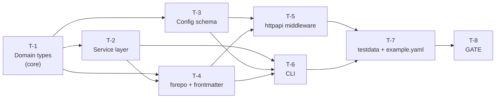

# Foundation — Domain Model & Configuration (F1) — Task Plan

**Status:** Draft
**Author:** Claude (Opus 4.7) + Mikhail Savin
**Date:** 2026-05-06
**Feature:** foundation-domain-config (F1)
**Branch:** `feature/foundation-domain-config`
**Work Type:** **Pure feature** (новый функционал расширяет домен; «старых» данных нет, обратная совместимость для ранее опубликованных постов не требуется по решению M1).

---

## Test Style Source

**Test Style Source:** Tier 2 — adjacent existing tests
- Evidence: `internal/core/core_test.go`, `internal/core/slug_test.go`, `internal/core/service_test.go`, `internal/adapters/fsrepo/repository_test.go`, `internal/adapters/fsrepo/frontmatter_parser_test.go`, `internal/adapters/fsrepo/test_helpers_test.go`, `internal/adapters/httpapi/server_test.go`, `internal/cli/list_test.go`.
- Key patterns to follow:
  - Стандартный пакет `testing`, без сторонних assertion-библиотек.
  - Table-driven tests со структурой `tests := []struct{ name string; ...; expected ... }`, итерация через `t.Run(tt.name, func(t *testing.T) { ... })`.
  - Хелперы в `<package>/test_helpers_test.go` (например `fsrepo/test_helpers_test.go`).
  - Test doubles вручную (например `fakeClock` имплементирующий `core.Clock`), без mock-фреймворков.
  - Имена тестов: `TestPackageName_Behavior` или `TestFunctionName`.
- **PBT unavailable** — нет `rapid`/`gopter`/`gocheck` в `go.mod`. Substitute: targeted unit tests в стиле table-driven с явным перебором значений; тегаются `Property/<N>` через комментарий вида `// Property: CP-N` в начале функции.

---

## Commands

| Action   | Command              | Source         |
|----------|----------------------|----------------|
| Test     | `task test`          | `Taskfile.yml` |
| Build    | `task build`         | `Taskfile.yml` |
| Lint     | `task lint`          | `Taskfile.yml` |
| Race     | `task test:race`     | `Taskfile.yml` |
| Coverage | `task test:coverage` | `Taskfile.yml` |
| Format   | `task fmt`           | `Taskfile.yml` |
| Vet      | `task vet`           | `Taskfile.yml` |
| Generate | n/a (F1)             | —              |

---

## Coverage Matrix

| Requirement | Task(s) | Correctness Property |
|-------------|---------|----------------------|
| REQ-1.1, REQ-1.2 | T-1, T-2 | CP-7 (validation), unit tests |
| REQ-1.3, REQ-1.4 | T-2 | CP-3 |
| REQ-1.5 | T-2 | CP-2 |
| REQ-2.1 | T-1 | CP-6 |
| REQ-2.2 | T-1 | CP-6 |
| REQ-2.3 | T-1 | CP-6 |
| REQ-2.4 | T-1 | CP-6 |
| REQ-2.5 | T-4 | CP-5 |
| REQ-2.6 | T-1, T-4 | CP-6 |
| REQ-2.7 | T-1 | CP-7-style validation |
| REQ-3.1, REQ-3.2, REQ-3.3 | T-1, T-2 | CP-4, CP-10 |
| REQ-3.4 | T-2 | unit test |
| REQ-3.5 | T-2 | unit test |
| REQ-4.1 | T-1, T-4 | CP-1 |
| REQ-4.2 | T-4 | unit test |
| REQ-4.3, REQ-4.4 | T-1, T-4 | CP-11 |
| REQ-4.5 | T-4 | unit test |
| REQ-4.6 | T-4 | CP-1 |
| REQ-5.1, REQ-5.2 | T-3 | CP-9 |
| REQ-5.3 | T-3 | unit test |
| REQ-5.4 | T-3 | CP-9 |
| REQ-5.5 | T-3 | CP-9 |
| REQ-5.6, REQ-5.7 | T-3 | unit test |
| REQ-5.8 | T-3 | CP-9 |
| REQ-5.9 | T-3 | CP-9 |
| REQ-5.10 | T-3 | CP-9 |
| REQ-5.11 | T-3 | unit test |
| REQ-5.12 | T-3 | unit test |
| REQ-6.1 | T-6 | unit test |
| REQ-6.2, REQ-6.3 | T-6 | CP-13 |
| REQ-6.4 | T-6 | unit test |
| REQ-6.5 | T-6 | unit test |
| REQ-6.6 | T-6 | unit test |
| REQ-6.7 | T-6 | CP-12 |
| REQ-7.1 | T-4 | unit test |
| REQ-7.2 | T-4 | CP-1 |
| REQ-7.3 | T-4 | CP-1 |
| REQ-7.4 | T-4 | CP-6 |
| REQ-7.5 | T-4 | CP-7 |
| REQ-7.6 | T-1 | CP-8 |
| REQ-8.1 | T-5 | unit test |
| REQ-8.2 | T-5 | CP-1 |
| REQ-8.3 | T-5 | CP-6 |
| REQ-8.4 | T-5 | CP-14 |
| REQ-8.5 | T-5 | CP-2 |
| REQ-9.1, REQ-9.2 | T-6 | CP-15 |
| REQ-9.3 | T-6 | unit test (build verify) |
| REQ-9.4, REQ-9.5, REQ-9.6 | T-6 | unit test |
| REQ-10.1 | T-8 (GATE) | full test suite |
| REQ-10.2 | T-7 | unit test |
| REQ-10.3 | T-3 | covered by T-3 tests |

Все REQ покрыты. Все CP-1..CP-15 покрыты.

---

## Task Order (Pure Feature flow)

Следуем порядку: **GREEN (test stubs)** → **CODE (implementation, bottom-up по слоям)** → **GREEN (full tests)** → **GATE**. Поскольку каждый слой имеет собственный набор тестов, в плане каждый top-level T-N сам по себе содержит RED→CODE→GREEN внутри своего слоя, но в порядке зависимостей по вертикали.

```
T-1 (core domain types + tests)
  → T-2 (service layer + tests)
    → T-3 (config schema + tests)
      → T-4 (fsrepo + tests)
        → T-5 (httpapi + tests)
          → T-6 (cli + tests)
            → T-7 (testdata, sqlite schema, example yaml)
              → T-8 (GATE — full verification)
```

---

## T-1: Расширить доменные типы `Post`, `PostFilter`, добавить `Attachment`/`PublishAttempt`/новые статусы

***_Requirements:_*** REQ-1.1, REQ-1.2, REQ-2.1, REQ-2.2, REQ-2.3, REQ-2.4, REQ-2.6, REQ-2.7, REQ-3.1, REQ-3.2, REQ-3.3, REQ-4.1, REQ-4.3, REQ-4.4, REQ-7.6
***_Preservation:_*** CP-4, CP-6, CP-7, CP-8, CP-10, CP-11
***_Complexity:_*** standard

GOAL: создать фундамент типов, на котором стоит всё остальное. Все будущие слои импортируют этот пакет.

### T-1.1 [CODE] Расширить `Post`, добавить `Attachment`, `AttachmentType`, `PublishAttempt` в `internal/core/post.go`
- Файл: `internal/core/post.go`.
- CRITICAL: добавить поля строго согласно §2.5 design'а: обязательные `TenantID uuid.UUID`, `AuthorID uuid.UUID`, `CreatedAt time.Time`, `UpdatedAt time.Time`, `Revision int`; опциональные `Excerpt *string`, `CoverImage *Attachment`, `Attachments []Attachment`, `PublishHistory []PublishAttempt`, `RevisionSHA *string`.
- CRITICAL: yaml/json теги соответствуют design'у (без `omitempty` для обязательных, с `omitempty` для опциональных).
- IMPORTANT: добавить метод `func (p Post) TenantShortID() string` — возвращает `strings.ReplaceAll(p.TenantID.String(), "-", "")[0:8]`.
- IMPORTANT: добавить типы `AttachmentType string` с константами `AttachmentTypePhoto`, `AttachmentTypeVideo`, `AttachmentTypeDocument`, `AttachmentTypeAudio` и функцию `func (t AttachmentType) Validate() error` (возвращает `ErrValidation`, если не одна из 4 констант).
- IMPORTANT: добавить структуры `Attachment` и `PublishAttempt` со всеми полями из §2.5.
- DO NOT удалять существующие поля `External ExternalLinks`, `Content string`, `Tags`, `Deadline`, `ScheduledAt`, `PublishedAt`.
- Импорты добавить: `encoding/json`, `github.com/google/uuid`.

### T-1.2 [CODE] Расширить `PostFilter` и `CreatePostInput` в `internal/core/post.go`
- Файл: `internal/core/post.go`.
- CRITICAL: добавить в `PostFilter` поля `TenantID uuid.UUID`, `AuthorID *uuid.UUID`, `SortBy string`, `SortOrder string`, `Limit int`, `Offset int`.
- CRITICAL: добавить в `CreatePostInput` поля `TenantID uuid.UUID`, `AuthorID uuid.UUID`, `Excerpt *string`.
- IMPORTANT: добавить константу `var allowedSortKeys = map[string]struct{}{"created_at":{}, "updated_at":{}, "deadline":{}, "scheduled_at":{}, "title":{}, "status":{}}` и функцию `func IsValidSortKey(s string) bool`.

### T-1.3 [CODE] Заменить `StatusOrder` на `allowedTransitions` + добавить новые статусы в `internal/core/core.go`
- Файл: `internal/core/core.go`.
- CRITICAL: добавить константы `StatusArchived = "archived"`, `StatusFailed = "failed"`.
- CRITICAL: удалить экспортируемую `var StatusOrder` (заменяется приватной `allowedTransitions`).
- IMPORTANT: добавить приватную `var allowedTransitions = map[PostStatus][]PostStatus{...}` строго согласно ADR-2 и §2.5 design'а: `idea→{draft}`, `draft→{ready}`, `ready→{scheduled, published}`, `scheduled→{published, ready, failed}`, `failed→{ready, archived}`, `published→{archived}`, `archived→{}`.
- IMPORTANT: добавить публичную функцию `func IsTransitionAllowed(from, to PostStatus) bool`. Проверяет наличие `to` в `allowedTransitions[from]`.
- IMPORTANT: добавить публичную `func AllStatuses() []PostStatus` — возвращает все 7 статусов в порядке lifecycle (для документации/UI).

### T-1.4 [CODE] Обновить `IsStatusTransitionValid` и добавить новые ошибки в `internal/core/errors.go`
- Файл: `internal/core/errors.go`.
- CRITICAL: переписать `IsStatusTransitionValid(from, to)` как deprecated alias на `IsTransitionAllowed(from, to)` (тело — `return IsTransitionAllowed(from, to)`).
- IMPORTANT: добавить `// Deprecated: use IsTransitionAllowed.` комментарий.
- CRITICAL: добавить новые ошибки: `ErrInvalidTransition = errors.New("invalid status transition")`, `ErrTenantMismatch = errors.New("tenant mismatch")`, `ErrPublishRetryExhausted = errors.New("publish retry attempts exhausted")`.
- DO NOT удалять существующие ошибки.

### T-1.5 [GREEN] Написать unit-тесты для `core` в `internal/core/core_test.go`
- Файл: `internal/core/core_test.go`.
- CRITICAL: переписать `TestIsStatusTransitionValid` под полный декартов перебор PostStatus×PostStatus (7×7=49 пар), сверка с `allowedTransitions`. Tag `// Property: CP-4`.
- CRITICAL: переписать `TestPostStatusConstants` под все 7 статусов в `AllStatuses()`.
- IMPORTANT: добавить `TestIsTransitionAllowed_Discovers10AllowedTransitions` — отдельный тест, проверяющий, что суммарно по `allowedTransitions` ровно 10 разрешённых переходов (по count). Это защита от случайного добавления переходов.
- Test_Style: следовать стилю `internal/core/slug_test.go` (table-driven со struct полями `name, from, to, expected`).

### T-1.6 [GREEN] Написать unit-тесты для `Post`, `Attachment`, `PublishAttempt` в `internal/core/post_test.go`
- Файл: `internal/core/post_test.go` (NEW).
- CRITICAL: `TestPost_TenantShortID` — table-driven: 5 разных UUIDv7 → 8 hex-символов без дефисов. Tag `// Property: CP-8`.
- CRITICAL: `TestAttachmentType_Validate` — table-driven: 4 валидных типа → nil; 3 невалидных строки → `ErrValidation`. Tag `// Property: CP-7`.
- IMPORTANT: `TestPost_RoundTrip_YAML` — сериализация валидного `Post` в YAML и обратно; все обязательные/опциональные поля (с CoverImage и 2 Attachment) совпадают. Tag `// Property: CP-6`.
- IMPORTANT: `TestPost_RoundTrip_JSON` — то же для JSON.
- IMPORTANT: `TestPostFilter_IsValidSortKey` — все 6 валидных ключей → true; 5 невалидных строк → false. Tag `// Property: CP-11`.
- IMPORTANT: `TestPublishAttempt_RoundTrip_YAML` — сериализация attempt с непустым `ResponsePayload` (`json.RawMessage("{\"ok\":true}")`) round-trip. Tag `// Property: CP-6`.

---

## T-2: Расширить `PostService` под новые контракты

***_Requirements:_*** REQ-1.1, REQ-1.2, REQ-1.3, REQ-1.4, REQ-1.5, REQ-3.3, REQ-3.4, REQ-3.5
***_Preservation:_*** CP-2, CP-3, CP-10
***_Complexity:_*** complex

GOAL: координация Revision, валидация tenant immutability, добавление методов Archive/MarkFailed.

### T-2.1 [CODE] Расширить `PostService.CreatePost` валидацией и установкой audit-полей
- Файл: `internal/core/service.go`, метод `CreatePost`.
- CRITICAL: в начале метода проверить `in.TenantID == uuid.Nil` → return `nil, fmt.Errorf("%w: tenant_id required", ErrValidation)`.
- CRITICAL: проверить `in.AuthorID == uuid.Nil` → return `nil, fmt.Errorf("%w: author_id required", ErrValidation)`.
- CRITICAL: установить в создаваемом `Post`: `TenantID = in.TenantID`, `AuthorID = in.AuthorID`, `CreatedAt = s.clock.Now()`, `UpdatedAt = s.clock.Now()`, `Revision = 1`.
- IMPORTANT: если `in.Excerpt != nil` — копировать в `post.Excerpt`.
- DO NOT менять существующую логику генерации `ID`, `Slug`.

### T-2.2 [CODE] Расширить `PostService.UpdatePost` инкрементом `Revision` и проверкой tenant immutability
- Файл: `internal/core/service.go`, метод `UpdatePost`.
- CRITICAL: в начале метода загрузить старый пост через `s.repo.GetByID(ctx, post.ID)`. Если `existing.TenantID != post.TenantID` → return `nil, ErrTenantMismatch` (не вызывать `repo.Update`).
- CRITICAL: установить `post.UpdatedAt = s.clock.Now()`, `post.Revision = existing.Revision + 1`, `post.CreatedAt = existing.CreatedAt` (нельзя перезаписать CreatedAt).
- IMPORTANT: вызвать `s.repo.Update(ctx, post)` после валидации.

### T-2.3 [CODE] Добавить `PostService.UpdateStatus` с проверкой `IsTransitionAllowed`
- Файл: `internal/core/service.go`.
- CRITICAL: метод `UpdateStatus(ctx context.Context, id PostID, newStatus PostStatus) (*Post, error)`.
- CRITICAL: загрузить пост через `repo.GetByID`. Если `!IsTransitionAllowed(post.Status, newStatus)` → return `nil, ErrInvalidTransition`.
- CRITICAL: если `newStatus == StatusPublished` и `post.PublishedAt == nil` → установить `post.PublishedAt = ptr(s.clock.Now())`.
- CRITICAL: установить `post.Status = newStatus`, вызвать `s.UpdatePost` (через приватный путь без двойной проверки tenant).
- NOTE: чтобы избежать рекурсии валидации, ввести приватный метод `s.updateStatusInternal(ctx, post)`, который инкрементирует Revision/UpdatedAt и вызывает `repo.Update`.

### T-2.4 [CODE] Добавить `PostService.Archive` и `MarkFailed`
- Файл: `internal/core/service.go`.
- CRITICAL: `Archive(ctx, id PostID)` — загрузить, проверить `IsTransitionAllowed(post.Status, StatusArchived)` (только из `published` или `failed`), установить статус, сохранить.
- CRITICAL: `MarkFailed(ctx, id PostID, errMsg string)` — допустим только из `scheduled`. Установить `Status = StatusFailed`, добавить запись в `PublishHistory`: `PublishAttempt{ID: uuid.New(), At: clock.Now(), Status: "failed", Error: errMsg, RetryAttempt: len(existing PublishHistory)+1}`. Сохранить через `repo.Update`.

### T-2.5 [CODE] Добавить `PostService.AppendPublishAttempt`
- Файл: `internal/core/service.go`.
- CRITICAL: метод `AppendPublishAttempt(ctx context.Context, id PostID, attempt PublishAttempt) error`.
- IMPORTANT: загрузить пост, добавить attempt в `PublishHistory`, вызвать `repo.Update`. (Truncation до 10 — ответственность fsrepo, не сервиса; SQL-режимы сохраняют всё в отдельной таблице в F2.)

### T-2.6 [GREEN] Написать тесты сервиса в `internal/core/service_test.go`
- Файл: `internal/core/service_test.go` (MODIFIED — расширить существующий).
- IMPORTANT: использовать локальный `fakeRepo` (in-memory map) и `fakeClock` (фиксированное время) — следовать паттерну существующего файла.
- CRITICAL: `TestService_CreatePost_RequiresTenantID` — вызов с zero TenantID → `ErrValidation`. (REQ-1.1)
- CRITICAL: `TestService_CreatePost_RequiresAuthorID` — zero AuthorID → `ErrValidation`. (REQ-1.2)
- CRITICAL: `TestService_CreatePost_SetsAudit` — проверить `CreatedAt == UpdatedAt == clock.Now()`, `Revision == 1`. Tag `// Property: CP-3`. (REQ-1.3)
- CRITICAL: `TestService_UpdatePost_IncrementsRevision` — N=10 последовательных Update; финальный `Revision == 11`, `CreatedAt` неизменен, `UpdatedAt` обновляется. Tag `// Property: CP-3`. (REQ-1.4)
- CRITICAL: `TestService_UpdatePost_TenantImmutable` — Update с другим TenantID → `ErrTenantMismatch`, repo.Update не вызывается. Tag `// Property: CP-2`. (REQ-1.5)
- CRITICAL: `TestService_UpdateStatus_AllowedTransitions` — все 10 разрешённых переходов из таблицы успешно. Tag `// Property: CP-4, CP-10`. (REQ-3.3)
- CRITICAL: `TestService_UpdateStatus_DisallowedRejected` — 39 неразрешённых переходов из 49 → `ErrInvalidTransition`. Tag `// Property: CP-10`.
- CRITICAL: `TestService_UpdateStatus_PublishedSetsPublishedAt` — переход в `published` устанавливает `PublishedAt`. (REQ-3.4)
- CRITICAL: `TestService_MarkFailed_AppendsHistory` — после `MarkFailed` пост в статусе `failed`, `PublishHistory` содержит 1 запись с `Status="failed"`, `Error="..."`. (REQ-3.5)
- IMPORTANT: `TestService_Archive_FromPublished` — успех; `TestService_Archive_FromIdea` — `ErrInvalidTransition`.

---

## T-3: Расширить `Config` под новые секции (`storage`, `auth`, `worker`, `server`)

***_Requirements:_*** REQ-5.1, REQ-5.2, REQ-5.3, REQ-5.4, REQ-5.5, REQ-5.6, REQ-5.7, REQ-5.8, REQ-5.9, REQ-5.10, REQ-5.11, REQ-5.12, REQ-10.3
***_Preservation:_*** CP-9
***_Complexity:_*** standard

GOAL: новая схема конфигурации с дефолтами, env-override, валидацией.

### T-3.1 [CODE] Добавить структуры `StorageConfig`, `GitStorageConfig`, `PostgresConfig` в `internal/adapters/config/config.go`
- Файл: `internal/adapters/config/config.go`.
- CRITICAL: добавить структуры строго по §2.5 design'а с тегами `yaml`/`mapstructure`.
- IMPORTANT: тип `time.Duration` в `PostgresConfig.ConnMaxLifetime`, `WorkerConfig.Interval`, `WorkerConfig.RetryBackoff`, `ServerConfig.ReadTimeout`, `ServerConfig.WriteTimeout`, `AuthConfig.TokenTTL` — viper парсит из строки `"30m"`, `"15s"`. Опциональный mapstructure.DecodeHook для дюраций.

### T-3.2 [CODE] Добавить `AuthConfig`, `OAuthConfig`, `WorkerConfig`, `ServerConfig`
- Файл: `internal/adapters/config/config.go`.
- CRITICAL: структуры по §2.5; поле `AuthConfig.TenantDefault uuid.UUID` и `AuthorDefault uuid.UUID` — yaml-теги `tenant_default`/`author_default`.
- IMPORTANT: добавить кастомные `MarshalYAML`/`UnmarshalYAML` для `uuid.UUID` если не сработает дефолт — но `github.com/google/uuid` уже поддерживает text-marshalling, viper-mapstructure обычно умеет; если декодинг ломается, добавить `mapstructure.DecodeHook` для `uuid.UUID`.

### T-3.3 [CODE] Расширить `Config`, обновить `NewDefaultConfig`, `loadFromFile`, `Validate`
- Файл: `internal/adapters/config/config.go`.
- CRITICAL: добавить в `Config` поля `Storage`, `Auth`, `Worker`, `Server` (все non-omitempty).
- CRITICAL: в `NewDefaultConfig`: `Storage.Type = "fs"`, `Storage.Git.AutoCommit = true`, `Storage.Git.Branch = "main"`, `Storage.Git.CommitTemplate = "chore: update post {{.Slug}}"`, `Storage.Postgres.MaxOpenConns = 10`, `Storage.Postgres.MaxIdleConns = 5`, `Storage.Postgres.ConnMaxLifetime = 30*time.Minute`, `Auth.Type = "none"`, `Auth.TokenTTL = 24*time.Hour`, `Worker.Interval = time.Minute`, `Worker.MaxRetries = 3`, `Worker.RetryBackoff = 30*time.Second`, `Server.Addr = "localhost"`, `Server.Port = 8080`, `Server.ReadTimeout = 15*time.Second`, `Server.WriteTimeout = 15*time.Second`. `tenant_default` и `author_default` в дефолтном конфиге равны `uuid.Nil` — устанавливаются только при `jtpost init` (T-6).
- CRITICAL: в `loadFromFile` добавить вызовы `v.SetDefault` для всех новых ключей и `v.BindEnv` для всех новых вложенных ключей (`storage.type`, `storage.git.enabled`, ..., `auth.tenant_default`, `auth.author_default`, ..., `worker.interval`, `server.port`, и т.д. — полный список ~25 ключей).
- CRITICAL: в `Validate()` добавить:
  - `if c.Storage.Type != "" && c.Storage.Type != "fs" && c.Storage.Type != "sqlite" && c.Storage.Type != "postgres" { return fmt.Errorf("%w: invalid storage.type", core.ErrConfigInvalid) }`
  - `if c.Auth.TenantDefault == uuid.Nil { return fmt.Errorf("%w: auth.tenant_default required", core.ErrConfigInvalid) }`
  - `if c.Auth.AuthorDefault == uuid.Nil { return fmt.Errorf("%w: auth.author_default required", core.ErrConfigInvalid) }`
- DO NOT удалять `Defaults DefaultConfig`, `SQLite SQLiteConfig`, `Telegram TelegramConfig` (REQ-5.11 — оставлены).
- NOTE: `SQLite SQLiteConfig` (top-level, deprecated) оставить для обратной совместимости, но в `NewDefaultConfig` использовать только `Storage.SQLite.DSN`.

### T-3.4 [GREEN] Написать тесты конфига в `internal/adapters/config/config_test.go`
- Файл: `internal/adapters/config/config_test.go` (NEW).
- CRITICAL: `TestConfig_LoadDefaults` — вызвать `LoadWithDefaults("")`, проверить `Storage.Type == "fs"`, `Server.Port == 8080`, `Worker.Interval == time.Minute`, и т.д. Tag `// Property: CP-9`. (REQ-5.2)
- CRITICAL: `TestConfig_LoadFromYAML` — записать temp YAML с непустыми всеми секциями, прочитать, проверить значения.
- CRITICAL: `TestConfig_EnvOverride` — table-driven: пары (env_key, env_value, expected_field). Минимум 8 кейсов: `JTPOST_STORAGE_TYPE`, `JTPOST_STORAGE_GIT_ENABLED`, `JTPOST_AUTH_TYPE`, `JTPOST_AUTH_TENANT_DEFAULT`, `JTPOST_AUTH_AUTHOR_DEFAULT`, `JTPOST_WORKER_INTERVAL`, `JTPOST_SERVER_PORT`, `JTPOST_SERVER_BASE_URL`. Использовать `t.Setenv`. Tag `// Property: CP-9`. (REQ-5.10)
- CRITICAL: `TestConfig_Validate_RejectsZeroTenant` — `cfg.Auth.TenantDefault = uuid.Nil` → `Validate()` возвращает ошибку, обёрнутую в `core.ErrConfigInvalid`. (REQ-5.12)
- CRITICAL: `TestConfig_Validate_RejectsZeroAuthor` — аналогично. (REQ-5.12)
- CRITICAL: `TestConfig_Validate_InvalidStorageType` — `Storage.Type = "mysql"` → ошибка. (REQ-5.3)
- CRITICAL: `TestConfig_Validate_AcceptsAllStorageTypes` — `fs`, `sqlite`, `postgres` (с заданным non-zero tenant/author) — все валидны.
- IMPORTANT: `TestConfig_PreservesDefaultsPlatforms` — Save → Load round-trip сохраняет `Defaults.Platforms = []string{"telegram"}`. (REQ-5.11)
- IMPORTANT: `TestConfig_DurationParsing` — env `JTPOST_WORKER_INTERVAL=2m30s` → `cfg.Worker.Interval == 2*time.Minute+30*time.Second`.

---

## T-4: Обновить `fsrepo` под подкаталоги по `tenant_short_id` и расширенный frontmatter

***_Requirements:_*** REQ-2.5, REQ-2.6, REQ-4.1, REQ-4.3, REQ-4.4, REQ-4.5, REQ-4.6, REQ-7.1, REQ-7.2, REQ-7.3, REQ-7.4, REQ-7.5
***_Preservation:_*** CP-1, CP-5, CP-6, CP-7, CP-11
***_Complexity:_*** complex

GOAL: FS-репозиторий хранит посты в `<posts_dir>/<tenant_short>/<slug>.md`, поддерживает tenant scope из context, новый набор полей, truncation истории.

### T-4.1 [CODE] Расширить `frontmatter_parser.go` под новые поля
- Файл: `internal/adapters/fsrepo/frontmatter_parser.go`.
- CRITICAL: в `SerializePost` добавить сериализацию `TenantID`, `AuthorID`, `CreatedAt`, `UpdatedAt`, `Revision`, `Excerpt`, `CoverImage`, `Attachments`, `PublishHistory`, `RevisionSHA`. Использовать стандартный `yaml.Marshal` (теги уже на полях `Post`).
- CRITICAL: перед сериализацией: если `len(post.PublishHistory) > 10`, заменить на последние 10 (отсортированы по `At` desc). Tag `// Property: CP-5`.
- CRITICAL: в `ParsePost` после `yaml.Unmarshal` валидировать обязательные поля: `ID != uuid.Nil`, `TenantID != uuid.Nil`, `AuthorID != uuid.Nil`, `Title != ""`, `Slug != ""`, `Status != ""`, `!CreatedAt.IsZero()`, `!UpdatedAt.IsZero()`, `Revision >= 1`. При нарушении — return `nil, fmt.Errorf("%w: missing required field <name>", core.ErrValidation)`.
- IMPORTANT: добавить хелпер `func (a Attachment) AbsolutePath(postsDir string) (string, error)` — `filepath.Clean(filepath.Join(postsDir, a.Path))` + проверка, что результат `strings.HasPrefix(absPath, absPostsDir)` (защита от `..`).

### T-4.2 [CODE] Перевести `FileSystemPostRepository.Create/Update/Delete` на подкаталоги
- Файл: `internal/adapters/fsrepo/repository.go`.
- CRITICAL: метод-хелпер `func (r *FileSystemPostRepository) postPath(post *core.Post) string` — `filepath.Join(r.postsDir, post.TenantShortID(), post.Slug+".md")`.
- CRITICAL: в `Create` после генерации пути вызвать `os.MkdirAll(filepath.Dir(path), 0o755)` перед `os.WriteFile`.
- CRITICAL: в `Update` вычислить путь из tenant старого поста (не нового, т.к. tenant immutable — при попытке изменения сервис уже отрежет на T-2.2).
- IMPORTANT: в `Delete` использовать `postPath` хелпер.

### T-4.3 [CODE] Добавить tenant-scope проверки в `GetByID` и `List`
- Файл: `internal/adapters/fsrepo/repository.go`.
- CRITICAL: добавить хелпер `tenantFromContext(ctx) (uuid.UUID, error)` который читает context.Value(`httpapi.TenantContextKey`)... NOTE: чтобы избежать import cycle между `fsrepo` и `httpapi`, ключ context должен жить в **`internal/core`** или в новом пакете `internal/contextkeys`. РЕШЕНИЕ: создать пакет `internal/core/scope.go` с типом `ctxKey int` и функциями `WithTenant(ctx, uuid)`, `TenantFromContext(ctx)` (аналогично `WithAuthor`/`AuthorFromContext`). Все слои импортируют из `core`.
- IMPORTANT: подзадача T-4.3a — создать `internal/core/scope.go` с типом и функциями:
  ```go
  type ctxKey int
  const (tenantKey ctxKey = iota; authorKey)
  func WithTenant(ctx context.Context, id uuid.UUID) context.Context
  func TenantFromContext(ctx context.Context) (uuid.UUID, bool)
  func WithAuthor(...); func AuthorFromContext(...)
  ```
- CRITICAL: в `GetByID(ctx, id)`: после загрузки файла — извлечь `TenantID` из context. Если не задан — return `nil, ErrTenantMismatch` (REQ-7.3). Если `loaded.TenantID != ctxTenant` — return `nil, ErrNotFound` (REQ-4.6, не утечка).
- CRITICAL: в `List(ctx, filter)`: если `filter.TenantID == uuid.Nil` — return `nil, fmt.Errorf("%w: tenant_id required", ErrValidation)`. Читать только `<postsDir>/<filter.TenantShortID()>/*.md` (где `TenantShortID` = первые 8 hex без дефисов). Если папка не существует (`os.ErrNotExist`) — вернуть пустой список без ошибки.
- IMPORTANT: после загрузки списка применить фильтры: `Statuses` (AND), `Tags` (OR), `Search` (case-insensitive в Title/Slug), `AuthorID` (если задан).
- IMPORTANT: реализовать сортировку: switch по `filter.SortBy` (если != "" и валиден через `core.IsValidSortKey`), порядок из `filter.SortOrder` (`asc`/`desc`, default `asc`). Невалидный `SortBy` → `ErrValidation`.
- IMPORTANT: применить `Limit`/`Offset` после сортировки.

### T-4.4 [CODE] Хелпер `filterTenantShortID` и адаптация `GetBySlug`
- Файл: `internal/adapters/fsrepo/repository.go`.
- CRITICAL: добавить метод `func (f PostFilter) TenantShortID() string` в `internal/core/post.go` (аналогичен `Post.TenantShortID`).
- CRITICAL: `GetBySlug(ctx, slug)` — извлечь tenant из context, путь = `<postsDir>/<short>/<slug>.md`. Если файл отсутствует — `ErrNotFound`.

### T-4.5 [GREEN] Расширить тесты `fsrepo` в `internal/adapters/fsrepo/repository_test.go` и `frontmatter_parser_test.go`
- Файлы: `internal/adapters/fsrepo/repository_test.go`, `frontmatter_parser_test.go`, `test_helpers_test.go`.
- IMPORTANT: обновить хелпер в `test_helpers_test.go` — `newTestPost(t)` создаёт пост с заполненными `TenantID`, `AuthorID`, `CreatedAt`, `UpdatedAt`, `Revision = 1`. Используются фиксированные UUID константы (например `testTenant1, testTenant2, testAuthor1`).
- CRITICAL: `TestFSRepo_Create_TenantSubdir` — после Create проверить `os.Stat(<postsDir>/<short>/<slug>.md)`. (REQ-7.1)
- CRITICAL: `TestFSRepo_GetByID_OtherTenant_NotFound` — создать пост tenant1, GetByID с context tenant2 → `ErrNotFound`. Tag `// Property: CP-1`. (REQ-4.6)
- CRITICAL: `TestFSRepo_GetByID_NoContext_TenantMismatch` — без `WithTenant` → `ErrTenantMismatch`. (REQ-7.3)
- CRITICAL: `TestFSRepo_List_TenantScoped` — 2 поста tenant1, 1 пост tenant2; List с filter.TenantID=tenant1 → 2. Tag `// Property: CP-1`.
- CRITICAL: `TestFSRepo_List_RejectsZeroTenant` — filter.TenantID=uuid.Nil → ErrValidation. (REQ-4.1)
- CRITICAL: `TestFSRepo_List_EmptyTenantDir` — несуществующая папка → пустой список без ошибки.
- CRITICAL: `TestFSRepo_List_AuthorFilter` — фильтр по AuthorID работает. (REQ-4.2)
- CRITICAL: `TestFSRepo_List_Sort` — table-driven по 6 sort keys × asc/desc; невалидный → ErrValidation. Tag `// Property: CP-11`.
- CRITICAL: `TestFSRepo_List_LimitOffset` — 5 постов, Limit=2 Offset=1 → 2 поста начиная со 2-го.
- CRITICAL: `TestFrontmatter_RoundTrip_AllFields` — pose со всеми установленными полями (CoverImage, 2 Attachment, 3 PublishAttempt, RevisionSHA) → round-trip equal. Tag `// Property: CP-6`.
- CRITICAL: `TestFrontmatter_PublishHistoryTruncation` — 15 attempts → после round-trip 10 (последних по At desc). Tag `// Property: CP-5`.
- CRITICAL: `TestFrontmatter_RejectsMissing<Field>` — table-driven по 9 required-полям. Каждое поле по очереди удаляется → `ErrValidation`. Tag `// Property: CP-7`.
- IMPORTANT: `TestAttachment_AbsolutePath_RejectsTraversal` — `Path = "../etc/passwd"` → `ErrValidation`.

---

## T-5: Обновить `httpapi` под `jsonPost`, middleware, tenant enforcement

***_Requirements:_*** REQ-8.1, REQ-8.2, REQ-8.3, REQ-8.4, REQ-8.5
***_Preservation:_*** CP-1, CP-2, CP-6, CP-14
***_Complexity:_*** standard

GOAL: middleware заглушка под F4, расширенный jsonPost, enforcement tenant immutability.

### T-5.1 [CODE] Добавить middleware `TenantFromConfigMiddleware` в `internal/adapters/httpapi/middleware.go`
- Файл: `internal/adapters/httpapi/middleware.go`.
- CRITICAL: функция `func TenantFromConfigMiddleware(cfg *config.Config) func(http.Handler) http.Handler`.
- CRITICAL: в обёртке: `ctx := core.WithTenant(r.Context(), cfg.Auth.TenantDefault); ctx = core.WithAuthor(ctx, cfg.Auth.AuthorDefault); next.ServeHTTP(w, r.WithContext(ctx))`. (REQ-8.1)
- DO NOT экспортировать ctxKey — он живёт в `core`.

### T-5.2 [CODE] Расширить `jsonPost` и конвертеры в `internal/adapters/httpapi/server.go`
- Файл: `internal/adapters/httpapi/server.go`.
- CRITICAL: расширить структуру `jsonPost` (или эквивалентную) всеми полями `core.Post` согласно §2.5. Обязательные без `omitempty`, опциональные с `omitempty`.
- CRITICAL: обновить функции `postToJSON(*core.Post) jsonPost` и `jsonToPost(jsonPost) (*core.Post, error)` — копирование всех новых полей.
- IMPORTANT: для `PublishHistory` — конвертация `[]PublishAttempt` напрямую (та же структура).

### T-5.3 [CODE] Регистрация middleware в `httpapi.New`
- Файл: `internal/adapters/httpapi/server.go`, конструктор.
- CRITICAL: в цепочке middleware (`LoggingMiddleware`, `RecoveryMiddleware`) добавить `TenantFromConfigMiddleware(s.cfg)` ПЕРЕД handlers.
- IMPORTANT: конструктор теперь принимает `*config.Config` (если ещё не принимал) — обновить сигнатуру и вызовы из `cmd/jtpost` если нужно.

### T-5.4 [CODE] Enforce tenant_id в POST/PATCH хендлерах
- Файл: `internal/adapters/httpapi/server.go`, хендлеры `handleCreatePost`, `handleUpdatePost`.
- CRITICAL: в обоих хендлерах после парсинга body: извлечь `ctxTenant, _ := core.TenantFromContext(r.Context())`. Если `body.TenantID != uuid.Nil && body.TenantID != ctxTenant` → `http.Error(w, ..., 403)` с body `{"error":"tenant_mismatch"}`. Если `body.TenantID == uuid.Nil` — установить из context (для convenience). (REQ-8.4)
- CRITICAL: в `handleUpdatePost` (PATCH): загрузить existing пост, если `body.TenantID != existing.TenantID && body.TenantID != uuid.Nil` → 400 `{"error":"tenant_id_immutable"}`. (REQ-8.5)
- IMPORTANT: вспомогательная функция `writeJSONError(w, status, code string)` — пишет `{"error": code}` с правильным Content-Type.

### T-5.5 [GREEN] Тесты HTTP API в `internal/adapters/httpapi/server_test.go`
- Файл: `internal/adapters/httpapi/server_test.go`.
- IMPORTANT: создать helper `newTestServer(t)` — собирает Config с `Auth.TenantDefault = testTenant`, `Auth.AuthorDefault = testAuthor`, fake-репозиторий, регистрирует middleware.
- CRITICAL: `TestHTTP_Middleware_PopulatesContext` — wrap test handler, который читает `core.TenantFromContext`; проверить, что значение совпадает с конфигом. (REQ-8.1)
- CRITICAL: `TestHTTP_GET_Posts_TenantScoped` — заранее создать 2 поста разных tenant'ов; GET `/api/posts` возвращает только посты tenant'а из middleware. Tag `// Property: CP-1`. (REQ-8.2)
- CRITICAL: `TestHTTP_POST_Posts_TenantMismatch` — body `{"tenant_id": "<other>"}` → 403, body `{"error":"tenant_mismatch"}`. Tag `// Property: CP-14`. (REQ-8.4)
- CRITICAL: `TestHTTP_POST_Posts_AutoTenant` — body без tenant_id → пост создан с tenant из middleware.
- CRITICAL: `TestHTTP_PATCH_Posts_TenantImmutable` — PATCH с попыткой изменить tenant_id → 400, `{"error":"tenant_id_immutable"}`. Tag `// Property: CP-2`. (REQ-8.5)
- CRITICAL: `TestHTTP_jsonPost_AllFields` — POST с полным набором полей (CoverImage, Attachments, Excerpt) → GET возвращает те же поля. Tag `// Property: CP-6`. (REQ-8.3)

---

## T-6: Обновить CLI: `init`, `new`, `list --format json`, удалить `getService`

***_Requirements:_*** REQ-6.1, REQ-6.2, REQ-6.3, REQ-6.4, REQ-6.5, REQ-6.6, REQ-6.7, REQ-9.1, REQ-9.2, REQ-9.3, REQ-9.4, REQ-9.5, REQ-9.6
***_Preservation:_*** CP-12, CP-13, CP-15
***_Complexity:_*** standard

GOAL: интерактивный init, JSON-list, чистка root.go.

### T-6.1 [CODE] Удалить legacy `getService` в `internal/cli/root.go`
- Файл: `internal/cli/root.go`.
- CRITICAL: удалить функцию `getService` целиком (строки в районе :74). Все вызывающие её места уже не используют (TODO висел незакрытый).
- IMPORTANT: убедиться, что `task build` проходит после удаления (zero callers).
- DO NOT трогать другие функции в этом файле.

### T-6.2 [CODE] Реализовать интерактивный `jtpost init`
- Файл: `internal/cli/init.go`.
- CRITICAL: в команду `jtpost init` добавить флаг `--force` (`bool`).
- CRITICAL: алгоритм:
  1. Прочитать `--config` путь (default `.jtpost.yaml`).
  2. Если файл существует и `!--force`: вывести `Config already exists at <path>. Overwrite? [y/N]: ` в stdout; читать одну строку из stdin (или `cmd.InOrStdin()` для тестируемости). Если ответ не начинается с `y`/`Y` → вывести `Aborted` в stderr, `return nil`. (REQ-6.2, REQ-6.3)
  3. Сгенерировать `tenantID := uuid.Must(uuid.NewV7())` и `authorID := uuid.Must(uuid.NewV7())`. Если `tenantShort(tenantID) == authorShort(authorID)` — перегенерировать `authorID` в цикле до 10 раз (REQ-6.7). Если все 10 раз коллизия — log warning через logger и продолжить.
  4. Создать конфиг через `config.NewDefaultConfig()`, установить `cfg.Auth.TenantDefault = tenantID`, `cfg.Auth.AuthorDefault = authorID`.
  5. Сохранить через `cfg.Save(path)` (REQ-6.1, REQ-6.4, REQ-6.5).
  6. Создать директории `os.MkdirAll(filepath.Join(cfg.PostsDir, tenantShort), 0o755)` и `os.MkdirAll(cfg.TemplatesDir, 0o755)`. (REQ-6.6)
- IMPORTANT: для тестируемости вынести генератор UUID в interface `type uuidGenerator interface { New() uuid.UUID }` и поле в команде; default — реальный uuid.NewV7. Это нужно для `TestCLIInit_UUIDPrefixUniqueness`.

### T-6.3 [CODE] Расширить `jtpost new` флагами `--tenant`/`--author`
- Файл: `internal/cli/new.go`.
- CRITICAL: добавить флаги `--tenant` (string) и `--author` (string). Если задан — парсить через `uuid.Parse`. Если парсинг fails → return error из RunE с сообщением `invalid UUID for --tenant/--author` (cobra сам преобразует в exit 1). (REQ-9.6)
- CRITICAL: установить `input.TenantID = parsed_tenant ?? cfg.Auth.TenantDefault`, `input.AuthorID = parsed_author ?? cfg.Auth.AuthorDefault`. (REQ-9.4, REQ-9.5)
- IMPORTANT: при сохранении файла учитывать новый путь с tenant subdir (через сервис → fsrepo автоматически).

### T-6.4 [CODE] Реализовать `jtpost list --format json`
- Файл: `internal/cli/list.go`, строка ~66 (TODO).
- CRITICAL: удалить TODO-плейсхолдер.
- CRITICAL: вместо плейсхолдера: при `format == "json"` сериализовать срез постов через `json.NewEncoder(cmd.OutOrStdout()).Encode(posts)`. (REQ-9.1)
- CRITICAL: если `posts == nil` или `len(posts) == 0` — вывести `[]\n` (через `Encode([]struct{}{})` или явно `[]*core.Post{}`). НЕ `null`. (REQ-9.2)

### T-6.5 [GREEN] Тесты CLI
- Файлы: `internal/cli/init_test.go` (NEW), `internal/cli/new_test.go` (NEW or MODIFIED), `internal/cli/list_test.go` (MODIFIED).
- IMPORTANT: использовать `bytes.Buffer` для `cmd.SetOut`/`SetErr`/`SetIn` для тестируемости.
- CRITICAL: `TestCLIInit_NoExistingFile_CreatesAll` — пустой dir → init создаёт `.jtpost.yaml` с непустыми UUID, дир `content/posts/<short>/`, дир `templates/`. (REQ-6.1, REQ-6.6)
- CRITICAL: `TestCLIInit_ExistingFile_AnswerNo_FilePreserved` — pre-write file with `original` content, stdin = `\n` → файл байт-в-байт `original`, exit 0. Tag `// Property: CP-13`. (REQ-6.2, REQ-6.3)
- CRITICAL: `TestCLIInit_ExistingFile_AnswerYes_Overwritten` — stdin = `y\n` → файл перезаписан, новые UUID отличаются от старых. (REQ-6.4)
- CRITICAL: `TestCLIInit_ForceFlag_NoPrompt` — `--force` без stdin → файл перезаписан без prompt. (REQ-6.5)
- CRITICAL: `TestCLIInit_UUIDPrefixUniqueness` — fake `uuidGenerator` возвращающий 3 UUID с одинаковым префиксом, потом разный → init успешно использует разные префиксы для tenant/author. Tag `// Property: CP-12`. (REQ-6.7)
- CRITICAL: `TestCLINew_DefaultsFromConfig` — без флагов: пост получает `TenantID == cfg.Auth.TenantDefault`. (REQ-9.4)
- CRITICAL: `TestCLINew_TenantFlag_Overrides` — `--tenant <uuid>` → пост создан с этим UUID. (REQ-9.5)
- CRITICAL: `TestCLINew_InvalidUUIDFlag` — `--tenant=foo` → команда возвращает ошибку (cobra exit 1). (REQ-9.6)
- CRITICAL: `TestCLIList_FormatJSON_NonEmpty` — несколько постов → stdout парсится `json.Unmarshal` в `[]jsonPost`, длина совпадает. Tag `// Property: CP-15`. (REQ-9.1)
- CRITICAL: `TestCLIList_FormatJSON_Empty` — нет постов → stdout `[]\n`. Tag `// Property: CP-15`. (REQ-9.2)

---

## T-7: Обновить `testdata/posts/*.md`, `.jtpost.example.yaml`, минимальная адаптация SQLite-схемы

***_Requirements:_*** REQ-10.2
***_Preservation:_*** all (preservation = green test suite после T-1..T-6)
***_Complexity:_*** mechanical

GOAL: фикстуры и пример конфига приведены в соответствие с новыми обязательными полями.

### T-7.1 [CODE] Перегенерировать 5 файлов в `testdata/posts/`
- Файлы: `testdata/posts/*.md` (5 файлов).
- CRITICAL: для каждого файла обновить frontmatter — добавить обязательные поля `tenant_id` (одинаковый UUIDv7 для всех 5 фикстур), `author_id` (одинаковый), `created_at` (фиксированные значения), `updated_at`, `revision: 1`.
- IMPORTANT: использовать единые тестовые константы (например `tenant_id: 01900000-0000-7000-8000-000000000001`, `author_id: 01900000-0000-7000-8000-000000000002`).
- NOTE: расположение файлов остаётся в `testdata/posts/` без подкаталогов — это самостоятельные fixture файлы, тесты их парсят напрямую через `ParsePost`, не через `FileSystemPostRepository.List`. Если какой-либо тест использует `List` на `testdata/posts/`, он также адаптируется: либо переносим файлы в подкаталог `testdata/posts/01900000/`, либо тест работает с временным каталогом — на усмотрение исполнителя в момент устранения test failure.

### T-7.2 [CODE] Обновить `.jtpost.example.yaml`
- Файл: `.jtpost.example.yaml`.
- CRITICAL: переписать пример со всеми новыми секциями:
  - `posts_dir`, `templates_dir` (как было).
  - `storage:` с `type: fs`, закомментированными примерами `git`, `sqlite`, `postgres`.
  - `auth:` с `type: none`, заполненными `tenant_default` и `author_default` (placeholder UUID), закомментированной `oauth`.
  - `worker:` с дефолтами.
  - `server:` с дефолтами.
  - `telegram:` (как было, но в комментарии помечено опционально).
  - `defaults:` с `platforms: [telegram]` и комментарием `# reserved for future platform extensions`.

### T-7.3 [CODE] Минимальная адаптация SQLite-схемы (если репо есть)
- Файл: `internal/adapters/sqlite/*.go` (любой файл со SQL DDL).
- IMPORTANT: добавить колонки `tenant_id TEXT NOT NULL`, `author_id TEXT NOT NULL`, `created_at DATETIME NOT NULL`, `updated_at DATETIME NOT NULL`, `revision INTEGER NOT NULL DEFAULT 1` в `CREATE TABLE posts (...)`.
- NOTE: полная функциональность SQLite — F2 (включая sqlc/goose). В F1 цель — чтобы код компилировался и существующие SQLite-тесты (если есть) проходили на новой схеме.
- DO NOT добавлять миграцию для существующих БД — пользователю будет предложено `rm .jtpost.db` (см. ADR-7).

### T-7.4 [VERIFY] Прогон полного test suite после T-7.x
- CRITICAL: запустить `task test` — все тесты должны быть зелёные.
- CRITICAL: запустить `task lint` — без ошибок.
- IMPORTANT: при ошибках вернуться к соответствующей T-N и исправить.

---

## T-8: GATE — финальная верификация всех требований и CP

***_Requirements:_*** REQ-10.1, REQ-10.2, REQ-10.3 (и охват всех остальных через подсчёт)
***_Preservation:_*** все CP-1..CP-15
***_Complexity:_*** mechanical

GOAL: подтвердить, что фича готова к фазе Implementation Review. Это checkpoint, не написание нового кода.

### T-8.1 [VERIFY] Полный прогон Taskfile
- CRITICAL: `task fmt` — отформатировать.
- CRITICAL: `task vet` — без ошибок.
- CRITICAL: `task lint` — без ошибок.
- CRITICAL: `task test` — без ошибок, все 49+ unit + 15 PBT-substitute тестов зелёные.
- CRITICAL: `task test:race` — без ошибок.
- IMPORTANT: `task test:coverage` — записать процент покрытия для CHANGELOG.
- CRITICAL: `task build` — бинарник собирается.

### T-8.2 [VERIFY] Trace requirements coverage
- CRITICAL: пройтись по Coverage Matrix этого документа; для каждой строки убедиться, что в коде существует тест (по имени из §2.8 design'а или §T-N.M текущего плана).
- IMPORTANT: фиксировать любые непокрытые REQ в `implementation.md` отчёте фазы 5 как known issue.

### T-8.3 [VERIFY] CHANGELOG.md обновление
- Файл: `CHANGELOG.md`.
- CRITICAL: добавить раздел `## [Unreleased] — Foundation refactor (F1)` с подписями:
  - **Breaking changes** (config/JSON/frontmatter формат, удаление `StatusOrder`, удаление `getService`).
  - **Added** (новые поля Post, новые статусы, новые секции конфига, `jtpost init --force`, `list --format json`, `new --tenant/--author`).
  - **Migration path:** `jtpost init --force` для регенерации конфига; для пользователей SQLite — удалить `.jtpost.db` и перегенерировать (полные миграции — F2).

### T-8.4 [GATE] Final checkpoint
- CRITICAL: подтвердить пользователю выполнение T-1..T-7 и зелёный T-8.1..T-8.3.
- CRITICAL: подготовить implementation report для фазы 5.

---

## Dependency Diagram



---

## Quality Control Checklist

- [x] Все REQ в Coverage Matrix покрыты хотя бы одним T-N.
- [x] Каждый task имеет `*_Requirements:_*`.
- [x] Каждая CODE-задача имеет `*_Preservation:_*` (CP).
- [x] Pure feature flow: GREEN→CODE→GREEN→GATE на каждом слое; зависимости вертикальные.
- [x] GATE — финальная задача.
- [x] Каждый top-level task имеет `*_Complexity:_*`.
- [x] Test Style Source: Tier 2, evidence cited, PBT unavailable отмечено.
- [x] Commands block заполнен реальными командами из `Taskfile.yml`.
- [x] Subtasks затрагивают по одному файлу (для каждой подзадачи указан `Файл:`).
- [x] Нет prohibited formulations (TBD, "appropriate", "similar to").
