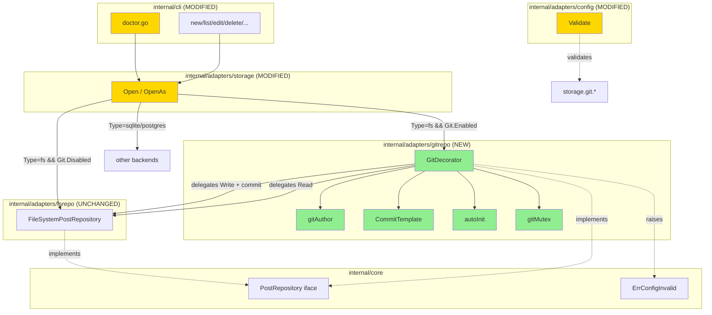

# Git-storage Decorator (F3) — Design

**Status:** Draft
**Author:** Claude (Opus 4.7) + Mikhail Savin
**Date:** 2026-05-07
**Feature:** git-storage-decorator (F3)

## 2.1 Overview

F3 строит Decorator-обёртку над `core.PostRepository` (фактически — fs-backend). Логически фича делится на 4 части:

1. **Decorator core** — `internal/adapters/gitrepo` пакет с `GitDecorator{inner, repo, cfg, mu}`.
2. **Auto-init и репо-management** — `PlainOpen`/`PlainInit` логика, stale-lock detection, detached HEAD detection.
3. **Commit/push** — template-rendering, `wt.Add`/`wt.Commit`, опц. `repo.Push` с timeout, auth (ssh-agent + HTTPS-token).
4. **Wiring и UX** — factory оборачивает fs-репо при `Git.Enabled`, doctor расширяется git-status, Validate проверяет AutoPush+Remote и template-syntax.

Implementation order: Group 8 (validate) → Group 3 (template) → Group 1 (decorator skeleton) → Group 2 (auto-init) → Group 5 (mutex) → Group 4 (push) → Group 6 (factory) → Group 7 (doctor) → Group 9 (тесты финализируют).

## 2.2 Architecture



## 2.3 Components and Interfaces

### Files Requiring Changes

| File | Change Type | Description |
|------|-------------|-------------|
| `internal/adapters/gitrepo/decorator.go` | `[NEW]` | `GitDecorator` struct + конструктор `NewGitDecorator` + все методы PostRepository + commitChanges/pushChanges helpers |
| `internal/adapters/gitrepo/template.go` | `[NEW]` | `parseCommitTemplate(s string) (*template.Template, error)`; default template; rendering helper `renderMessage(tmpl, op, post) string` |
| `internal/adapters/gitrepo/author.go` | `[NEW]` | `gitAuthor() *object.Signature` — env `GIT_AUTHOR_NAME`/`EMAIL` → fallback `"jtpost"`/`"bot@jtpost.local"` |
| `internal/adapters/gitrepo/decorator_test.go` | `[NEW]` | Unit-tests: create→commit, update→commit, delete→commit, list/get pass-through, invalid template fails Open, auto-init, detached HEAD, stale lock |
| `internal/adapters/gitrepo/push_test.go` | `[NEW]` | Push-tests через bare-tempdir-remote (file://-protocol) |
| `internal/adapters/gitrepo/template_test.go` | `[NEW]` | Tests для parseCommitTemplate + rendering всех 6 переменных |
| `internal/adapters/storage/factory.go` | `[MODIFIED]` | В ветке `case "fs"`: если `cfg.Storage.Git.Enabled` — обернуть в `gitrepo.NewGitDecorator` |
| `internal/adapters/storage/factory_test.go` | `[MODIFIED]` | Новый кейс: `Type=fs && Git.Enabled=true && PostsDir в tempdir` → возвращает `*gitrepo.GitDecorator` |
| `internal/adapters/config/config.go` | `[MODIFIED]` | `Validate()` extension: `AutoPush=true && Remote==""` → ErrConfigInvalid; парсинг `CommitTemplate` |
| `internal/adapters/config/config_test.go` | `[MODIFIED]` | Тесты для AutoPush+Remote validation, invalid template |
| `internal/cli/doctor.go` | `[MODIFIED]` | В `checkStorage` для `fs && Git.Enabled`: добавить sub-check git status (clean/dirty + remote check) |
| `internal/cli/doctor_test.go` | `[MODIFIED]` | Тесты: doctor c git-enabled → ok message; dirty repo → warn |
| `internal/adapters/fsrepo/repository_test.go` | `[MODIFIED]` (опц.) | Если хотим прогнать `repotest.RunContract` через GitDecorator — добавить `TestGitFS_RunContract` |
| `CHANGELOG.md` | `[MODIFIED]` | F3 секция |
| `.jtpost.example.yaml` | `[MODIFIED]` | Раскомментировать `storage.git.*` пример с пояснениями |
| `go.mod`, `go.sum` | `[MODIFIED]` | `github.com/go-git/go-git/v5` + transitive |

### Files NOT Requiring Changes

| File | Reason Unchanged |
|------|-----------------|
| `internal/core/post.go`, `errors.go`, `repository.go`, `scope.go`, `service.go` | F3 не меняет домен и интерфейсы — только обёртка |
| `internal/adapters/fsrepo/repository.go` | Inner-репо без знания о git; декоратор делает всё |
| `internal/adapters/sqlite/*`, `internal/adapters/postgres/*` | Git decorator не применяется к SQL-backend |
| `internal/adapters/repotest/contract.go` | Decorator pass-through всё CRUD; контракт не меняется |
| `internal/adapters/httpapi/*` | HTTP API работает через `core.PostService` который через `core.PostRepository` — прозрачно |
| `internal/cli/migrate.go`, `migrate_db.go` | Migrate работает через factory; git-decorator оборачивается автоматически если включён |
| `internal/cli/{new,list,edit,delete,...}.go` | Все используют `openRepo(cfg)` — прозрачно |
| `Taskfile.yml`, `.github/workflows/ci.yml` | F3 — pure unit-tests, без новых требований к окружению |

### Interfaces (signatures only)

```go
// internal/adapters/gitrepo/decorator.go
package gitrepo

type GitDecorator struct {
    inner    core.PostRepository
    repo     *git.Repository
    postsDir string
    cfg      config.GitStorageConfig
    template *template.Template
    mu       sync.Mutex
    detached bool // HEAD в detached state — auto-commit отключён
}

func NewGitDecorator(
    inner core.PostRepository,
    postsDir string,
    cfg config.GitStorageConfig,
) (*GitDecorator, error)
// Открывает или создаёт git-репо в postsDir. Парсит CommitTemplate.
// Удаляет stale .git/index.lock (>60s). Определяет detached-state.

// PostRepository интерфейс (proxy):
func (d *GitDecorator) GetByID(ctx context.Context, id core.PostID) (*core.Post, error)
func (d *GitDecorator) GetBySlug(ctx context.Context, slug string) (*core.Post, error)
func (d *GitDecorator) List(ctx context.Context, filter core.PostFilter) ([]*core.Post, error)
func (d *GitDecorator) Create(ctx context.Context, post *core.Post) error
func (d *GitDecorator) Update(ctx context.Context, post *core.Post) error
func (d *GitDecorator) Delete(ctx context.Context, id core.PostID) error

// MigratableRepository proxy (только если inner реализует):
func (d *GitDecorator) ImportPosts(ctx context.Context, posts []*core.Post) error
func (d *GitDecorator) Count(ctx context.Context) (int64, error)

// Внутренние:
func (d *GitDecorator) commitChanges(ctx context.Context, op string, post *core.Post) error
func (d *GitDecorator) pushChanges(ctx context.Context) error
func (d *GitDecorator) relativePath(post *core.Post) string

// internal/adapters/gitrepo/template.go
package gitrepo

const defaultCommitTemplate = "chore: {{.Operation}} post {{.Slug}}"

type TemplateVars struct {
    Slug      string
    Title     string
    ID        string
    Status    string
    Operation string // "create" | "update" | "delete"
    Time      time.Time // UTC
}

func parseCommitTemplate(s string) (*template.Template, error)
func renderMessage(tmpl *template.Template, op string, post *core.Post) string

// internal/adapters/gitrepo/author.go
package gitrepo

func gitAuthor() *object.Signature
// env GIT_AUTHOR_NAME, GIT_AUTHOR_EMAIL → fallback "jtpost", "bot@jtpost.local".
// When возвращает time.Now().UTC().
```

**Pre/post-conditions:**
- `NewGitDecorator` precondition: `inner` валидно открыт; `cfg.Branch != ""` (обеспечено `Validate`/defaults). Postcondition: репо открыт или создан; `template` парсен; mutex zero-value готов; detached-flag установлен.
- Mutate-методы precondition: ctx содержит tenant scope (как требует inner). Postcondition: пост на диске + (если не detached) git-commit; (если AutoPush) push attempted.
- `commitChanges`: вызывается ТОЛЬКО под `mu.Lock()` (вызывающий метод обязан).
- `pushChanges`: timeout 30s через `context.WithTimeout`.

## 2.4 Key Decisions

### ADR-1: Decorator pattern vs встраивание в fsrepo

- **Context:** Где живёт git-логика? Внутри fsrepo (option B из explore) или отдельным слоем поверх (option A)?
- **Options:** A. Decorator. B. Встроено в fsrepo. C. Shell-out CLI git. D. Async worker.
- **Decision:** A (Decorator).
- **Rationale:** Single-responsibility (fsrepo не знает про git, gitrepo не знает про FS-детали кроме относительных путей). Тестируется отдельно. Можно отключить через `Enabled=false` и получить чистый fs. Будущее — workflow для batch-коммитов через ImportPosts проще.
- **Consequences:** Лишний слой type-assertion в factory. Mutex per-decorator (per-process); cross-process — на go-git/`.git/index.lock`.

### ADR-2: pure-Go go-git/v5 vs CLI shell-out

- **Context:** Как взаимодействовать с git?
- **Options:** A. `github.com/go-git/go-git/v5`. B. `os/exec git ...`. C. `git2go` (CGO+libgit2).
- **Decision:** A (go-git/v5).
- **Rationale:** CGO_ENABLED=0 совместимость (релизный pipeline через goreleaser); работает в distroless; нет внешней зависимости. C — отпадает по CGO. B — сложности с auth, exit-codes, parsing stderr.
- **Consequences:** ~6 МБ к бинарю (+transitive). Меньшая поддержка экзотических git-фич, но F3 их не использует.

### ADR-3: Sync push с timeout vs async push

- **Context:** Push идёт сразу или в фоне?
- **Options:** A. Sync с 30s timeout. B. Sync без timeout. C. Async через goroutine. D. Опционально через `worker` (F6).
- **Decision:** A (sync, hardcoded 30s).
- **Rationale:** UX — пользователь хочет знать сразу что push прошёл. 30s — разумный максимум для интерактивного CLI. Async (C) добавляет state-management. F6 worker — позже extension.
- **Consequences:** Failed network add 30s к latency. Mitigated через REQ-4.3 — push-fail НЕ блокирует операцию (warning + success).

### ADR-4: Failed push — soft-fail vs hard-fail

- **Context:** Если `git push` упал, должен ли `Create()`/`Update()`/`Delete()` вернуть ошибку?
- **Options:** A. Soft-fail (log warning, return success). B. Hard-fail (return error, post на диске остаётся в dirty-tree).
- **Decision:** A (soft-fail).
- **Rationale:** Пользователь не должен терять локально-сохранённый пост из-за временной сетевой проблемы. `git push` может быть выполнен позже вручную (или через `jtpost doctor` retry в follow-up). Hard-fail затруднит UX в offline-режиме.
- **Consequences:** Нужен мониторинг (warning в log) чтобы не пропустить регулярные push-fails. Doctor-check показывает ahead-by-N для индикации.

### ADR-5: Auth strategy

- **Context:** Как авторизоваться при push?
- **Options:** A. Только ssh-agent. B. Только HTTP basic-auth. C. ssh-agent + GIT_HTTPS_TOKEN env. D. Полная git-credentials helpers.
- **Decision:** C (ssh-agent + GIT_HTTPS_TOKEN env).
- **Rationale:** Покрывает 90% сценариев. SSH через agent — стандарт для devs. HTTPS-token через env — стандарт для CI/CD. D — over-engineering для CLI-tool в B-этапе.
- **Consequences:** Без env пользователь не сможет push на HTTPS-remote с private auth. Документировать в CHANGELOG.

### ADR-6: Versioning & Backward Compatibility

- **Versioning strategy:** F3 — minor-bump (0.5.x → 0.6.0). Существующие пользователи с `storage.type=fs && git.enabled=false` — изменений нет.
- **Breaking change assessment:**
  - Нет изменений public API.
  - Существующие FS-данные совместимы (декоратор только добавляет git-history к ним).
  - Существующие dirs которые случайно содержат `.git` — будут рассматриваться как git-репо при `git.enabled=true`. Это soft-issue, документируется.
- **Migration path:**
  1. Включить `storage.git.enabled=true` в `.jtpost.yaml`.
  2. При первом запуске: если `posts_dir` не git — будет init. Документация рекомендует положить `.gitignore` с `*.tmp` и т.п.
  3. Если `auto_push=true` — задать `storage.git.remote=git@github.com:user/posts.git` и убедиться что ssh-agent запущен или установить `GIT_HTTPS_TOKEN`.

## 2.5 Data Models

```go
// internal/adapters/gitrepo/template.go

// [NEW] Template variables passed to text/template.Execute.
type TemplateVars struct {
    Slug      string    // post.Slug
    Title     string    // post.Title
    ID        string    // post.ID.String()
    Status    string    // string(post.Status)
    Operation string    // "create" | "update" | "delete"
    Time      time.Time // UTC, generated at commit time
}

// internal/adapters/gitrepo/decorator.go

// [NEW] GitDecorator wraps any core.PostRepository with git auto-commit hook.
type GitDecorator struct {
    inner    core.PostRepository
    repo     *git.Repository
    postsDir string
    cfg      config.GitStorageConfig
    template *template.Template
    mu       sync.Mutex
    detached bool
}

// Pre-existing types (unchanged):
// config.GitStorageConfig {Enabled, AutoCommit, AutoPush, Remote, Branch, CommitTemplate}
// core.PostRepository interface
```

## 2.6 Correctness Properties

```
Property 1: Git commit follows successful FS write
Category: Propagation
Statement: For all (op, post) where op ∈ {Create, Update, Delete} and inner.<op>(ctx, post) returns nil,
           a corresponding git commit appears in the repo's history with non-empty message
           rendered from CommitTemplate, UNLESS detached HEAD is detected.
Validates: Requirements 1.5, 2.4
```

```
Property 2: No git commit for failed FS write
Category: Absence
Statement: For all (op, post) where op ∈ {Create, Update, Delete} and inner.<op>(ctx, post) returns non-nil error,
           no git commit is created, no git push is attempted, and the error is propagated unmodified.
Validates: Requirements 1.4
```

```
Property 3: Read operations bypass git
Category: Equivalence
Statement: For all read operations Op ∈ {GetByID, GetBySlug, List, Count},
           GitDecorator.<Op>(ctx, args) returns the exact same value as inner.<Op>(ctx, args)
           without acquiring gitMutex or touching the git repo.
Validates: Requirements 1.3
```

```
Property 4: Auto-init creates git repo when missing
Category: Round-trip
Statement: For all postsDir not yet a git repo (no .git/),
           after NewGitDecorator(inner, postsDir, cfg{Enabled=true, Branch="main"}),
           git.PlainOpen(postsDir) succeeds AND HEAD points to refs/heads/main.
Validates: Requirements 2.1, 2.2
```

```
Property 5: Existing repo is not modified on Open
Category: Equivalence
Statement: For all postsDir already containing valid .git/, and any current branch B ≠ cfg.Branch,
           NewGitDecorator does NOT switch branches or modify .git/config; HEAD remains on B.
Validates: Requirements 2.3
```

```
Property 6: Detached HEAD disables auto-commit
Category: Absence
Statement: For all postsDir with HEAD detached (e.g., checked out specific commit),
           after NewGitDecorator and any subsequent Create/Update/Delete,
           NO new commits are added to the repo and the operation returns success.
Validates: Requirements 2.4
```

```
Property 7: Stale lockfile is removed
Category: Round-trip
Statement: For all postsDir with .git/index.lock older than 60 seconds at Open,
           NewGitDecorator removes the lockfile and proceeds; subsequent commits succeed.
Validates: Requirements 2.5
```

```
Property 8: Template variables are correctly bound
Category: Propagation
Statement: For all valid templates referencing {{.Slug}}, {{.Title}}, {{.ID}}, {{.Status}}, {{.Operation}}, {{.Time}},
           the rendered commit message contains the corresponding values from the input post and op.
Validates: Requirements 3.1
```

```
Property 9: Default template applies when CommitTemplate is empty
Category: Equivalence
Statement: For all GitStorageConfig with CommitTemplate == "",
           the rendered message equals "chore: <op> post <slug>" for every commit.
Validates: Requirements 3.2
```

```
Property 10: Invalid template fails at Open
Category: Absence
Statement: For all GitStorageConfig with malformed CommitTemplate (text/template parse error),
           NewGitDecorator returns errors.Is(err, core.ErrConfigInvalid) == true and does NOT open the repo.
Validates: Requirements 1.2, 8.2
```

```
Property 11: AutoPush+empty Remote rejected at Validate
Category: Absence
Statement: For all Config with Storage.Git.Enabled=true && AutoPush=true && Remote=="",
           Config.Validate() returns errors.Is(err, core.ErrConfigInvalid) == true.
Validates: Requirements 4.1, 8.1
```

```
Property 12: Failed push does not fail mutate operation
Category: Absence
Statement: For all (op, post) where inner.<op> succeeds, git commit succeeds, but git push fails (e.g., network error),
           GitDecorator.<op> returns nil; the post remains on disk; the commit remains in local history.
Validates: Requirements 4.3
```

```
Property 13: Mutex serializes concurrent mutations
Category: Exclusion
Statement: For all concurrent calls to GitDecorator.Create/Update/Delete from N goroutines,
           git operations execute sequentially (no two `wt.Commit` calls overlap),
           and no `.git/index.lock` collision occurs.
Validates: Requirements 5.1, 5.2
```

```
Property 14: Factory wires decorator iff Git.Enabled
Category: Propagation
Statement: For all cfg with Storage.Type=fs:
           - if Storage.Git.Enabled=true → storage.Open returns *gitrepo.GitDecorator;
           - if Storage.Git.Enabled=false → storage.Open returns *fsrepo.FileSystemPostRepository.
Validates: Requirements 6.1, 6.2
```

```
Property 15: Doctor reports git status when enabled
Category: Propagation
Statement: For all cfg with Storage.Type=fs && Storage.Git.Enabled=true,
           jtpost doctor output contains a "Git" check section with status (clean | dirty | detached);
           DSN/credentials in remote URL are masked.
Validates: Requirements 7.1, 7.2, 7.3
```

```
Property 16: ImportPosts produces single batch commit
Category: Equivalence
Statement: For all calls to ImportPosts(ctx, posts) where len(posts) >= 1,
           exactly ONE new git commit is added to the repo's HEAD (regardless of len(posts)),
           with all post files staged in that commit.
Validates: Requirements 1.6
```

## 2.7 Error Handling

| Scenario | Detection | Action |
|----------|-----------|--------|
| postsDir не существует | `os.Stat(postsDir)` → IsNotExist | `os.MkdirAll(0o755)` затем PlainInit |
| postsDir не git-репо | `git.PlainOpen` returns `ErrRepositoryNotExists` | `git.PlainInit(false)` с branch=cfg.Branch |
| Невалидный CommitTemplate | `template.Parse` error | `errors.Join(core.ErrConfigInvalid, err)` из `NewGitDecorator` |
| Stale .git/index.lock | mtime > 60s ago | os.Remove(lock); продолжить |
| Detached HEAD | `repo.Head()` returns `Hash{...}, nil` (без HEAD-symref) | log warning; `d.detached=true`; mutate-операции skip git |
| inner.Create/Update/Delete fail | error != nil | пробросить error без обращения к git |
| `wt.Add` fail | error из go-git | log warning; пропустить commit (post уже на диске); вернуть success из мутации |
| `wt.Commit` fail | error из go-git | log warning; вернуть success из мутации |
| `repo.Push` fail | error из go-git (network/auth/conflict) | log warning с masked URL; вернуть success |
| Push timeout (>30s) | `context.DeadlineExceeded` | log warning «push timed out»; вернуть success |
| Empty repo + первый commit | `wt.Commit` без parent | go-git делает initial commit автоматически |
| Mutex acquisition уже от другого goroutine | `mu.Lock()` блокирует до освобождения | sequential execution (REQ-5.1) |
| `Config.Validate()` AutoPush+empty Remote | строковое сравнение | `errors.Join(core.ErrConfigInvalid, ...)` |
| `Config.Validate()` invalid template | `parseCommitTemplate` error | `errors.Join(core.ErrConfigInvalid, ...)` |

## 2.8 Testing Strategy

**Test Style Source:** Tier 2
- Reference test files: `internal/adapters/sqlite/repository_test.go` (table-driven, native testing), `internal/adapters/repotest/contract.go` (subtest-paттерн), `internal/adapters/storage/factory_test.go` (factory-dispatch tests).
- Key patterns: `t.TempDir()` для git-репо, table-driven через `tt := []struct{...}{...}`, `t.Run` для подсценариев, helper-функции локально.
- PBT note: PBT-библиотек нет; substitute через targeted unit tests с явным cartesian-product (>3 input combinations per property).

**Project Commands:**

| Action               | Command                          |
|----------------------|----------------------------------|
| Test (unit)          | `task test`                      |
| Test (race)          | `task test:race`                 |
| Build                | `task build`                     |
| Lint                 | `task lint`                      |
| Format               | `task fmt`                       |
| Vet                  | `task vet`                       |
| Generate (sqlc)      | `task generate` (без изменений в F3) |

### Unit Tests

| Test | Description | Tags |
|------|-------------|------|
| `TestParseCommitTemplate_Default` | пустой `s` → дефолтный шаблон | `Feature/template`, `Property/9` |
| `TestParseCommitTemplate_Valid` | корректный шаблон с Slug/Title/ID/Status/Operation/Time → парсится | `Feature/template`, `Property/8` |
| `TestParseCommitTemplate_Invalid` | malformed `{{.Slug` → error | `Feature/template`, `Property/10` |
| `TestRenderMessage_AllVars` | все 6 переменных корректно подставляются | `Feature/template`, `Property/8` |
| `TestGitAuthor_FromEnv` | env GIT_AUTHOR_NAME/EMAIL → используются | `Feature/author` |
| `TestGitAuthor_Fallback` | без env → "jtpost", "bot@jtpost.local" | `Feature/author` |
| `TestNewGitDecorator_AutoInit` | empty postsDir → after Open: `.git/` существует, HEAD на `main` | `Feature/decorator`, `Property/4` |
| `TestNewGitDecorator_ExistingRepo` | postsDir уже git-репо на ветке `feature/x` → не переключается | `Feature/decorator`, `Property/5` |
| `TestNewGitDecorator_DetachedHEAD` | postsDir в detached state → `d.detached=true` | `Feature/decorator`, `Property/6` |
| `TestNewGitDecorator_StaleLock` | `.git/index.lock` старше 60s → удаляется при Open | `Feature/decorator`, `Property/7` |
| `TestNewGitDecorator_FreshLock` | `.git/index.lock` свежий — пока не удалять (просто остаётся) | `Feature/decorator` |
| `TestNewGitDecorator_InvalidTemplate` | malformed CommitTemplate → ErrConfigInvalid; репо не открывается | `Feature/decorator`, `Property/10` |
| `TestGitDecorator_Create_AddsCommit` | Create → коммит с message по template → проверка через `repo.Log` | `Feature/decorator`, `Property/1` |
| `TestGitDecorator_Update_AddsCommit` | Update → коммит c Operation=update | `Feature/decorator`, `Property/1` |
| `TestGitDecorator_Delete_AddsCommit` | Delete → коммит с removed file | `Feature/decorator`, `Property/1` |
| `TestGitDecorator_Create_InnerFail_NoCommit` | inner.Create fails → нет коммита, ошибка проброшена | `Feature/decorator`, `Property/2` |
| `TestGitDecorator_Read_PassThrough` | Get/List/Count → проксируется в inner, не трогает git | `Feature/decorator`, `Property/3` |
| `TestGitDecorator_Detached_NoCommit` | detached → Create success без коммита | `Feature/decorator`, `Property/6` |
| `TestGitDecorator_ImportPosts_BatchCommit` | ImportPosts(N=3) → один коммит на все 3 файла | `Feature/decorator`, `Property/16` |
| `TestGitDecorator_Concurrent_NoLockCollision` | 10 goroutines × Create → все 10 коммитов, без `.git/index.lock` race | `Feature/decorator`, `Property/13` |
| `TestGitDecorator_Push_Success_BareRemote` | tempdir bare-remote через file:// → push прилетает | `Feature/push`, `Property/12` |
| `TestGitDecorator_Push_Failed_NoOpReturn` | invalid remote URL → push fail → Create returns nil | `Feature/push`, `Property/12` |
| `TestGitDecorator_Push_Timeout` | unreachable URL с задержкой > 30s → context.DeadlineExceeded → no error пробрасывается | `Feature/push`, `Property/12` |
| `TestStorageFactory_FS_Git_Enabled` | `Type=fs && Git.Enabled=true` → factory возвращает GitDecorator | `Feature/factory`, `Property/14` |
| `TestStorageFactory_FS_Git_Disabled` | `Type=fs && Git.Enabled=false` → factory возвращает FileSystemPostRepository | `Feature/factory`, `Property/14` |
| `TestConfigValidate_AutoPushNoRemote` | AutoPush=true, Remote="" → ErrConfigInvalid | `Feature/config`, `Property/11` |
| `TestConfigValidate_InvalidGitTemplate` | malformed CommitTemplate → ErrConfigInvalid | `Feature/config`, `Property/10` |
| `TestDoctor_Storage_FsGit_Clean` | git-enabled репо без изменений → "clean" в выводе | `Feature/doctor`, `Property/15` |
| `TestDoctor_Storage_FsGit_Dirty` | git-репо с изменениями → "dirty (N files)" | `Feature/doctor`, `Property/15` |
| `TestDoctor_Storage_FsGit_RemoteMismatch` | configured remote != actual `origin` → warning | `Feature/doctor`, `Property/15` |
| `TestRunContract_GitFS` | `repotest.RunContract` через GitDecorator-обёрнутый fs-репо → 18 subtests GREEN | `Feature/contract`, `Property/1`, `Property/3` |

### Property-Based Tests (substitute = targeted unit tests)

| Test | Property | Generator description | Tags |
|------|----------|-----------------------|------|
| `prop_GitCommitFollowsWrite` | Property 1 | 3 операции × 2 сценария tenant × 2 опции AutoPush = 12 кейсов | `Property/1` |
| `prop_NoCommitOnInnerFail` | Property 2 | Inject failing inner для Create/Update/Delete × 3 сценария | `Property/2` |
| `prop_ReadPassThrough` | Property 3 | Все 4 read-метода × проверка отсутствия `.git/index` modification | `Property/3` |
| `prop_AutoInit` | Property 4 | empty dir × tempdir с partial files × различные cfg.Branch | `Property/4` |
| `prop_ExistingRepoNotModified` | Property 5 | Pre-create репо на ветках main/dev/feature/x → проверить что не переключается | `Property/5` |
| `prop_DetachedNoCommit` | Property 6 | tempdir с checked-out commit (detached) → 3 mutate ops без коммитов | `Property/6` |
| `prop_StaleLockRemoved` | Property 7 | Lockfile mtime { now-30s, now-90s, now } → только третий удаляется | `Property/7` |
| `prop_TemplateVarsBound` | Property 8 | 6 переменных × 5 разных post-fixtures = 30 рендерингов | `Property/8` |
| `prop_DefaultTemplate` | Property 9 | CommitTemplate="" × 3 операции = 3 кейса | `Property/9` |
| `prop_InvalidTemplate` | Property 10 | 5 невалидных шаблонов × 2 операции (Validate, NewGitDecorator) | `Property/10` |
| `prop_AutoPushNoRemote` | Property 11 | AutoPush={true,false} × Remote={"","x"} = 4 кейса | `Property/11` |
| `prop_FailedPushNoOpReturn` | Property 12 | invalid URL × timeout × auth-fail = 3 типа push-ошибок | `Property/12` |
| `prop_MutexSerializes` | Property 13 | N goroutines={2,5,10} × Create | `Property/13` |
| `prop_FactoryDispatch` | Property 14 | Type ∈ {fs,sqlite,postgres} × Git.Enabled ∈ {true,false} = 6 кейсов | `Property/14` |
| `prop_DoctorReport` | Property 15 | Storage type ∈ {fs+git, fs-git, sqlite, postgres} × clean/dirty/detached = ≥6 | `Property/15` |
| `prop_ImportPostsBatchCommit` | Property 16 | len(posts) ∈ {1, 5, 50} → каждое = 1 коммит | `Property/16` |
