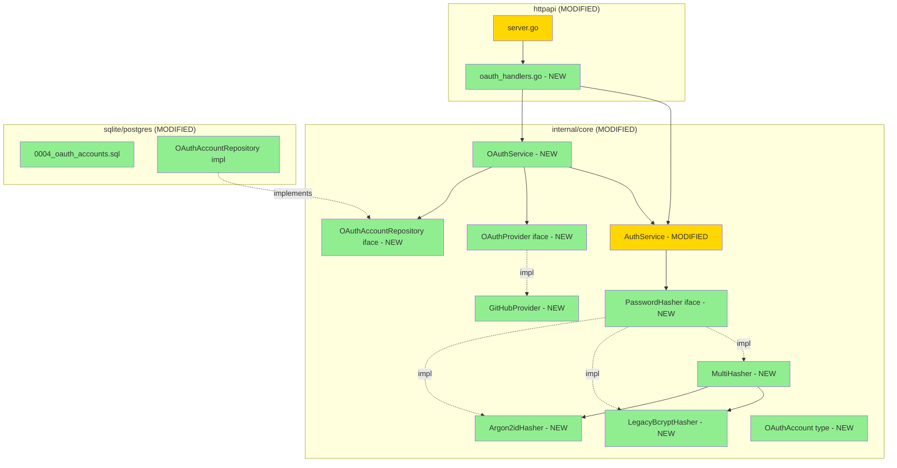

# OAuth GitHub + Argon2id (F4c) — Design

**Status:** Draft
**Author:** Claude (Opus 4.7) + Mikhail Savin
**Date:** 2026-05-07
**Feature:** oauth-argon2id (F4c)

## 2.1 Overview

5 частей: (1) `PasswordHasher` interface + Argon2id/Legacy/MultiHasher impls; (2) AuthService переход на Hasher + auto-rehash + IssueSessionForUser; (3) OAuthAccount entity + repository + миграция `0004_oauth_accounts.sql`; (4) OAuthService domain logic + GitHubProvider; (5) HTTP handlers + serve wiring + config расширения.

## 2.2 Architecture



## 2.3 Components and Interfaces

### Files Requiring Changes

| File | Status | Description |
|------|--------|-------------|
| `internal/core/password_hasher.go` | NEW | PasswordHasher iface + Argon2id/Legacy/Multi |
| `internal/core/password_hasher_test.go` | NEW | Hasher unit tests |
| `internal/core/auth_service.go` | MODIFIED | hasher field; CreateUser/VerifyPassword/Login через hasher; IssueSessionForUser; rehash hook |
| `internal/core/auth_service_test.go` | MODIFIED | Tests with Argon2id (tests use bcrypt cost=4 substitute via ConfigurableHasher OR оставить bcrypt в mock-tests) |
| `internal/core/oauth_account.go` | NEW | OAuthAccount type, OAuthUserInfo type |
| `internal/core/oauth_repository.go` | NEW | OAuthAccountRepository iface |
| `internal/core/oauth_service.go` | NEW | OAuthService + OAuthProvider iface |
| `internal/core/oauth_providers/github.go` | NEW | GitHubProvider impl |
| `internal/core/oauth_service_test.go` | NEW | OAuthService tests с mock provider |
| `internal/adapters/{sqlite,postgres}/migrations/0004_oauth_accounts.sql` | NEW | DDL |
| `internal/adapters/{sqlite,postgres}/queries/oauth_accounts.sql` | NEW | sqlc |
| `internal/adapters/{sqlite,postgres}/oauth_accounts.go` | NEW | impl + facade |
| `internal/adapters/{sqlite,postgres}/oauth_accounts_test.go` | NEW | CRUD + cascade |
| `internal/adapters/storage/factory.go` | MODIFIED | Bundle.OAuthAccounts |
| `internal/adapters/httpapi/oauth_handlers.go` | NEW | OAuthHandler {Initiate, Callback} |
| `internal/adapters/httpapi/oauth_handlers_test.go` | NEW | mock-based tests |
| `internal/adapters/httpapi/server.go` | MODIFIED | register oauth routes; add OAuthService to ServerConfig |
| `internal/adapters/httpapi/middleware.go` | MODIFIED | RequireAuth skip-list расширен `/api/auth/oauth/` |
| `internal/adapters/config/config.go` | MODIFIED | OAuth.Providers map; Auth.PasswordHasher; Validate |
| `internal/cli/serve.go` | MODIFIED | OAuthService wiring |
| `CHANGELOG.md`, `.jtpost.example.yaml` | MODIFIED | docs |

### Files NOT Requiring Changes

| File | Reason |
|------|--------|
| `fsrepo/*` | FS не поддерживает users/oauth |
| `gitrepo/*` | F3 без изменений |
| `cli/{user,token}.go` | CLI auth остаётся |
| `cli/migrate*.go` | без изменений |

### Interfaces

```go
// internal/core/password_hasher.go
type PasswordHasher interface {
    Hash(password string) (string, error)
    Verify(hash, password string) error
    NeedsRehash(hash string) bool
}

// internal/core/oauth_account.go
type OAuthAccount struct {
    ID         uuid.UUID
    UserID     uuid.UUID
    Provider   string
    ExternalID string
    Email      string
    CreatedAt  time.Time
}

type OAuthUserInfo struct {
    ExternalID  string
    Email       string
    DisplayName string
}

// internal/core/oauth_repository.go
type OAuthAccountRepository interface {
    GetByExternalID(ctx context.Context, provider, externalID string) (*OAuthAccount, error)
    Create(ctx context.Context, a *OAuthAccount) error
    ListByUser(ctx context.Context, userID uuid.UUID) ([]*OAuthAccount, error)
    Delete(ctx context.Context, id uuid.UUID) error
}

// internal/core/oauth_service.go
type OAuthProvider interface {
    Name() string
    AuthorizeURL(state string) string
    Exchange(ctx context.Context, code string) (accessToken string, err error)
    FetchUserInfo(ctx context.Context, accessToken string) (*OAuthUserInfo, error)
}

type OAuthService struct{ /* opaque */ }

func NewOAuthService(
    providers map[string]OAuthProvider,
    users UserRepository,
    oauthAccounts OAuthAccountRepository,
    defaultTenantID uuid.UUID,
    defaultRole Role,
    clock Clock,
) *OAuthService

func (s *OAuthService) BuildAuthorizeURL(provider string) (url, state string, err error)
func (s *OAuthService) HandleCallback(ctx context.Context, provider, code string) (*User, error)

// AuthService new method:
func (s *AuthService) IssueSessionForUser(ctx context.Context, user *User, ttl time.Duration) (*LoginResult, error)
```

## 2.4 Key Decisions

### ADR-1: PasswordHasher как interface + MultiHasher detection

- **Decision:** Single Hasher param в AuthService = `MultiHasher` (detection by prefix). `Argon2idHasher` для Hash/Verify; `LegacyBcryptHasher` только Verify (read-only).
- **Rationale:** Backward-compat; auto-upgrade при login; конфигурация одна (`auth.password_hasher: auto`).

### ADR-2: Argon2id parameters hardcoded, config-override deferred

- **Decision:** Hardcoded OWASP 2024 baseline.
- **Rationale:** Менять параметры опасно (incompatible с existing hashes). Config-override — F11/maintenance.

### ADR-3: State через cookie, не DB-table

- **Decision:** `jtpost_oauth_state` cookie (Max-Age=600, HttpOnly, Secure, SameSite=Lax, Path=/api/auth/oauth/).
- **Rationale:** Простой, достаточный для OAuth flow. DB-table — overkill для 10-min ttl. Замена в B-этап + sliding-session.

### ADR-4: Email-based linking автоматический

- **Decision:** Если GitHub email == existing user email → автоматически link.
- **Rationale:** GitHub primary email обязан быть verified (REQ-5.4) — снижает email injection risk. Explicit confirm UI — F8 Web UI.

### ADR-5: Versioning — minor bump 0.7 → 0.8

- Backward-compat: existing bcrypt passwords продолжают работать через MultiHasher; OAuth-endpoints новые, не конфликтуют. Config расширения — все с defaults.

## 2.5 Data Models

### Migration 0004_oauth_accounts.sql (sqlite)

```sql
-- +goose Up
CREATE TABLE oauth_accounts (
    id          TEXT PRIMARY KEY,
    user_id     TEXT NOT NULL,
    provider    TEXT NOT NULL,
    external_id TEXT NOT NULL,
    email       TEXT NOT NULL,
    created_at  TEXT NOT NULL,
    UNIQUE (provider, external_id),
    FOREIGN KEY (user_id) REFERENCES users(id) ON DELETE CASCADE
);
CREATE INDEX idx_oauth_user ON oauth_accounts(user_id);
-- +goose Down
DROP TABLE oauth_accounts;
```

### Postgres-вариант — uuid + timestamptz + REFERENCES inline.

## 2.6 Correctness Properties

```
Property 1: Argon2id roundtrip
Category: Round-trip
Statement: For all (password) where Hash returns h, Verify(h, password) returns nil.
Validates: REQ-1.2, REQ-1.3, REQ-1.4
```

```
Property 2: Wrong password rejected
Category: Absence
Statement: Argon2idHasher.Verify(h, wrongPassword) returns ErrUnauthorized.
Validates: REQ-1.4
```

```
Property 3: Hash format detection
Category: Propagation
Statement: MultiHasher.Verify($argon2id$...) → Argon2idHasher; $2a$/$2b$/$2y$ → LegacyBcryptHasher; иначе → ErrUnauthorized.
Validates: REQ-1.6
```

```
Property 4: Legacy needs rehash
Category: Propagation
Statement: NeedsRehash($2a$...) == true; NeedsRehash($argon2id$...) == false.
Validates: REQ-1.7
```

```
Property 5: Login auto-rehash legacy
Category: Round-trip
Statement: Login user with bcrypt-hash → Login success → background goroutine UpdateUser с Argon2id-hash. После — VerifyPassword(новый hash, password) success.
Validates: REQ-2.4
```

```
Property 6: OAuth-only user rejected по password-login
Category: Absence
Statement: VerifyPassword для user.PasswordHash == "" → ErrUnauthorized.
Validates: REQ-7.4
```

```
Property 7: OAuth callback existing oauth_account → re-login
Category: Equivalence
Statement: HandleCallback с existing (provider, external_id) → возвращает того же user.
Validates: REQ-7.1
```

```
Property 8: OAuth callback link by email
Category: Propagation
Statement: HandleCallback с email matching existing user, без oauth_account → создаёт OAuthAccount link, возвращает existing user.
Validates: REQ-7.2
```

```
Property 9: OAuth callback new user
Category: Round-trip
Statement: HandleCallback без oauth_account и без user-by-email → создаёт User+OAuthAccount, возвращает new user.
Validates: REQ-7.3
```

```
Property 10: OAuth no verified email rejected
Category: Absence
Statement: HandleCallback с provider возвращающим non-verified email → ErrValidation.
Validates: REQ-4.3
```

```
Property 11: State cookie roundtrip
Category: Round-trip
Statement: BuildAuthorizeURL → state X; callback с cookie=X & query state=X → success.
Validates: REQ-6.1, REQ-6.2
```

```
Property 12: State mismatch rejected
Category: Absence
Statement: callback с cookie != query state → 400.
Validates: REQ-6.2
```

```
Property 13: GitHub provider builds correct URL
Category: Equivalence
Statement: GitHubProvider.AuthorizeURL(state) содержит client_id, redirect_uri, state, scope=user:email.
Validates: REQ-5.2
```

```
Property 14: Storage Bundle includes OAuthAccounts
Category: Propagation
Statement: For all sqlite/postgres backends, Bundle.OAuthAccounts != nil.
Validates: REQ-8.1
```

```
Property 15: Cascade delete oauth_accounts
Category: Propagation
Statement: DeleteUser → oauth_accounts user'a удалены через FK CASCADE.
Validates: REQ-3.3
```

```
Property 16: PasswordHasher config validation
Category: Absence
Statement: Auth.PasswordHasher ∉ {"", "auto", "argon2id", "bcrypt"} → ErrConfigInvalid.
Validates: REQ-8.4
```

## 2.7 Error Handling

| Scenario | Detection | Action |
|----------|-----------|--------|
| Argon2id parse fail | regex/parse helper | ErrUnauthorized |
| Argon2id hash mismatch | constant-time compare | ErrUnauthorized |
| Bcrypt format detected | prefix `$2a$` | LegacyBcryptHasher.Verify |
| Unknown hash format | not detected | ErrUnauthorized |
| OAuth provider not registered | map lookup miss | ErrConfigInvalid |
| OAuth code exchange fail | provider.Exchange error | ErrValidation |
| GitHub no verified email | FetchUserInfo не нашёл | ErrValidation "no verified email" |
| Callback state mismatch | constant-time compare | HTTP 400 |
| Callback code missing | URL parse | HTTP 400 |
| HandleCallback general failure | error from service | HTTP 400 with details |
| OAuth-only user password login | PasswordHash == "" | ErrUnauthorized |
| Re-hash UpdateUser fails | ignored, log warning | Login succeeds anyway |

## 2.8 Testing Strategy

**Test Style Source:** Tier 2.

**Project Commands:** test/race/integration/build/lint/generate (без изменений).

### Unit Tests

| Test | Description | Tags |
|------|-------------|------|
| TestArgon2idHasher_RoundTrip | Hash → Verify ok | Property/1 |
| TestArgon2idHasher_WrongPassword | Hash → Verify(wrong) → ErrUnauthorized | Property/2 |
| TestArgon2idHasher_FormatString | regex check на `$argon2id$v=19$m=...$.../...` | Property/1 |
| TestLegacyBcryptHasher_VerifyExisting | bcrypt hash from F4a → Verify ok | — |
| TestMultiHasher_DetectArgon2id | Verify($argon2id$...) → success | Property/3 |
| TestMultiHasher_DetectBcrypt | Verify($2a$...) → success | Property/3 |
| TestMultiHasher_UnknownFormat | Verify("plain") → ErrUnauthorized | Property/3 |
| TestMultiHasher_NeedsRehash_Bcrypt | true | Property/4 |
| TestMultiHasher_NeedsRehash_Argon2id | false | Property/4 |
| TestAuthService_Login_RehashLegacy | bcrypt-stored user → login → eventually argon2 hash в БД | Property/5 |
| TestAuthService_VerifyPassword_OAuthOnly_Rejected | empty hash → ErrUnauthorized | Property/6 |
| TestAuthService_IssueSessionForUser_Roundtrip | OAuth-style session creation | — |
| TestSQLiteOAuthRepo_CRUD | CRUD + GetByExternalID + ListByUser | Property/14 |
| TestSQLiteOAuthRepo_CascadeDelete | DeleteUser → oauth empty | Property/15 |
| TestPostgresOAuthRepo_* (integration) | зеркало | Property/14, 15 |
| TestStorageBundle_OAuthAccounts_Set | sqlite → non-nil | Property/14 |
| TestConfigValidate_PasswordHasher | range check | Property/16 |
| TestOAuthService_HandleCallback_NewUser | mock provider → создаёт user+oauth_account | Property/9 |
| TestOAuthService_HandleCallback_ExistingOAuth | repeat call → re-login | Property/7 |
| TestOAuthService_HandleCallback_LinkByEmail | existing user (email match) → link | Property/8 |
| TestOAuthService_HandleCallback_NoVerifiedEmail | provider returns no email → ErrValidation | Property/10 |
| TestGitHubProvider_AuthorizeURL | URL contains все ожидаемые params | Property/13 |
| TestGitHubProvider_FetchUserInfo_Mock | mock GitHub API → возвращает correct OAuthUserInfo | — |
| TestOAuthHandler_Initiate_RedirectAndCookie | GET /oauth/github → 302 + jtpost_oauth_state cookie | Property/11 |
| TestOAuthHandler_Callback_StateMismatch_400 | invalid state → 400 | Property/12 |
| TestOAuthHandler_Callback_Success_SessionCookie | valid state + code → 302 / + Set-Cookie session | Property/11 |
| TestOAuthHandler_UnknownProvider_404 | /oauth/google → 404 (если не настроен) | — |
