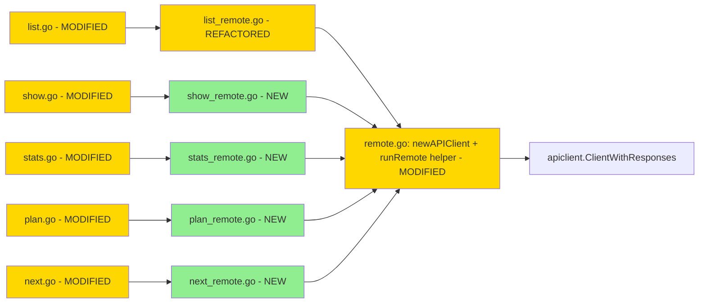

# `--remote` для read-only CLI команд (F5c) — Design

## 2.1 Overview

5 файлов: `internal/cli/{show,stats,plan,next}_remote.go` + extracted helper `runRemote` в `remote.go`. Refactor `list_remote.go` использовать helper.

## 2.2 Architecture



## 2.3 Components

### Files

| File | Status | Description |
|------|--------|-------------|
| `internal/cli/remote.go` | MODIFIED | + `runRemote` helper, extracted contextBackground |
| `internal/cli/list.go`, `list_remote.go` | MODIFIED | refactored на `runRemote` (no behavior change) |
| `internal/cli/show.go` | MODIFIED | branching local/remote |
| `internal/cli/show_remote.go` | NEW | runShowRemote |
| `internal/cli/stats.go` | MODIFIED | branching |
| `internal/cli/stats_remote.go` | NEW | runStatsRemote |
| `internal/cli/plan.go` | MODIFIED | branching |
| `internal/cli/plan_remote.go` | NEW | runPlanRemote |
| `internal/cli/next.go` | MODIFIED | branching |
| `internal/cli/next_remote.go` | NEW | runNextRemote |
| `internal/cli/{show,stats,plan,next}_remote_test.go` | NEW | Mock-server tests |
| `CHANGELOG.md` | MODIFIED | F5c |

### Interface

```go
// runRemote — общий wrapper для remote-mode команд.
// Возвращает (didRun bool, err error). Если cmd НЕ в remote-mode — (false, nil).
func runRemote(cmd *cobra.Command, fn func(ctx context.Context, cli *apiclient.ClientWithResponses) error) (bool, error)
```

## 2.4 Key Decisions

### ADR-1: Helper-based DRY

- **Decision:** `runRemote` extract — единая точка инициализации client + ctx + standard 401-handling.
- **Rationale:** 4+ мест copy-paste — anti-pattern.

### ADR-2: JSON-only output для F5c

Table-mode для apiclient generated types — отложен в F5d. JSON-вывод универсален.

## 2.5 Data Models — без изменений.

## 2.6 Correctness Properties

- CP-1: helper signature stable (returns isRemote+error).
- CP-2: runListRemote behavior identical после refactor (TestList_RemoteMode_* pass).
- CP-3: каждая *_remote.go вызывает соответствующий ClientWithResponses метод.
- CP-4: 401 от remote → exit 1 с "unauthorized".
- CP-5: 404 (где применимо) → "not found".
- CP-6: 5xx → wrapped error.
- CP-7: connection error → wrapped error.
- CP-8: local-mode без --remote — без изменений (tests existing pass).
- CP-9: JSON encoder pretty-printed.
- CP-10: ctx fallback на context.Background при nil cmd.Context().

## 2.7 Error Handling

| Scenario | Action |
|----------|--------|
| 200 → JSON-вывод |
| 401 → exit 1 "unauthorized: invalid or expired --auth token" |
| 404 → exit 1 "not found" |
| 5xx → exit 1 "remote API returned <code>" |
| connection refused → exit 1 with wrapped error |
| invalid id format (show) → caller-side validation (uuid.Parse) |

## 2.8 Testing Strategy

| Test | Description |
|------|-------------|
| TestShow_RemoteMode_Success | mock /posts/{id} → 200 + JSON |
| TestShow_RemoteMode_404 | 404 → error "not found" |
| TestStats_RemoteMode_Success | mock /stats |
| TestPlan_RemoteMode_Success | mock /plan |
| TestNext_RemoteMode_Success | mock /next |
| TestRunRemote_Helper | unit test helper isolation |
| Existing tests pass без изменений |
