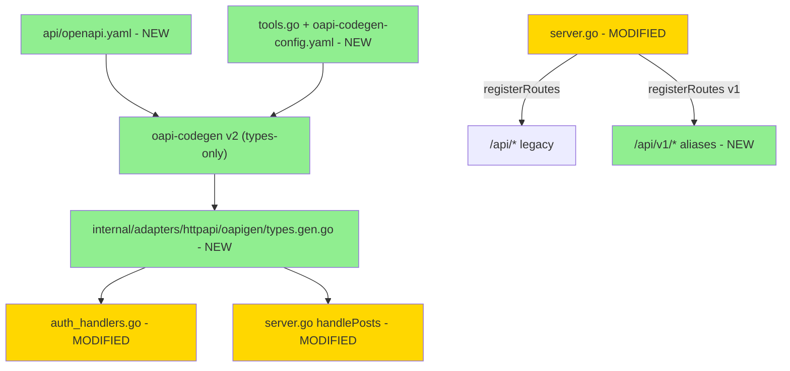

# OpenAPI 3.1 Spec + types codegen (F5) — Design

**Status:** Draft · **Date:** 2026-05-07

## 2.1 Overview

5 частей: (1) `api/openapi.yaml` — full спецификация existing endpoints; (2) `tools.go` + `oapi-codegen-config.yaml`; (3) Generated types `oapigen/types.gen.go` с UUID/time overrides; (4) Refactor существующих handlers использовать generated types; (5) `/api/v1/...` aliases в server.go.

## 2.2 Architecture



## 2.3 Components and Interfaces

### Files Requiring Changes

| File | Status | Description |
|------|--------|-------------|
| `api/openapi.yaml` | NEW | Full spec |
| `tools.go` | NEW | `//go:build tools` blank-import oapi-codegen |
| `oapi-codegen-config.yaml` | NEW | types-only config |
| `internal/adapters/httpapi/oapigen/types.gen.go` | NEW | Generated (committed) |
| `Taskfile.yml` | MODIFIED | `generate:openapi`, `generate:sqlc`, `generate` aggregate |
| `internal/adapters/httpapi/auth_handlers.go` | MODIFIED | LoginRequest/Response → oapigen |
| `internal/adapters/httpapi/server.go` | MODIFIED | v1 alias routes; jsonPost → oapigen.Post (опц для F5; refactor частично) |
| `internal/adapters/httpapi/api_v1_test.go` | NEW | Alias tests |
| `internal/adapters/httpapi/openapi_spec_test.go` | NEW | Spec parse smoke test |
| `CHANGELOG.md`, `.jtpost.example.yaml` | MODIFIED | docs |

### Files NOT Requiring Changes

| File | Reason |
|------|--------|
| `core/post.go`, `service.go` | Domain не меняется; types — HTTP-уровень |
| `internal/adapters/{sqlite,postgres,storage,fsrepo,gitrepo}` | Storage не меняется |
| `internal/cli/*` | CLI client codegen — F5b |
| `internal/adapters/httpapi/middleware.go`, `oauth_handlers.go` | Middleware и OAuth не требуют refactor для F5 (можно оставить с manual types) |

## 2.4 Key Decisions

### ADR-1: Types-only codegen

- **Decision:** Generate ONLY types (not server.go ServerInterface).
- **Rationale:** Минимальный refactor; existing handler-routing работает; postepenно можно добавлять server-side codegen в F5b.
- **Consequences:** Не извлекаем auto-validation; spec может drift от code (но `task generate && git diff --exit-code` ловит).

### ADR-2: `/api/v1/` aliases (не replacement)

- **Decision:** Добавляем `/api/v1/...` параллельно legacy `/api/...`.
- **Rationale:** Backward-compat. Legacy deprecation — F5b/F5c.
- **Consequences:** routing-table удваивается. Простая helper-функция для регистрации path с double-prefix.

### ADR-3: oapi-codegen v2 (не v1)

- **Decision:** `github.com/oapi-codegen/oapi-codegen/v2`.
- **Rationale:** v1 deprecated; v2 поддерживает OpenAPI 3.1.

### ADR-4: UUID through compatibility mappings

- **Decision:** В `oapi-codegen-config.yaml`: `output-options.client-type: types`, `compatibility.uuid-as-string: false` или explicit `import-mapping`. UUID `format: uuid` → `uuid.UUID`.
- **Rationale:** F1 already uses `uuid.UUID`; type-conversion должна быть прямой.
- **Consequences:** Generated types depend on `github.com/google/uuid` — это уже direct dep.

### ADR-5: Versioning — minor bump 0.9 → 0.10

API contract стабилизируется в `/api/v1/`. Legacy `/api/` work as before.

## 2.5 Data Models

OpenAPI components.schemas (фрагмент):
- `Post` — все F1+F4 поля (см. requirements REQ-1.4).
- `Attachment{id uuid, type enum, path string, url string, caption string, mime_type string, size int64}`.
- `PublishAttempt{id, at, target, status, message_id, error, retry_attempt, duration}`.
- `LoginRequest{email, password}`, `LoginResponse{csrf_token, user_id, role, expires_at}`.
- `ErrorResponse{error string}`.
- `Stats`, `PlanItem`, `Tags`.

## 2.6 Correctness Properties

```
Property 1: Generated types compile
Category: Equivalence
Statement: For all schemas в openapi.yaml, generated Go-struct компилируется и имеет PascalCase имена.
Validates: REQ-2.5
```

```
Property 2: UUID type override
Category: Propagation
Statement: For all uuid-fields в openapi.yaml (format: uuid), generated type — `uuid.UUID` или `*uuid.UUID`.
Validates: REQ-3.1
```

```
Property 3: time.Time для date-time
Category: Propagation
Statement: For all date-time fields, generated type — `time.Time` или `*time.Time`.
Validates: REQ-3.2
```

```
Property 4: Nullable → pointer
Category: Propagation
Statement: For all `nullable: true` fields, generated type — pointer.
Validates: REQ-3.3
```

```
Property 5: Spec validity
Category: Absence
Statement: `oapi-codegen` парсит api/openapi.yaml без ошибок.
Validates: REQ-6.4
```

```
Property 6: v1 alias equivalence
Category: Equivalence
Statement: For all v1-prefixed paths, response identical к legacy path same handler.
Validates: REQ-5.1, REQ-5.3, REQ-6.3
```

```
Property 7: Generated code freshness
Category: Round-trip
Statement: `task generate` → `git diff --exit-code -- oapigen` clean.
Validates: REQ-6.2
```

```
Property 8: Legacy paths work
Category: Equivalence
Statement: `/api/posts` после F5 → возвращает то же что и до F5.
Validates: REQ-5.2
```

```
Property 9: LoginRequest decode
Category: Propagation
Statement: POST /api/auth/login с body matching openapi LoginRequest schema → 200.
Validates: REQ-4.1
```

```
Property 10: Handler refactor non-breaking
Category: Equivalence
Statement: For all existing handler tests, after refactor — все pass.
Validates: REQ-4.3
```

```
Property 11: securitySchemes declared
Category: Propagation
Statement: api/openapi.yaml содержит bearerAuth (HTTP Bearer) и cookieAuth (apiKey/cookie).
Validates: REQ-1.5
```

```
Property 12: Error response uniform
Category: Equivalence
Statement: Все 4xx/5xx responses используют `$ref: #/components/schemas/ErrorResponse`.
Validates: REQ-1.6
```

```
Property 13: All endpoints in spec
Category: Equivalence
Statement: For all routes в server.go, в openapi.yaml есть corresponding path. Counter — все 11+ endpoints из REQ-1.2.
Validates: REQ-1.2
```

```
Property 14: tools.go pattern
Category: Propagation
Statement: tools.go под build-tag `tools`; oapi-codegen — direct dep после `go mod tidy`.
Validates: REQ-2.1
```

```
Property 15: Taskfile generate aggregates
Category: Equivalence
Statement: `task generate` runs both sqlc и oapi-codegen.
Validates: REQ-2.4
```

```
Property 16: Build clean
Category: Absence
Statement: `task build` → no errors после refactor.
Validates: REQ-4.3, REQ-6.1
```

## 2.7 Error Handling

| Scenario | Detection | Action |
|----------|-----------|--------|
| Invalid openapi.yaml | oapi-codegen parse fail | Build fail; CI catches |
| Generated code stale | git diff --exit-code | CI workflow fail |
| Refactored handler breaks test | task test | Test fail visible |
| UUID/time override misconfigured | compile error | Build fail |
| Type collision (`Post` vs existing `jsonPost`) | compile error | Rename one |

## 2.8 Testing Strategy

**Test Style Source:** Tier 2 (как F4).

**Project Commands:** test/race/build/lint/generate (как раньше).

### Tests

| Test | Description |
|------|-------------|
| TestOpenAPISpec_Parses | api/openapi.yaml — valid (через kin-openapi или oapi-codegen) |
| TestAPIV1_AliasRoutes | GET /api/v1/posts == /api/posts (in-memory tests) |
| TestLoginHandler_OAPIGenTypes | LoginHandler использует oapigen.LoginRequest |
| Existing handler tests | Все existing tests должны pass без изменений |
| Generated types compile | `go build ./internal/adapters/httpapi/oapigen/...` |
