# Storage Parity — SQLite + Postgres (F2) — Design

**Status:** Draft
**Author:** Claude (Opus 4.7) + Mikhail Savin
**Date:** 2026-05-07
**Feature:** storage-parity-postgres (F2)

## 2.1 Overview

F2 строит единый трёхбэкендный storage-слой (`fs`/`sqlite`/`postgres`) поверх F1-доменной модели. Логически фича распадается на 6 частей:

1. **Domain extensions** — новые ошибки `ErrConflict`, `ErrMigrationFailed`; `Config.Validate()` усилён под DSN-проверки.
2. **SQL toolchain** — `sqlc.yaml` с двумя пакетами (sqlite/postgres), embed-FS goose-миграций в каждом адаптере.
3. **SQLite v2** — переписанный `internal/adapters/sqlite` под F1-парность через sqlc-генерацию + optimistic lock через `WHERE revision=?`.
4. **Postgres** — новый `internal/adapters/postgres` на `pgx/v5` + `pgxpool`, изоморфный SQLite семантически.
5. **Storage factory** — `internal/adapters/storage` для runtime-выбора по `cfg.Storage.Type`; CLI и httpapi-серверный путь перевязаны.
6. **CLI/Tooling** — `jtpost migrate db` (schema), `jtpost migrate --from --to` (data), `jtpost doctor` v2; контракт-сьют `internal/adapters/repotest`; integration-тесты Postgres через testcontainers.

Implementation order соответствует topological order из requirements (Group 9 → 5 errors → 10 → 3 → 1 → 5 lock → 2 → 4 → 8 → 6 → 7). Каждый шаг даёт зелёный билд.

## 2.2 Architecture

```mermaid
graph TB
    subgraph CLI["cmd/jtpost + internal/cli (MODIFIED)"]
        new[new/list/edit/...]
        migrate_data[migrate --from/--to]
        migrate_db[migrate db up/status]
        doctor[doctor]
        serve[serve]
    end

    subgraph Factory["internal/adapters/storage (NEW)"]
        Open[storage.Open cfg]
    end

    subgraph FS["internal/adapters/fsrepo (UNCHANGED)"]
        FSRepo[FileSystemPostRepository]
    end

    subgraph SQLite["internal/adapters/sqlite (REWRITTEN)"]
        SQLiteRepo[PostRepository]
        SQLiteMig[migrations FS embed]
        SQLiteSqlc[queries sqlc-gen]
    end

    subgraph PG["internal/adapters/postgres (NEW)"]
        PGRepo[PostRepository]
        PGMig[migrations FS embed]
        PGSqlc[queries sqlc-gen]
        PGPool[pgxpool.Pool]
    end

    subgraph Core["internal/core"]
        Repo[PostRepository iface]
        ErrConflict[ErrConflict NEW]
        ErrMig[ErrMigrationFailed NEW]
        Service[PostService]
    end

    subgraph Test["internal/adapters/repotest (NEW)"]
        Contract[RunContract]
    end

    new --> Open
    migrate_data --> Open
    migrate_db --> SQLiteMig
    migrate_db --> PGMig
    doctor --> Open
    serve --> Open

    Open --> FSRepo
    Open --> SQLiteRepo
    Open --> PGRepo

    SQLiteRepo --> SQLiteSqlc
    SQLiteRepo --> SQLiteMig
    PGRepo --> PGSqlc
    PGRepo --> PGMig
    PGRepo --> PGPool

    SQLiteRepo -. implements .-> Repo
    PGRepo -. implements .-> Repo
    FSRepo -. implements .-> Repo

    Service --> Repo
    SQLiteRepo -. raises .-> ErrConflict
    PGRepo -. raises .-> ErrConflict
    SQLiteRepo -. raises .-> ErrMig
    PGRepo -. raises .-> ErrMig

    Contract -. tests .-> FSRepo
    Contract -. tests .-> SQLiteRepo
    Contract -. tests .-> PGRepo

    style Open fill:#90EE90
    style PGRepo fill:#90EE90
    style PGMig fill:#90EE90
    style PGSqlc fill:#90EE90
    style PGPool fill:#90EE90
    style Contract fill:#90EE90
    style ErrConflict fill:#90EE90
    style ErrMig fill:#90EE90
    style SQLiteRepo fill:#FFD700
    style SQLiteMig fill:#FFD700
    style SQLiteSqlc fill:#FFD700
    style new fill:#FFD700
    style migrate_data fill:#FFD700
    style migrate_db fill:#FFD700
    style doctor fill:#FFD700
    style serve fill:#FFD700
```



## 2.3 Components and Interfaces

### Files Requiring Changes

| File | Change Type | Description |
|------|-------------|-------------|
| `internal/core/errors.go` | `[MODIFIED]` | Добавляются `ErrConflict`, `ErrMigrationFailed` |
| `internal/adapters/config/config.go` | `[MODIFIED]` | `Validate()` проверяет DSN при `Type=sqlite/postgres`, отрицательные `MaxOpenConns/MaxIdleConns` |
| `internal/adapters/config/config_test.go` | `[MODIFIED]` | Кейсы для новых валидаций |
| `sqlc.yaml` | `[NEW]` | Конфиг с двумя пакетами `sqlite`, `postgres` |
| `Taskfile.yml` | `[MODIFIED]` | Новые задачи `generate`, `test:integration`, `db:up`, `db:status` |
| `internal/adapters/sqlite/repository.go` | `[MODIFIED]` | Полностью переписан: F1-поля, scope из ctx, расширенный `List`, optimistic lock, sqlc-обёртка |
| `internal/adapters/sqlite/migrations/0001_initial.sql` | `[NEW]` | F1-схема через goose `-- +goose Up`/`Down` |
| `internal/adapters/sqlite/queries/*.sql` | `[NEW]` | sqlc-запросы (Create/Get*/List/Update/Delete/Count) |
| `internal/adapters/sqlite/queries/*.sql.go` | `[NEW]` | sqlc-сгенерированный код (commitable) |
| `internal/adapters/sqlite/repository_test.go` | `[MODIFIED]` | Использует `repotest.RunContract`; локальные кейсы только для sqlite-специфики |
| `internal/adapters/postgres/repository.go` | `[NEW]` | Реализация `core.PostRepository` через `pgxpool.Pool` |
| `internal/adapters/postgres/migrations/0001_initial.sql` | `[NEW]` | F1-схема для Postgres (`uuid`, `jsonb`, `timestamptz`) |
| `internal/adapters/postgres/queries/*.sql` | `[NEW]` | sqlc-запросы для Postgres |
| `internal/adapters/postgres/queries/*.sql.go` | `[NEW]` | sqlc-сгенерированный код |
| `internal/adapters/postgres/repository_test.go` | `[NEW]` | Build-tag `integration`, использует testcontainers + `repotest.RunContract` |
| `internal/adapters/storage/factory.go` | `[NEW]` | `Open(cfg) (core.PostRepository, io.Closer, error)`; диспатч по `Storage.Type` |
| `internal/adapters/storage/factory_test.go` | `[NEW]` | Тесты диспатча и валидации DSN |
| `internal/adapters/repotest/contract.go` | `[NEW]` | `RunContract(t, factory)`; capability-флаги `OptimisticLock`, `Transactions` |
| `internal/adapters/fsrepo/repository_test.go` | `[MODIFIED]` | Делегирует основные сценарии в `repotest.RunContract`; локальные кейсы — только FS-специфика |
| `internal/cli/root.go` | `[MODIFIED]` | Добавляется helper `openRepo(cfg)`; используется всеми командами |
| `internal/cli/new.go`, `list.go`, `edit.go`, `delete.go`, `plan.go`, `next.go`, `import.go`, `migrate_ids.go` | `[MODIFIED]` | Замена `fsrepo.NewFileSystemRepository(cfg.PostsDir)` на `openRepo(cfg)` |
| `internal/cli/migrate.go` | `[MODIFIED]` | Полностью переписан: `--from`/`--to` через factory; убран `--db` |
| `internal/cli/migrate_db.go` | `[NEW]` | Подкоманда `jtpost migrate db <up|status>` |
| `internal/cli/doctor.go` | `[MODIFIED]` | Универсальный Storage-check, маскирование DSN |
| `internal/adapters/httpapi/server.go` | `[MODIFIED]` | Конструктор сервера принимает `core.PostRepository` через factory |
| `internal/adapters/httpapi/server_test.go` | `[MODIFIED]` | Подмена через factory; FS-сценарии в e2e-стиле |
| `.github/workflows/ci.yml` | `[MODIFIED]` | Job `integration-tests` (linux only) с `task test:integration` |
| `CHANGELOG.md` | `[MODIFIED]` | F2 entry: storage parity, новые команды, breaking change в `migrate --db` |
| `.jtpost.example.yaml` | `[MODIFIED]` | Раскомментированы примеры `storage.postgres.dsn`, `storage.sqlite.dsn` |
| `go.mod`, `go.sum` | `[MODIFIED]` | Новые: `pgx/v5`, `pgxpool`, `pressly/goose/v3`, `testcontainers-go`, `testcontainers-go/modules/postgres` |

### Files NOT Requiring Changes

| File | Reason Unchanged |
|------|-----------------|
| `internal/core/post.go` | F1-модель уже завершена, F2 только использует |
| `internal/core/repository.go` | Интерфейсы `PostRepository`, `TransactionalRepository`, `MigratableRepository` достаточны |
| `internal/core/service.go` | `UpdatePost` уже инкрементирует Revision; F2 только меняет адаптеры |
| `internal/core/scope.go` | F1 `WithTenant`/`TenantFromContext` подходят для SQL-адаптеров без изменений |
| `internal/adapters/fsrepo/repository.go` | F1-имплементация остаётся reference behaviour для contract-suite |
| `internal/adapters/fsrepo/frontmatter_parser.go` | YAML-сериализация Post не зависит от storage type |
| `internal/adapters/httpapi/middleware.go` | Tenant middleware из F1 без изменений |
| `internal/adapters/telegram/*` | Publisher не зависит от storage |
| `cmd/jtpost/main.go` | Точка входа cobra без знания о storage |
| `internal/core/clock.go`, `publisher.go`, `slug.go`, `core.go`, `post.go` | F1-API стабильно |

### Interfaces (signatures only)

```go
// internal/adapters/storage/factory.go
package storage

func Open(cfg *config.Config) (core.PostRepository, io.Closer, error)
// Возвращает репозиторий по cfg.Storage.Type. Для sqlite/postgres
// синхронно применяет goose-миграции и проверяет соединение (Ping).

// internal/adapters/sqlite/repository.go
package sqlite

func NewSQLitePostRepository(cfg Config) (*PostRepository, error)
// cfg.DSN required; применяет миграции из embed.FS.

func (r *PostRepository) Close() error
func (r *PostRepository) BeginTx(ctx context.Context) (context.Context, func() error, error)
func (r *PostRepository) GetByID(ctx context.Context, id core.PostID) (*core.Post, error)
func (r *PostRepository) GetBySlug(ctx context.Context, slug string) (*core.Post, error)
func (r *PostRepository) List(ctx context.Context, filter core.PostFilter) ([]*core.Post, error)
func (r *PostRepository) Create(ctx context.Context, post *core.Post) error
func (r *PostRepository) Update(ctx context.Context, post *core.Post) error
func (r *PostRepository) Delete(ctx context.Context, id core.PostID) error
func (r *PostRepository) ImportPosts(ctx context.Context, posts []*core.Post) error
func (r *PostRepository) Count(ctx context.Context) (int64, error)

// internal/adapters/postgres/repository.go
package postgres

type Config struct {
    DSN             string
    MaxOpenConns    int
    MaxIdleConns    int
    ConnMaxLifetime time.Duration
}

func NewPostgresRepository(ctx context.Context, cfg Config) (*PostRepository, error)
// Создаёт pgxpool, синхронно делает Ping, применяет goose-миграции.

// Same method set as SQLite (one PostRepository.* per CRUD op).

// internal/adapters/repotest/contract.go
package repotest

type Capabilities struct {
    OptimisticLock bool
    Transactions   bool
}

type Factory func(t *testing.T) (core.PostRepository, Capabilities, func() /*cleanup*/)

func RunContract(t *testing.T, factory Factory)

// internal/cli/root.go (helper)
func openRepo(cfg *config.Config) (core.PostRepository, io.Closer, error)
```

**Pre/post-conditions:**
- `storage.Open` precondition: `cfg.Validate()` уже прошёл; postcondition: репо готов к Use, миграции применены, Ping прошёл (для SQL).
- `*.PostRepository.GetByID` precondition: `core.TenantFromContext(ctx)` возвращает не-Nil; otherwise `ErrTenantMismatch`.
- `*.PostRepository.Update` precondition: `post.Revision` уже инкрементирован сервисом; адаптер использует `post.Revision-1` в `WHERE`.
- `repotest.RunContract` precondition: factory создаёт «пустое» хранилище; cleanup запускается через `t.Cleanup`.

## 2.4 Key Decisions

### ADR-1: Хранение `attachments`/`publish_history` как JSON-колонки

- **Context:** F1 определил эти поля как массивы. Нужно решить — отдельные таблицы (нормализация) или JSON-колонки (денормализация).
- **Options:**
  1. Отдельные таблицы `post_attachments`, `post_publish_attempts` с FK на `posts(id)`.
  2. JSON-колонки в `posts` (`jsonb` Postgres / `TEXT` SQLite).
  3. Гибрид — `cover_image` inline, остальное в таблицах.
- **Decision:** Option 2 (JSON-колонки).
- **Rationale:** F2 не требует JOIN-фильтрации по полям внутри (например, "найти все посты с photo-вложением"). JSON упрощает mapping (одна Row → один Post), уменьшает количество запросов. SQLite `json_extract` и Postgres `jsonb`-операторы покроют будущую фильтрацию без миграции схемы.
- **Consequences:** При переходе к C-этапу (RLS, partition) и появлении media-management фич — миграция на отдельные таблицы будет дорогой. Зафиксировано как deferred risk; F2 предупреждает в CHANGELOG.

### ADR-2: Optimistic lock через `WHERE revision = ?`, `ErrConflict`

- **Context:** Concurrent Update двух процессов может потерять чужие изменения. Нужен механизм обнаружения конфликта.
- **Options:**
  1. `SELECT ... FOR UPDATE` (pessimistic lock) перед каждым Update.
  2. `UPDATE ... WHERE id=? AND revision=?` + проверка `RowsAffected`.
  3. Версионирование через `xmin` (Postgres-специфично).
- **Decision:** Option 2.
- **Rationale:** Универсально работает в SQLite и Postgres, не требует серверного lock'а, не блокирует читателей. Сервис уже инкрементирует Revision (F1), так что адаптеру не нужны новые public-методы.
- **Consequences:** Клиенты должны обрабатывать `ErrConflict` (retry или surface to user). FS-адаптер не реализует optimistic lock (документировано в REQ-5.6) — для multi-writer-FS-сценариев используется stat+rename, что в F2 признаётся достаточным.

### ADR-3: sqlc с двумя dialect-package'ами

- **Context:** SQL-синтаксис sqlite и postgres различается (placeholders `?` vs `$1`, JSON-функции, UUID-операторы). Нужно решить как организовать sqlc.
- **Options:**
  1. Один пакет sqlc, общий SQL — невозможно в принципе для смешанных диалектов.
  2. Два пакета `internal/adapters/sqlite/queries` и `internal/adapters/postgres/queries` с независимыми `*.sql` файлами и одинаковыми именами функций.
  3. Один query-набор + ручная transpile-обёртка.
- **Decision:** Option 2.
- **Rationale:** sqlc официально поддерживает multi-package в одном `sqlc.yaml`. Гарантирует типобезопасность для каждого диалекта. Имена функций одинаковые → адаптеры взаимозаменяемы на уровне обёртки.
- **Consequences:** Дублирование DDL/DML на уровне SQL-файлов (≈400 строк). Контракт-сьют в `repotest` страхует от семантического дрейфа.

### ADR-4: pgx/v5 + pgxpool, eager Ping

- **Context:** Нужен Postgres-драйвер. Также — момент верификации соединения.
- **Options:**
  1. `database/sql` + `lib/pq` (legacy).
  2. `database/sql` + `jackc/pgx/v5/stdlib`.
  3. Native `pgx/v5` + `pgxpool` (без `database/sql` уровня).
- **Decision:** Option 3 + синхронный `Pool.Ping(ctx)` в `NewPostgresRepository`.
- **Rationale:** Native pgx даёт типобезопасные `pgtype.UUID`, `jsonb`, `timestamptz`, поддержку LISTEN/NOTIFY (для F6). Eager Ping = fail-fast: пользователь сразу узнаёт о неправильной конфигурации, а не в первый запрос. sqlc-генерация поддерживает оба режима.
- **Consequences:** Нельзя использовать общий `database/sql` codepath с SQLite — sqlc генерирует разные сигнатуры (`*sql.DB` vs `*pgxpool.Pool`). Адаптеры остаются самостоятельными.

### ADR-5: Миграции через goose, embed-FS, авто-применение в `Open()`

- **Context:** Нужна versionированная миграционная система; нужен баланс между удобством dev и контролем prod.
- **Options:**
  1. `golang-migrate/migrate` (CLI-first).
  2. `pressly/goose/v3` (library + CLI, embed friendly).
  3. Ручные `CREATE TABLE IF NOT EXISTS` (как было).
- **Decision:** goose v3 + `embed.FS` в каждом адаптере + `goose.Up` синхронно в `Open` + отдельная команда `jtpost migrate db <up|status>` для ручного контроля.
- **Rationale:** goose поддерживает оба диалекта одной библиотекой; embed решает «откуда брать миграции в скомпилированном бинарнике»; авто-применение убирает шаг для одиночного пользователя; ручная команда оставляет дверь для DBA.
- **Consequences:** Для полностью pinned-deploy сценариев (B-этап) нужно будет добавить `--no-auto-migrate` флаг. Не делаем в F2 — добавим когда понадобится.

### ADR-6: Контракт-сьют с capability-флагами

- **Context:** Три адаптера должны соблюдать поведенческий контракт, но FS не поддерживает optimistic lock и транзакции.
- **Options:**
  1. Контракт-сьют гоняет всё подряд; FS просто проваливает specific-кейсы → нечестно.
  2. Контракт-сьют принимает `Capabilities{OptimisticLock, Transactions bool}`; SQL-only кейсы скипаются для FS.
  3. Два независимых сьюта (общий + SQL-only).
- **Decision:** Option 2.
- **Rationale:** Один источник истины поведения; capability-флаги делают расширения наглядными; легко добавлять новые backend'ы.
- **Consequences:** Тесты должны явно проверять флаг перед запуском SQL-only кейса. Это документируется в `repotest/contract.go`.

### ADR-7: Versioning & Backward Compatibility

- **Versioning strategy:** F2 — minor-bump (0.4.x → 0.5.0). `Config.Storage.Type` существует с F1 как «schema-only»; F2 делает его load-bearing. Пользователи с `.jtpost.yaml` без секции `storage` получают default `fs` (REQ-4.2). Существующие FS-данные совместимы.
- **Breaking change assessment:**
  - `jtpost migrate --db <path>` удалён → REQ-6.5 возвращает явную ошибку с инструкцией. Пользователи должны заменить на `--from sqlite --to <X>`.
  - Существующие `.jtpost.db` (F0-схема) теряются при первом `Open` SQLite v2 (REQ-3.6, F1-M1 fixed). CHANGELOG предупреждает.
  - `cfg.SQLite.DSN` (top-level) сохранён как deprecated — `cfg.Storage.SQLite.DSN` имеет приоритет. В коде factory читает `cfg.Storage.SQLite.DSN`, fallback на `cfg.SQLite.DSN` если первый пуст.
- **Migration path:** users (1) бэкапят posts content (FS-каталог, посты в SQLite — экспорт через старый `jtpost migrate` до апгрейда), (2) обновляют `.jtpost.yaml` под новую схему (или пропускают — defaults подхватятся), (3) запускают новую версию.

## 2.5 Data Models

### Domain errors (NEW)

```go
// internal/core/errors.go (extension)

// [NEW] Optimistic-lock conflict on Update.
// Returned by SQL adapters when WHERE id=? AND revision=? affects 0 rows
// and the post still exists.
var ErrConflict = errors.New("conflict")

// [NEW] Migration application failure (goose error wrap).
var ErrMigrationFailed = errors.New("migration failed")
```

### Storage factory config

```go
// internal/adapters/storage/factory.go

// [NEW] No new exported types — Open returns core.PostRepository.
// Internally dispatches by cfg.Storage.Type.
```

### SQLite schema (`migrations/sqlite/0001_initial.sql`)

```sql
-- +goose Up
DROP TABLE IF EXISTS posts;
CREATE TABLE posts (
    id              TEXT PRIMARY KEY,
    tenant_id       TEXT NOT NULL,
    author_id       TEXT NOT NULL,
    title           TEXT NOT NULL,
    slug            TEXT NOT NULL,
    status          TEXT NOT NULL,
    tags            TEXT NOT NULL DEFAULT '[]',     -- JSON array
    deadline        TEXT,                            -- RFC3339 or NULL
    scheduled_at    TEXT,
    published_at    TEXT,
    excerpt         TEXT,
    cover_image     TEXT,                            -- JSON object or NULL
    attachments     TEXT NOT NULL DEFAULT '[]',     -- JSON array
    publish_history TEXT NOT NULL DEFAULT '[]',     -- JSON array
    revision        INTEGER NOT NULL DEFAULT 1,
    revision_sha    TEXT,
    content         TEXT NOT NULL,
    telegram_url    TEXT,
    created_at      TEXT NOT NULL,
    updated_at      TEXT NOT NULL,
    UNIQUE (tenant_id, slug)
);
CREATE INDEX idx_posts_tenant ON posts(tenant_id);
CREATE INDEX idx_posts_tenant_status ON posts(tenant_id, status);
CREATE INDEX idx_posts_tenant_author ON posts(tenant_id, author_id);
CREATE INDEX idx_posts_tenant_created_at ON posts(tenant_id, created_at);
-- +goose Down
DROP TABLE posts;
```

### Postgres schema (`migrations/postgres/0001_initial.sql`)

```sql
-- +goose Up
CREATE TABLE posts (
    id              uuid PRIMARY KEY,
    tenant_id       uuid NOT NULL,
    author_id       uuid NOT NULL,
    title           text NOT NULL,
    slug            text NOT NULL,
    status          text NOT NULL,
    tags            jsonb NOT NULL DEFAULT '[]'::jsonb,
    deadline        timestamptz,
    scheduled_at    timestamptz,
    published_at    timestamptz,
    excerpt         text,
    cover_image     jsonb,
    attachments     jsonb NOT NULL DEFAULT '[]'::jsonb,
    publish_history jsonb NOT NULL DEFAULT '[]'::jsonb,
    revision        integer NOT NULL DEFAULT 1,
    revision_sha    text,
    content         text NOT NULL,
    telegram_url    text,
    created_at      timestamptz NOT NULL,
    updated_at      timestamptz NOT NULL,
    UNIQUE (tenant_id, slug)
);
CREATE INDEX idx_posts_tenant ON posts(tenant_id);
CREATE INDEX idx_posts_tenant_status ON posts(tenant_id, status);
CREATE INDEX idx_posts_tenant_author ON posts(tenant_id, author_id);
CREATE INDEX idx_posts_tenant_created_at ON posts(tenant_id, created_at);
-- +goose Down
DROP TABLE posts;
```

`[ASSUMPTION: goose-таблица версионирования (goose_db_version) хранится в той же schema что и posts; в Postgres это public]` — в B-этапе при появлении multi-tenant-DB можно вынести в jtpost-namespace.

### sqlc.yaml

```yaml
version: "2"
sql:
  - engine: sqlite
    schema: internal/adapters/sqlite/migrations
    queries: internal/adapters/sqlite/queries
    gen:
      go:
        package: sqlitedb
        out: internal/adapters/sqlite/sqlitedb
        sql_package: database/sql
        emit_interface: false
        emit_json_tags: false
  - engine: postgresql
    schema: internal/adapters/postgres/migrations
    queries: internal/adapters/postgres/queries
    gen:
      go:
        package: pgdb
        out: internal/adapters/postgres/pgdb
        sql_package: pgx/v5
        emit_interface: false
        emit_json_tags: false
```

### Capabilities (NEW)

```go
// internal/adapters/repotest/contract.go

// [NEW] Per-backend capability flags consumed by RunContract.
type Capabilities struct {
    OptimisticLock bool // Run conflict-on-stale-revision tests
    Transactions   bool // Run BeginTx/commit-rollback tests
}
```

## 2.6 Correctness Properties

```
Property 1: Tenant Isolation
Category: Exclusion
Statement: For all (post_a, post_b) where post_a.TenantID ≠ post_b.TenantID,
           and any operation Op ∈ {GetByID(post_a.ID), GetBySlug(post_a.Slug), Update(post_a), Delete(post_a.ID)}
           invoked with ctx.TenantID = post_b.TenantID,
           the system never returns post_a's data and never modifies post_a.
Validates: Requirements 1.3, 1.4, 1.10, 2.2
```

```
Property 2: Filter+Sort+Page Determinism
Category: Equivalence
Statement: For all PostFilter f with valid SortBy ∈ {created_at, updated_at, deadline, scheduled_at, title, status},
           any two invocations of List(ctx, f) on identical state return slices with identical order
           AND any two backends b1, b2 ∈ {fs, sqlite, postgres} return slices with the same order and length
           on identical state.
Validates: Requirements 1.5, 1.6, 1.7, 1.9, 2.2
```

```
Property 3: Sort Validation
Category: Absence
Statement: For all PostFilter f where f.SortBy ∉ allowedSortKeys ∪ {""},
           List(ctx, f) returns ErrValidation and never reads the storage.
Validates: Requirements 1.8, 2.2
```

```
Property 4: Optimistic Lock Conflict
Category: Absence
Statement: For all sequences (load post p; concurrently Update p with stale Revision; second Update succeeds with new Revision),
           the stale Update returns ErrConflict and never persists changes.
Validates: Requirements 5.1, 5.2, 5.3, 5.5
```

```
Property 5: Round-trip Persistence
Category: Round-trip
Statement: For all Post p with valid F1 fields,
           after Create(ctx, p) and immediate GetByID(ctx, p.ID) (with same tenant ctx),
           the returned post equals p modulo storage-driven normalization (timestamp truncation, JSON canonicalization).
Validates: Requirements 1.1, 1.2, 1.11, 2.2, 2.3
```

```
Property 6: Backend Equivalence Across Contract
Category: Equivalence
Statement: For all sequences of public PostRepository operations Σ executed against fs, sqlite, postgres
           starting from empty state and using identical inputs (modulo backend-specific cleanup/setup),
           each operation returns either equivalent success values OR the same domain error category
           (ErrNotFound, ErrTenantMismatch, ErrValidation, ErrConflict where supported).
Validates: Requirements 1.x, 2.2, 5.x (whole groups via contract-suite)
```

```
Property 7: Migration Idempotency
Category: Equivalence
Statement: For all SQL adapters a ∈ {sqlite, postgres},
           invoking Open(cfg) twice in sequence (or invoking goose.Up twice) produces the same final schema state
           and the second invocation is a no-op (no DDL executed, no error).
Validates: Requirements 3.2, 3.3, 3.4
```

```
Property 8: Storage Factory Dispatch
Category: Propagation
Statement: For all cfg with Storage.Type ∈ {fs, sqlite, postgres},
           storage.Open(cfg) returns a repository whose dynamic type matches the requested type
           (fsrepo.FileSystemPostRepository / sqlite.PostRepository / postgres.PostRepository respectively);
           for any other Type, returns ErrConfigInvalid without opening connections.
Validates: Requirements 4.1, 4.2, 4.3
```

```
Property 9: DSN-required Validation
Category: Absence
Statement: For all cfg with Storage.Type ∈ {sqlite, postgres} and corresponding DSN == "",
           neither cfg.Validate() nor storage.Open(cfg) ever opens a network connection or file handle;
           both return ErrConfigInvalid wrapped with a descriptive message.
Validates: Requirements 4.4, 4.5, 9.1, 9.2, 9.3
```

```
Property 10: Migration Removal of Legacy Flag
Category: Absence
Statement: For all CLI invocations of `jtpost migrate --db <path>`,
           the command exits with code 2 and the error message references --from/--to;
           no data migration is attempted.
Validates: Requirements 6.5
```

```
Property 11: Migrate Command Symmetry
Category: Round-trip
Statement: For all (source, target) ∈ {fs, sqlite, postgres}^2 with source ≠ target,
           after `jtpost migrate --from source --to target`,
           Count(target) == Count(source_pre) AND every post in source can be retrieved via GetByID in target
           (with appropriate tenant ctx).
Validates: Requirements 6.1, 6.3, 6.6
```

```
Property 12: Doctor Storage Check Coverage
Category: Propagation
Statement: For all cfg.Storage.Type ∈ {fs, sqlite, postgres},
           `jtpost doctor` runs the appropriate Storage check (FS path existence / SQL Open + ping/count)
           and never leaks raw DSN credentials in stdout/stderr (Postgres password is masked).
Validates: Requirements 7.1, 7.2, 7.3
```

```
Property 13: Contract Suite Coverage
Category: Equivalence
Statement: For all backends b ∈ {fs, sqlite, postgres} with capabilities cap,
           repotest.RunContract(t, factoryFor(b)) runs at minimum 15 scenarios and skips OptimisticLock/Transactions tests iff cap says so.
Validates: Requirements 8.1, 8.2
```

```
Property 14: Integration Tests Build-Tag Isolation
Category: Exclusion
Statement: For all default test invocations (`go test ./...` or `task test` without tags),
           tests under `internal/adapters/postgres` are NOT executed AND
           the unit suite never starts a Docker container.
Validates: Requirements 8.3, 8.4
```

```
Property 15: Migration Failure Wrapping
Category: Propagation
Statement: For all goose-error scenarios during Open() of SQL adapters,
           the returned error is errors.Is(err, core.ErrMigrationFailed) == true,
           preserving the underlying cause via errors.Unwrap.
Validates: Requirements 3.3, 9.4
```

```
Property 16: Postgres Pool Lifecycle
Category: Round-trip
Statement: For all NewPostgresRepository(ctx, cfg) -> r,
           after r.Close(), the underlying pgxpool.Pool reports zero acquired connections
           AND subsequent calls to any r.Method(...) return error (closed pool).
Validates: Requirements 2.1, 2.4, 2.5
```

## 2.7 Error Handling

| Scenario | Detection | Action |
|----------|-----------|--------|
| Невалидный `Storage.Type` в конфиге | `Config.Validate()` сравнивает с allowed set | Возвращает `ErrConfigInvalid`; CLI выводит в stderr и завершается с кодом 1 |
| Пустой DSN при `Type=sqlite` или `postgres` | `Validate()` (REQ-9.1, 9.2); `storage.Open` (REQ-4.4, 4.5) | `errors.Join(ErrConfigInvalid, "<type> dsn required")` |
| Postgres недоступен при `Open()` | `pgxpool.Pool.Ping(ctx)` синхронно | `errors.Join(ErrConfigInvalid, <pgx-error>)`; пул закрывается |
| Goose-миграция падает | `goose.Up` возвращает ошибку | `errors.Join(ErrMigrationFailed, <goose-error>)`; репо не возвращается |
| `GetByID` без tenant в ctx | `core.TenantFromContext(ctx)` → false | `ErrTenantMismatch` |
| `GetByID` с tenant из ctx, но пост чужой | `WHERE id=? AND tenant_id=?` → 0 rows | `ErrNotFound` (не утечка существования) |
| `List` без tenant в filter | `filter.TenantID == uuid.Nil` | `ErrValidation`, до запроса в БД |
| Unknown `SortBy` | `core.IsValidSortKey(filter.SortBy)` | `ErrValidation`, до запроса в БД |
| `Update` со stale Revision (SQL) | `WHERE revision=?` → 0 rows AND `SELECT 1 FROM posts WHERE id=?` → 1 row | `ErrConflict` |
| `Update` несуществующего поста (SQL) | `WHERE revision=?` → 0 rows AND post not found | `ErrNotFound` |
| `Delete` чужого поста | `WHERE id=? AND tenant_id=?` → 0 rows | `ErrNotFound` |
| JSON-decode error в `attachments`/`publish_history` | `json.Unmarshal` в сканере | `errors.Join(ErrValidation, <json-error>)` |
| `migrate --db <path>` (legacy) | Cobra flag-parser распознаёт флаг | exit code 2, stderr: `flag --db is no longer supported, use --from/--to` |
| `migrate --from X --to X` | Сравнение строк до открытия репо | exit code 1, stderr: `source and target must differ` |
| `migrate` без `--from`/`--to` | Cobra `MarkFlagRequired` | exit code 1, usage в stderr |
| `migrate` target не пуст без `--overwrite` | `repo.Count() > 0` | exit code 1, stderr: `target contains N posts, use --overwrite` |
| Docker недоступен в integration-тесте | `testcontainers.GenericContainer` returns error / containing «cannot connect to docker» | `t.Skip("docker not available")` |
| `pgxpool.Pool.Ping` падает после `Close()` | `pool.Stat().AcquiredConns()` → 0; pool closed | Пользовательский `Method` возвращает `pgx.ErrClosedPool` (обёртка не нужна) |
| `Postgres.MaxOpenConns < 0` или `MaxIdleConns < 0` в конфиге | `Config.Validate()` (REQ-9.3) | `ErrConfigInvalid` |
| Concurrent миграция из двух процессов | goose advisory lock в Postgres; SQLite — file lock | Один процесс ждёт другого; ошибка только при таймауте |

## 2.8 Testing Strategy

**Test Style Source:** Tier 2
- Reference test files: `internal/adapters/sqlite/repository_test.go`, `internal/adapters/fsrepo/repository_test.go`, `internal/core/post_test.go`.
- Key patterns: native `testing` package (no testify), table-driven tests via `tt := []struct{...}` slices, `t.Run(tt.name, ...)`, `testdata/` for fixtures, `t.TempDir()` for ephemeral storage, `t.Cleanup` for resource teardown.
- PBT note: PBT-библиотек в проекте нет (`gopter` не используется). Substitute: targeted unit tests covering representative inputs per Correctness Property; tagged `Property/<N>`.

**Project Commands:**

| Action               | Command                                              |
|----------------------|------------------------------------------------------|
| Test (unit)          | `task test`                                          |
| Test (race)          | `task test:race`                                     |
| Test (integration)   | `task test:integration`                              |
| Coverage             | `task test:coverage`                                 |
| Build                | `task build`                                         |
| Lint                 | `task lint`                                          |
| Format               | `task fmt`                                           |
| Vet                  | `task vet`                                           |
| Generate (sqlc)      | `task generate`                                      |
| Migrate up (dev)     | `task db:up -- --to sqlite`                          |
| Migrate status (dev) | `task db:status -- --to sqlite`                      |

### Unit Tests

| Test | Description | Tags |
|------|-------------|------|
| `TestErrorsExist` | `core.ErrConflict`, `core.ErrMigrationFailed` экспортируются | `Feature/errors` |
| `TestConfigValidate_StorageDSNRequired` | пустой DSN при `Type=sqlite\|postgres` → `ErrConfigInvalid` | `Feature/config-validate` |
| `TestConfigValidate_NegativeConns` | `MaxOpenConns<0` или `MaxIdleConns<0` → `ErrConfigInvalid` | `Feature/config-validate` |
| `TestStorageFactory_DispatchByType` | каждое значение `Storage.Type` → правильный репо-тип | `Feature/factory`, `Property/8` |
| `TestStorageFactory_EmptyTypeDefaultsToFS` | `Type=""` → fs-репо | `Feature/factory`, `Property/8` |
| `TestStorageFactory_InvalidType` | unknown type → `ErrConfigInvalid`, без открытия соединений | `Feature/factory`, `Property/8` |
| `TestStorageFactory_MissingDSN_NoConnection` | DSN="" и Type=postgres → ошибка без сетевой попытки | `Feature/factory`, `Property/9` |
| `TestSQLiteRepo_CreateGetRoundtrip` | post с F1-полями → Create → GetByID returns equal | `Feature/sqlite-parity`, `Property/5` |
| `TestSQLiteRepo_TenantIsolation` | пост tenantA не виден из ctx tenantB | `Feature/sqlite-parity`, `Property/1` |
| `TestSQLiteRepo_List_FilterSortLimit` | filter+SortBy+Limit+Offset работают | `Feature/sqlite-parity`, `Property/2` |
| `TestSQLiteRepo_List_InvalidSort` | unknown SortBy → `ErrValidation`, без запроса | `Feature/sqlite-parity`, `Property/3` |
| `TestSQLiteRepo_Update_RevisionConflict` | stale revision → `ErrConflict` | `Feature/sqlite-parity`, `Property/4` |
| `TestSQLiteRepo_Update_NotFound` | non-existent ID → `ErrNotFound`, не `ErrConflict` | `Feature/sqlite-parity`, `Property/4` |
| `TestSQLiteRepo_Migrate_Idempotent` | 2× `Open()` подряд → no error, no duplicate DDL | `Feature/sqlite-parity`, `Property/7` |
| `TestSQLiteRepo_JSONDecodeError` | повреждённый attachments_json → `ErrValidation` | `Feature/sqlite-parity` |
| `TestPostgresRepo_*` (integration build-tag) | те же сценарии что SQLite, но против testcontainers Postgres | `Feature/postgres`, `Property/{1..7}` |
| `TestPostgresRepo_PoolLifecycle` | Close → последующие вызовы → ошибка closed pool | `Feature/postgres`, `Property/16` |
| `TestPostgresRepo_PingFailFast` | bad DSN → Open returns без длинного timeout | `Feature/postgres`, `Property/9` |
| `TestRepotestRunContract_FS` | `RunContract` гоняется против fs, OptimisticLock=false → SQL-only кейсы скипаются | `Feature/contract`, `Property/13` |
| `TestRepotestRunContract_SQLite` | `RunContract` против sqlite, OptimisticLock=true | `Feature/contract`, `Property/13` |
| `TestRepotestRunContract_Postgres` (integration) | `RunContract` против testcontainers PG | `Feature/contract`, `Property/13` |
| `TestMigrateCmd_LegacyDBFlag` | `jtpost migrate --db x` → exit 2, message references `--from/--to` | `Feature/cli-migrate`, `Property/10` |
| `TestMigrateCmd_SameSourceTarget` | `--from fs --to fs` → exit 1, "must differ" | `Feature/cli-migrate` |
| `TestMigrateCmd_FSToSQLite` | копирует все посты, count совпадает | `Feature/cli-migrate`, `Property/11` |
| `TestMigrateCmd_TargetNotEmpty` | без `--overwrite` → exit 1 | `Feature/cli-migrate` |
| `TestMigrateCmd_DryRun` | `--dry-run` → перечисление постов в stdout, target пуст | `Feature/cli-migrate` |
| `TestMigrateDBCmd_Up_SQLite` | `migrate db up --to sqlite` → схема создана, версия выводится | `Feature/cli-migrate-db` |
| `TestMigrateDBCmd_Status_SQLite` | `migrate db status --to sqlite` → applied/pending список | `Feature/cli-migrate-db` |
| `TestDoctor_StorageFS` | `Type=fs` → проверка `PostsDir` и tenant-подкаталога | `Feature/cli-doctor`, `Property/12` |
| `TestDoctor_StorageSQLite` | `Type=sqlite` → Open + Count → OK | `Feature/cli-doctor`, `Property/12` |
| `TestDoctor_StoragePostgres_DSNMasking` | пароль из DSN заменён на `***` в выводе | `Feature/cli-doctor`, `Property/12` |
| `TestSQLiteMigration_DropsLegacyTable` | F0-схема → `Open` пересоздаёт таблицу | `Feature/migrations`, `Property/7` |
| `TestPostgresMigration_GooseVersionTable` (integration) | `goose_db_version` создаётся в `public` | `Feature/migrations`, `Property/7` |
| `TestMigrationFailedError_Unwrap` | искусственная битая миграция → `errors.Is(err, ErrMigrationFailed)` true | `Feature/migrations`, `Property/15` |
| `TestPostgresAdapter_BuildTagSkip` (default-tag suite) | через `t.Skip` или отсутствие — проверяется в CI | `Feature/integration`, `Property/14` |

### Property-Based Tests (substitute = targeted unit tests)

| Test | Property | Generator description (representative inputs) | Tags |
|------|----------|-----------------------------------------------|------|
| `prop_TenantIsolation` | Property 1 | Two tenants × all CRUD ops; assert no cross-leak in any combination | `Property/1` |
| `prop_FilterSortPageDeterminism` | Property 2 | Fixture with ≥10 posts, all 6 SortBy keys × asc/desc × 3 Limit/Offset combinations × 3 backends | `Property/2` |
| `prop_SortValidation` | Property 3 | SortBy from set {"", "valid_key", "INVALID", "DROP TABLE", "; --"} → only valid pass | `Property/3` |
| `prop_OptimisticLockConflict` | Property 4 | Sequence: load p; goroutine A updates; goroutine B updates with old Revision | `Property/4` |
| `prop_RoundtripPersistence` | Property 5 | Posts with various combinations of optional fields (with/without CoverImage, with/without PublishHistory of size 0/1/N) | `Property/5` |
| `prop_BackendEquivalence` | Property 6 | Same operation sequence on fs/sqlite/postgres → same outcomes | `Property/6` |
| `prop_MigrationIdempotency` | Property 7 | Open() × 2 sequentially; for both backends | `Property/7` |
| `prop_FactoryDispatch` | Property 8 | All Type values × Type="" × Type="invalid" | `Property/8` |
| `prop_DSNRequired` | Property 9 | All Type×DSN combinations from cartesian product | `Property/9` |
| `prop_LegacyFlag` | Property 10 | `migrate --db <path>` with various paths → all exit 2 | `Property/10` |
| `prop_MigrateSymmetry` | Property 11 | All (source, target) ∈ Backend×Backend with source≠target × non-empty fixture | `Property/11` |
| `prop_DoctorCoverage` | Property 12 | All 3 storage types × DSN with/without password | `Property/12` |
| `prop_ContractCoverage` | Property 13 | RunContract против каждого backend; assert tests run/skip according to capability | `Property/13` |
| `prop_BuildTagIsolation` | Property 14 | `go test -count=1 ./internal/adapters/postgres/` без `-tags` → exit 0, 0 tests run | `Property/14` |
| `prop_MigrationFailureWrap` | Property 15 | Inject failing migration; assert `errors.Is(ErrMigrationFailed)` | `Property/15` |
| `prop_PostgresPoolLifecycle` | Property 16 | NewPostgresRepository → Close → каждый из 6 методов → закрытый-пул error | `Property/16` |
