# Web Sessions + CSRF (F4b) — Design

**Status:** Draft
**Author:** Claude (Opus 4.7) + Mikhail Savin
**Date:** 2026-05-07
**Feature:** web-sessions (F4b)

## 2.1 Overview

F4b делится на 5 частей:

1. **Domain** — `Session` type, `SessionRepository` interface, `LoginInput`/`LoginResult` DTOs, scope helper `WithAuthSource`/`AuthSourceFromContext`, `WithSession`/`SessionFromContext`.
2. **Repository + миграция** — `0003_sessions.sql` (sqlite + postgres) + sqlc-queries (sessions).
3. **AuthService extension** — `Login`, `Logout`, `ValidateSession`, `RefreshCSRF`.
4. **Middleware** — `SessionMiddleware` (soft pass-through), `CSRFMiddleware` (gates state-changing methods для session-auth), `RequireAuthMiddleware` (final 401).
5. **HTTP handlers** — `POST /api/auth/login`, `/logout`, `/csrf` через httpapi.

Implementation order: Group 1 (types) → Group 7 (config) → Group 3 (migration+repo) → Group 2 (AuthService) → Group 4-5 (middleware) → Group 6 (handlers) → Group 8 (tests).

## 2.2 Architecture

```mermaid
graph TB
    subgraph CLI["internal/cli (MODIFIED)"]
        serve[serve.go - middleware chain]
    end

    subgraph HTTP["internal/adapters/httpapi (MODIFIED)"]
        BearerMW[BearerTokenMiddleware - F4a]
        SessionMW[SessionMiddleware - NEW]
        CSRFMW[CSRFMiddleware - NEW]
        RequireMW[RequireAuthMiddleware - NEW]
        LoginHandler[POST /api/auth/login - NEW]
        LogoutHandler[POST /api/auth/logout - NEW]
        CSRFHandler[POST /api/auth/csrf - NEW]
        Server[server.go - REGISTER]
    end

    subgraph Storage["internal/adapters/storage (MODIFIED)"]
        Bundle[Bundle.Sessions field - NEW]
    end

    subgraph SQLite["internal/adapters/sqlite (MODIFIED)"]
        SessionRepo[SessionRepository - NEW]
        Migration3[0003_sessions.sql - NEW]
    end

    subgraph PG["internal/adapters/postgres (MODIFIED)"]
        SessionRepoP[SessionRepository - NEW]
        Migration3P[0003_sessions.sql - NEW]
    end

    subgraph Core["internal/core (MODIFIED)"]
        SessionType[Session, LoginInput, LoginResult - NEW]
        SessionRepoIface[SessionRepository iface - NEW]
        AuthSvc[AuthService.Login/Logout/ValidateSession/RefreshCSRF - NEW]
        Scope[WithSession, WithAuthSource - NEW]
    end

    serve --> BearerMW
    serve --> SessionMW
    serve --> CSRFMW
    serve --> RequireMW
    Server --> LoginHandler
    Server --> LogoutHandler
    Server --> CSRFHandler

    LoginHandler --> AuthSvc
    LogoutHandler --> AuthSvc
    CSRFHandler --> AuthSvc
    SessionMW --> AuthSvc
    SessionMW --> Scope
    CSRFMW --> Scope

    AuthSvc --> SessionRepoIface
    Bundle --> SessionRepo
    Bundle --> SessionRepoP
    SessionRepo -. implements .-> SessionRepoIface
    SessionRepoP -. implements .-> SessionRepoIface

    style SessionMW fill:#90EE90
    style CSRFMW fill:#90EE90
    style RequireMW fill:#90EE90
    style LoginHandler fill:#90EE90
    style LogoutHandler fill:#90EE90
    style CSRFHandler fill:#90EE90
    style SessionRepo fill:#90EE90
    style SessionRepoP fill:#90EE90
    style Migration3 fill:#90EE90
    style Migration3P fill:#90EE90
    style SessionType fill:#90EE90
    style SessionRepoIface fill:#90EE90
    style AuthSvc fill:#FFD700
    style Scope fill:#FFD700
    style Bundle fill:#FFD700
    style serve fill:#FFD700
    style Server fill:#FFD700
    style BearerMW fill:#FFD700
```



## 2.3 Components and Interfaces

### Files Requiring Changes

| File | Status | Description |
|------|--------|-------------|
| `internal/core/session.go` | NEW | Session, LoginInput, LoginResult |
| `internal/core/session_repository.go` | NEW | SessionRepository interface |
| `internal/core/auth_service.go` | MODIFIED | Login, Logout, ValidateSession, RefreshCSRF |
| `internal/core/auth_service_test.go` | MODIFIED | + Session-related tests |
| `internal/core/scope.go` | MODIFIED | WithSession/WithAuthSource + getters |
| `internal/adapters/sqlite/migrations/0003_sessions.sql` | NEW | sqlite migration |
| `internal/adapters/sqlite/queries/sessions.sql` | NEW | sqlc queries |
| `internal/adapters/sqlite/sessions.go` | NEW | SessionRepository impl |
| `internal/adapters/sqlite/sessions_test.go` | NEW | CRUD tests |
| `internal/adapters/postgres/migrations/0003_sessions.sql` | NEW | postgres migration |
| `internal/adapters/postgres/queries/sessions.sql` | NEW | sqlc queries |
| `internal/adapters/postgres/sessions.go` | NEW | SessionRepository impl |
| `internal/adapters/postgres/sessions_test.go` | NEW | integration tests |
| `internal/adapters/storage/factory.go` | MODIFIED | Bundle.Sessions |
| `internal/adapters/storage/factory_test.go` | MODIFIED | + Session check |
| `internal/adapters/httpapi/middleware.go` | MODIFIED | + SessionMiddleware, CSRFMiddleware, RequireAuthMiddleware |
| `internal/adapters/httpapi/auth_handlers.go` | NEW | login/logout/csrf handlers |
| `internal/adapters/httpapi/server.go` | MODIFIED | route registration для /api/auth/* |
| `internal/adapters/httpapi/session_test.go` | NEW | middleware + handlers tests |
| `internal/adapters/config/config.go` | MODIFIED | Auth.SessionTTL, Server.CookieSecure, Server.CookieDomain |
| `internal/adapters/config/config_test.go` | MODIFIED | + validation tests |
| `internal/cli/serve.go` | MODIFIED | middleware chain wiring |
| `CHANGELOG.md`, `.jtpost.example.yaml` | MODIFIED | docs |

### Files NOT Requiring Changes

| File | Reason |
|------|--------|
| `internal/adapters/fsrepo/*` | FS не поддерживает sessions |
| `internal/adapters/gitrepo/*` | F3 decorator не затрагивается |
| `internal/cli/{user,token}.go` | F4a CLI остаётся |
| `internal/cli/migrate.go` | Без изменений |

### Interfaces

```go
// internal/core/session.go
type Session struct {
    ID         uuid.UUID
    UserID     uuid.UUID
    TokenHash  string
    CSRFToken  string
    CreatedAt  time.Time
    ExpiresAt  time.Time
    LastUsedAt *time.Time
}

type LoginInput struct {
    TenantID uuid.UUID
    Email    string
    Password string
}

type LoginResult struct {
    RawToken  string // plaintext for cookie
    CSRFToken string
    Session   *Session
    User      *User
}

// internal/core/session_repository.go
type SessionRepository interface {
    GetByTokenHash(ctx context.Context, hash string) (*Session, error)
    Create(ctx context.Context, s *Session) error
    Delete(ctx context.Context, id uuid.UUID) error
    DeleteByUser(ctx context.Context, userID uuid.UUID) error
    UpdateLastUsedAt(ctx context.Context, id uuid.UUID, t time.Time) error
    UpdateCSRFToken(ctx context.Context, id uuid.UUID, csrf string) error
}

// AuthService new methods:
func (s *AuthService) Login(ctx context.Context, in LoginInput, ttl time.Duration) (*LoginResult, error)
func (s *AuthService) Logout(ctx context.Context, sessionID uuid.UUID) error
func (s *AuthService) ValidateSession(ctx context.Context, raw string) (*User, Role, *Session, error)
func (s *AuthService) RefreshCSRF(ctx context.Context, sessionID uuid.UUID) (string, error)

// Middleware:
func SessionMiddleware(svc *core.AuthService) func(http.Handler) http.Handler
func CSRFMiddleware() func(http.Handler) http.Handler
func RequireAuthMiddleware() func(http.Handler) http.Handler
```

## 2.4 Key Decisions

### ADR-1: Server-side sessions vs JWT

- **Decision:** Server-side (как PAT в F4a — UNIQUE token_hash + bcrypt cost=4).
- **Rationale:** Revocation работает мгновенно (DELETE row); единый pattern с PAT; без JWT key management.
- **Consequences:** SQL hit per request. Acceptable; cache отложен.

### ADR-2: CSRF — double-submit pattern (не encrypted-token)

- **Decision:** Token plaintext в session.csrf_token + клиент передаёт в `X-CSRF-Token` header.
- **Rationale:** Не требует key management; проще; достаточно при HTTPS-only deployment.
- **Consequences:** XSS-уязвимость fronting compromises CSRF. Mitigation — HttpOnly session cookie + CSP в Web UI (F8).

### ADR-3: Composable middleware chain (Bearer || Session) → CSRF → RequireAuth

- **Decision:** Bearer и Session — soft-pass (вызывают next независимо от результата). RequireAuthMiddleware — final gate; 401 если ctx.User == nil.
- **Rationale:** Поддерживает оба источника auth одновременно; Bearer wins при наличии header.
- **Consequences:** В chain — 4 middleware вместо 2; более явная семантика.

### ADR-4: Cookie attributes

- **Decision:** `HttpOnly=true`, `Secure=cfg.Server.CookieSecure` (default true), `SameSite=Lax`, `Path=/`, `Domain=cfg.Server.CookieDomain || empty`.
- **Rationale:** Lax — баланс security/UX (защита от cross-site POST, разрешает top-level navigation). Secure default true для production; конфигурируемо для local dev (HTTP).
- **Consequences:** Local dev требует `cookie_secure: false` в `.jtpost.yaml` если HTTPS не настроен.

### ADR-5: Versioning

- F4b — minor bump (0.7 → 0.8). Backward-compat: deployments с `auth.type=token` получают добавленный SessionMiddleware в chain (Bearer wins при наличии). API endpoints `/api/auth/*` — новые, не конфликтуют. Конфиг расширяется (новые поля, defaults).

## 2.5 Data Models

```go
// internal/core/session.go
type Session struct { /* как §2.3 */ }
type LoginInput struct { /* как §2.3 */ }
type LoginResult struct { /* как §2.3 */ }
```

### SQLite migration `0003_sessions.sql`

```sql
-- +goose Up
CREATE TABLE sessions (
    id           TEXT PRIMARY KEY,
    user_id      TEXT NOT NULL,
    token_hash   TEXT NOT NULL UNIQUE,
    csrf_token   TEXT NOT NULL,
    created_at   TEXT NOT NULL,
    expires_at   TEXT NOT NULL,
    last_used_at TEXT,
    FOREIGN KEY (user_id) REFERENCES users(id) ON DELETE CASCADE
);
CREATE INDEX idx_sessions_user ON sessions(user_id);
CREATE INDEX idx_sessions_expires ON sessions(expires_at);
-- +goose Down
DROP TABLE sessions;
```

### Postgres migration `0003_sessions.sql`

```sql
-- +goose Up
CREATE TABLE sessions (
    id           uuid PRIMARY KEY,
    user_id      uuid NOT NULL REFERENCES users(id) ON DELETE CASCADE,
    token_hash   text NOT NULL UNIQUE,
    csrf_token   text NOT NULL,
    created_at   timestamptz NOT NULL,
    expires_at   timestamptz NOT NULL,
    last_used_at timestamptz
);
CREATE INDEX idx_sessions_user ON sessions(user_id);
CREATE INDEX idx_sessions_expires ON sessions(expires_at);
-- +goose Down
DROP TABLE sessions;
```

## 2.6 Correctness Properties

```
Property 1: Login round-trip
Category: Round-trip
Statement: For all (email, password) where user exists with that pair,
           Login → produces session; ValidateSession(LoginResult.RawToken) returns the same user.
Validates: REQ-2.1, REQ-2.4
```

```
Property 2: Wrong password rejected
Category: Absence
Statement: Wrong password → Login returns ErrUnauthorized; no session row created.
Validates: REQ-2.2
```

```
Property 3: Logout invalidates session
Category: Absence
Statement: After Logout(sessionID), ValidateSession with original token → ErrUnauthorized.
Validates: REQ-2.3
```

```
Property 4: Expired session rejected
Category: Absence
Statement: Session with ExpiresAt < now → ValidateSession returns ErrUnauthorized.
Validates: REQ-2.4
```

```
Property 5: Bearer wins over Session
Category: Exclusion
Statement: Request с обоими (Bearer header + Session cookie) → ctx.AuthSource = "bearer", session.CSRFToken не доступен.
Validates: REQ-4.3
```

```
Property 6: GET requests bypass CSRF
Category: Equivalence
Statement: Для метода ∈ {GET, HEAD, OPTIONS}, CSRFMiddleware пропускает запрос без проверки.
Validates: REQ-5.1
```

```
Property 7: Bearer-auth requests bypass CSRF
Category: Equivalence
Statement: Для POST/PATCH/DELETE с auth-source="bearer", CSRFMiddleware пропускает без проверки.
Validates: REQ-5.2
```

```
Property 8: Session-auth state-changing requests require valid CSRF
Category: Absence
Statement: POST/PATCH/DELETE с auth-source="session" и (missing OR wrong) X-CSRF-Token → 403; с правильным CSRF → 200.
Validates: REQ-5.3, REQ-5.4
```

```
Property 9: Login endpoint skips CSRF
Category: Equivalence
Statement: POST /api/auth/login проходит CSRFMiddleware независимо от наличия session.
Validates: REQ-5.5
```

```
Property 10: Login revokes existing session
Category: Propagation
Statement: При Login с уже-существующей valid session-cookie, старая session удаляется до создания новой.
Validates: REQ-6.3
```

```
Property 11: Logout idempotent
Category: Equivalence
Statement: POST /api/auth/logout без cookie или с invalid cookie → 200 + Set-Cookie с Max-Age=0.
Validates: REQ-6.4, REQ-6.5
```

```
Property 12: CSRF refresh requires session
Category: Absence
Statement: POST /api/auth/csrf без session → 401.
Validates: REQ-6.7
```

```
Property 13: Cookie attributes correct
Category: Propagation
Statement: Set-Cookie от login-response содержит HttpOnly=true; Secure=cfg.Server.CookieSecure; SameSite=Lax; Path=/.
Validates: REQ-6.1
```

```
Property 14: Session token cascade delete
Category: Propagation
Statement: При DeleteUser, sessions данного user → удалены через FK CASCADE.
Validates: REQ-3.1
```

```
Property 15: SessionTTL validation range
Category: Absence
Statement: Config.Auth.SessionTTL ∉ [5m, 720h] → ErrConfigInvalid.
Validates: REQ-7.5
```

```
Property 16: Composable middleware — RequireAuth final gate
Category: Propagation
Statement: Запрос без Bearer и без Session → RequireAuthMiddleware → 401.
Validates: REQ-4.6
```

## 2.7 Error Handling

| Scenario | Detection | Action |
|----------|-----------|--------|
| Login wrong password | bcrypt mismatch / GetByEmail not found | ErrUnauthorized → 401 |
| Login invalid email format | mail.ParseAddress | ErrValidation → 400 |
| Login без storage.type=sqlite/postgres | Bundle.Users == nil | 500 (config error) |
| Session token expired | ExpiresAt < now | ValidateSession → ErrUnauthorized; SessionMiddleware soft-pass; RequireAuth → 401 |
| Session token invalid (random string) | GetByTokenHash → ErrNotFound | то же |
| Session user удалён (cascade race) | GetByID → ErrNotFound после GetByTokenHash | ErrUnauthorized |
| Logout без cookie | session in ctx == nil | 200 + clear cookie (idempotent) |
| CSRF missing для session-state-changing | header empty | 403 csrf_invalid |
| CSRF wrong | subtle.ConstantTimeCompare fails | 403 csrf_invalid |
| Refresh CSRF без session | session in ctx == nil | 401 |
| Cookie без Secure flag at HTTPS-only deploy | Server.CookieSecure=true → set Secure=true | OK (default безопасный) |
| SessionTTL config out of range | Validate() | ErrConfigInvalid |
| Concurrent Login: race на session creation | UNIQUE token_hash collision | retry up to 3 times |

## 2.8 Testing Strategy

**Test Style Source:** Tier 2 (как F4a + httpapi-tests).

**Project Commands:**

| Action | Command |
|--------|---------|
| Test (unit) | `task test` |
| Test (race) | `task test:race` |
| Test (integration) | `task test:integration` |
| Build | `task build` |
| Lint | `task lint` |
| Generate | `task generate` |

### Unit Tests

| Test | Description | Tags |
|------|-------------|------|
| TestAuthService_Login_Success | Login → LoginResult.RawToken; session в БД | Feature/auth, Property/1 |
| TestAuthService_Login_WrongPassword | invalid → ErrUnauthorized | Feature/auth, Property/2 |
| TestAuthService_ValidateSession_Roundtrip | Login → Validate → returns user | Feature/auth, Property/1 |
| TestAuthService_ValidateSession_Expired | session.ExpiresAt past → ErrUnauthorized | Feature/auth, Property/4 |
| TestAuthService_ValidateSession_BadToken | random string → ErrUnauthorized | Feature/auth |
| TestAuthService_Logout | DeleteSession → Validate fails | Feature/auth, Property/3 |
| TestAuthService_RefreshCSRF | new csrf != old csrf, persisted | Feature/auth |
| TestSQLiteSessionRepo_CRUD | Create+Get+Delete+List+Update | Feature/sqlite-session, Property/14 |
| TestSQLiteSessionRepo_CascadeDelete | DeleteUser → sessions empty | Feature/sqlite-session, Property/14 |
| TestPostgresSessionRepo_* | Зеркало через testcontainers | Feature/postgres-session |
| TestStorageBundle_Sessions_Set | sqlite → Bundle.Sessions != nil | Feature/factory |
| TestConfigValidate_SessionTTL | range [5m, 720h] enforcement | Feature/config, Property/15 |
| TestSessionMiddleware_ValidCookie | ctx populated | Feature/middleware, Property/4 |
| TestSessionMiddleware_ExpiredCookie_NextChain | soft pass; if no Bearer next → eventually 401 | Feature/middleware, Property/4 |
| TestSessionMiddleware_NoCookie_NextChain | soft pass | Feature/middleware |
| TestSessionMiddleware_BearerWins | both headers → ctx.AuthSource=bearer | Feature/middleware, Property/5 |
| TestCSRFMiddleware_GET_Pass | GET method bypass | Feature/middleware, Property/6 |
| TestCSRFMiddleware_BearerAuth_Pass | session-source != session → bypass | Feature/middleware, Property/7 |
| TestCSRFMiddleware_SessionPOST_Valid | matching X-CSRF-Token → 200 | Feature/middleware, Property/8 |
| TestCSRFMiddleware_SessionPOST_Missing | no header → 403 | Feature/middleware, Property/8 |
| TestCSRFMiddleware_SessionPOST_Wrong | wrong token → 403 | Feature/middleware, Property/8 |
| TestCSRFMiddleware_LoginEndpoint_SkipCheck | /api/auth/login → bypass | Feature/middleware, Property/9 |
| TestRequireAuthMiddleware_NoUser_401 | ctx.User == nil → 401 | Feature/middleware, Property/16 |
| TestLoginHandler_Success | 200 + Set-Cookie + body{csrf_token} | Feature/handler, Property/13 |
| TestLoginHandler_WrongPassword | 401 | Feature/handler |
| TestLoginHandler_RevokesPreviousSession | login дважды → старая удалена | Feature/handler, Property/10 |
| TestLogoutHandler_Idempotent | без cookie → 200 + Max-Age=0 | Feature/handler, Property/11 |
| TestCSRFHandler_NoSession_401 | без session → 401 | Feature/handler, Property/12 |
| TestE2E_LoginThenProtectedPost | login → cookie → POST с CSRF → 200 | Feature/e2e |

### Property-Based (substitute targeted tests)

| Test | Property | Generator | Tags |
|------|----------|-----------|------|
| prop_LoginRoundTrip | P1 | 3 users × 3 ttl | Property/1 |
| prop_WrongPasswordRejected | P2 | 5 wrong-attempts | Property/2 |
| prop_LogoutInvalidates | P3 | login → logout → validate | Property/3 |
| prop_ExpiryEnforced | P4 | TTL ∈ {1ms, future} | Property/4 |
| prop_BearerWins | P5 | (Bearer, Session) пары | Property/5 |
| prop_GETBypassesCSRF | P6 | 5 method × 5 path | Property/6 |
| prop_BearerCSRFExempt | P7 | bearer + missing CSRF → 200 | Property/7 |
| prop_SessionCSRFRequired | P8 | (valid/missing/wrong CSRF) × 3 | Property/8 |
| prop_LoginPathSkipsCSRF | P9 | /api/auth/login без CSRF → 200 | Property/9 |
| prop_LoginRevokesOld | P10 | login twice → old deleted | Property/10 |
| prop_LogoutIdempotent | P11 | (no cookie / invalid / valid) | Property/11 |
| prop_CSRFRequiresSession | P12 | (no session / session) | Property/12 |
| prop_CookieAttrs | P13 | Set-Cookie inspection | Property/13 |
| prop_CascadeDelete | P14 | (1, 5, 10) sessions per user | Property/14 |
| prop_TTLValidation | P15 | TTL ∈ {1m, 5m, 24h, 720h, 1000h} | Property/15 |
| prop_RequireAuthFinal | P16 | no Bearer no Session | Property/16 |
